# Seaborn 简介

> 译者：[yiran](https://github.com/yiran7324)

Seaborn 是一个基于 [matplotlib](https://matplotlib.org/) 且数据结构与 [pandas](https://pandas.pydata.org/) 统一的统计图制作库。

这里列出了一些 seaborn 的功能：

* 计算[多变量](http://seaborn.pydata.org/examples/faceted_lineplot.html#faceted-lineplot)间[关系](http://seaborn.pydata.org/examples/scatter_bubbles.html#scatter-bubbles)的面向数据集接口
* 可视化类别变量的[观测](http://seaborn.pydata.org/examples/jitter_stripplot.html#jitter-stripplot)与[统计](http://seaborn.pydata.org/examples/pointplot_anova.html#pointplot-anova)
* 可视化[单变量](http://seaborn.pydata.org/examples/distplot_options.html#distplot-options)或[多变量](http://seaborn.pydata.org/examples/joint_kde.html#joint-kde)分布并与其子数据集[比较](http://seaborn.pydata.org/examples/horizontal_boxplot.html#horizontal-boxplot)
* 控制[线性回归](http://seaborn.pydata.org/examples/anscombes_quartet.html#anscombes-quartet)的不同[因变量](http://seaborn.pydata.org/examples/logistic_regression.html#logistic-regression)并进行参数估计与作图
* 对复杂数据进行易行的整体[结构](http://seaborn.pydata.org/examples/scatterplot_matrix.html#scatterplot-matrix)可视化
* 对[多表统计图](http://seaborn.pydata.org/examples/faceted_histogram.html#faceted-histogram)的制作高度抽象并简化可视化过程
* 提供多个内建[主题](http://seaborn.pydata.org/tutorial/aesthetics.html#aesthetics-tutorial)渲染 matplotlib 的图像样式
* 提供[调色板](http://seaborn.pydata.org/tutorial/color_palettes.html#palette-tutorial)工具生动再现数据

Seaborn 框架旨在以数据可视化为中心来挖掘与理解数据。它提供的面向数据集制图函数主要是对行列索引和数组的操作，包含对整个数据集进行内部的语义映射与统计整合，以此生成富于信息的图表。

下面是一些 🌰 的喵：

```py
import seaborn as sns
sns.set()
tips = sns.load_dataset("tips")
sns.relplot(x="total_bill", y="tip", col="time",
            hue="smoker", style="smoker", size="size",
            data=tips);

```

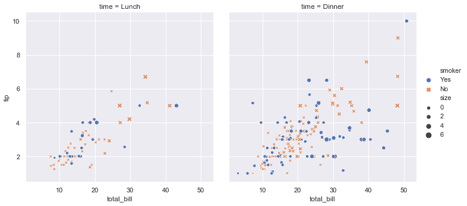

上面发生了什么呢？我们一步步分析：

1.  我们装载 seaborn，这是这个例子唯一需要的 python 库。

```py
import seaborn as sns

```

此处，seaborn 实际调用了 matplotlib 作图。虽然很多任务都可以直接使用 seaborn 提供的函数来完成，不过一些更深层或者更加个性化的可能需要直接使用 matplotlib 来实现，[下面](#intro-plot-customization)会详细介绍这一点。如果需要获得交互式体验，推荐使用 Jupyter/IPython 工具并开启 [matplotlib 模式](https://ipython.readthedocs.io/en/stable/interactive/plotting.html)。否则，在使用交互式工具时如果想要看到图片需要调用 matplotlib.pyplot.show 函数。

1.  我们设置并使用 seaborn 默认的主题、尺寸大小以及调色板。

```py
sns.set()

```

这里改变了 [matplotlib rcParam 系统](https://matplotlib.org/users/customizing.html) 所以会影响所有 matplotlib 图像的显示，即使你没有显式的调用 seaborn 修改这些参数。除了缺省的主题，我们提供一些[其他选项](http://seaborn.pydata.org/tutorial/aesthetics.html#aesthetics-tutorial)，你可以独立的控制图片风格与尺寸来将他们迅速应用到演讲当中（例如，在演讲投影中使用一个拥有可阅读字体的图表）。如果你倾向于使用默认 matplotlib 主题或者其他的内置样式，你可以跳过这一部分，只使用 seaborn 提供的制图函数。

1.  装载数据集

```py
tips = sns.load_dataset("tips")

```

文档中的代码多数会使用 [`load_dataset()`](generated/seaborn.load_dataset.html#seaborn.load_dataset "seaborn.load_dataset") 去取得样例数据集。这些数据集没什么特殊，都是 pandas 的数据结构（dataframes），所以我们也可以使用 `pandas.read_csv` 或者手动输入创建数据集。在文档中，多数作图都使用 `tips` 数据集，非常无聊但是就说明状况的作用还是可以。`tips` 数据集提供了一种“整洁”的整合数据的方式，所以如果你使用这种方式来整合自己的数据，使用 seaborn 再好不过了。[下面](#intro-tidy-data)详细解释为什么。

1.  我们写一个多子图散点图，分配语义变量

```py
sns.relplot(x="total_bill", y="tip", col="time",
            hue="smoker", style="smoker", size="size",
            data=tips)

```

这张图说明了 `tips` 数据集中五个变量的关系，三个是数值变量，另外两个是类别变量。其中 `total_bill` 和 `tip` 这两个数值变量决定了轴上每个点出现的位置，另外一个 `size` 变量影响着出现点的大小。第一个类别变量 `time` 将散点图分为两个子图，第二个类别变量 `smoker` 决定点的形状。

所有上述内容均由 [`relplot`](generated/seaborn.relplot.html#seaborn.relplot "seaborn.relplot") 一次调用生成。注意，在函数调用过程中，我们仅仅使用变量名来划分图像中的不同的语义。如果直接使用 matplotlib ，就必须将变量转换为可视化函数的参数（例如，指定颜色，指定每个类别的制图方式），这在 seaborn 中被自动执行了，以此让使用者将注意力放在他们要解决的问题上。

## 接口抽象

因为不存在可视化数据的最好方式，每一个制图所描述的问题都有自己最合适的可视化方法。seaborn 旨在让可视化方法间的切换变得更容易，有时仅仅需要改变同一个接口中的参数即可。

函数 [`relplot()`](generated/seaborn.relplot.html#seaborn.relplot "seaborn.relplot") 之所以这样命名是因为设计这个函数的初衷是想让他体现多个统计间的关系。散点图可以很好的体现统计数据间的关系，但是如果有一个变量具有时间意义，那线状图可能更好一点，因此，[`relplot()`](generated/seaborn.relplot.html#seaborn.relplot "seaborn.relplot") 函数提供了一个 `kind` 接口可以很方便的用作于改变图像的组织方式。

```py
dots = sns.load_dataset("dots")
sns.relplot(x="time", y="firing_rate", col="align",
            hue="choice", size="coherence", style="choice",
            facet_kws=dict(sharex=False),
            kind="line", legend="full", data=dots);

```

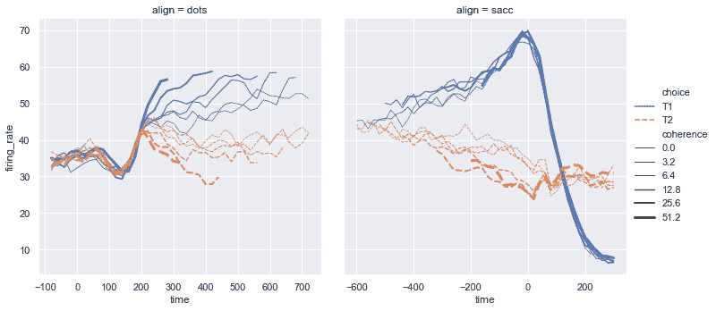

参数 `size` 和 `style` 被散点图和线状图共享，但是他们对这些可视化结果产生的影响是不同的（例如，改变点大小和线的样式）。这些细节在实际使用中是无需被关注的，我们只需要将注意力放在组织图像的结构与我们想表达的信息中。

## 估计与误差

我们常常会想知道一个变量的均值函数以便在计算其他变量时作为可用参数。seaborn 的许多函数都可以自动的计算参数估计，这在解决一些问题中是十分必要的。

```py
fmri = sns.load_dataset("fmri")
sns.relplot(x="timepoint", y="signal", col="region",
            hue="event", style="event",
            kind="line", data=fmri);

```

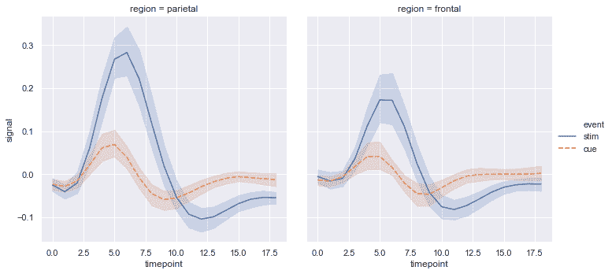

估计统计参数时，seaborn 使用了 bootstrap 方法计算置信区间和误差以表示估计的不确定性程度。

Seaborn 还能实现一些不是很好用语言描述统计估计。比如，使用 [`lmplot()`](generated/seaborn.lmplot.html#seaborn.lmplot "seaborn.lmplot") 可以将一个线性回归模型放在散点图当中去：

```py
sns.lmplot(x="total_bill", y="tip", col="time", hue="smoker",
           data=tips);

```

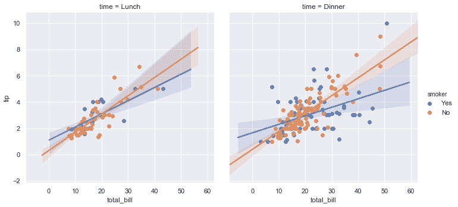

## 分类图

标准的散点图和线状图用来可视化数值型数据，但是可能有些变量含有分类信息，之前的做法不再合适。我们提供了一些可视化分类变量的函数，在 [`catplot()`](generated/seaborn.catplot.html#seaborn.catplot "seaborn.catplot") 中可以找到。和 [`relplot()`](generated/seaborn.relplot.html#seaborn.relplot "seaborn.relplot") 相似的地方是，写 [`catplot()`](generated/seaborn.catplot.html#seaborn.catplot "seaborn.catplot") 函数的目的是为了提供一个面向数据集的通用接口，不仅可以显示数值变量，同时展示一个或多个类别变量。

在下面这种图中，你可以改变观测的粒聚集度，最好的情况是，所有的观测值都被调整的恰好到不会重叠但是又是沿着类别轴的：

```py
sns.catplot(x="day", y="total_bill", hue="smoker",
            kind="swarm", data=tips);

```

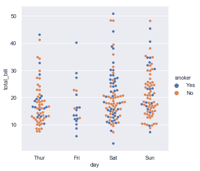

你也可以使用核密度估计来表示这些观测可能来源于的样本：

```py
sns.catplot(x="day", y="total_bill", hue="smoker",
            kind="violin", split=True, data=tips);

```

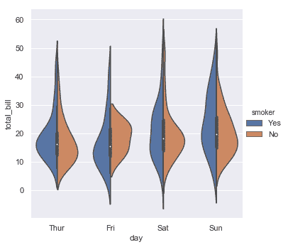

或者你可以在每个嵌套类别变量中求其唯一均值与置信区间：

```py
sns.catplot(x="day", y="total_bill", hue="smoker",
            kind="bar", data=tips);

```

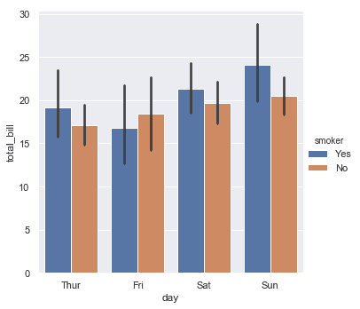

## 图与轴的函数

了解 seaborn 提供的不同函数间的区别非常重要，到目前为止我们见到的函数都是基于 figure-level 的函数。由于直接创建包含子图的 matplotlib 图像，数据得以被沿着轴展开，挖掘数据得到了优化。这些函数还可以做一些比较有技巧性的事情，比如把图例放在轴外。我们可以使用 [`FacetGrid`](generated/seaborn.FacetGrid.html#seaborn.FacetGrid "seaborn.FacetGrid") 来完成这些事情。

每一个 figure-level 的图像 `kind` （指传给 kind 参数位置的图类别变量）都包含着一个特殊的 axes-level 作为 [`FacetGrid`](generated/seaborn.FacetGrid.html#seaborn.FacetGrid "seaborn.FacetGrid") 的对象。例如，散点图实际上使用的是 [`scatterplot()`](generated/seaborn.scatterplot.html#seaborn.scatterplot "seaborn.scatterplot") 函数，条形图使用的是 [`barplot()`](generated/seaborn.barplot.html#seaborn.barplot "seaborn.barplot") 函数，这些函数被称为 axes-level 因为他们只会作用一个独立 matplotlib 图像轴不会影响到其他剩余轴上的子图。

总之就是 figure-level 函数控制整个图像，axes-level 的函数可以和 matplotlib 图进行更复杂的结合，无论其他轴上的子图是否由 seaborn 作出。

```py
import matplotlib.pyplot as plt
f, axes = plt.subplots(1, 2, sharey=True, figsize=(6, 4))
sns.boxplot(x="day", y="tip", data=tips, ax=axes[0])
sns.scatterplot(x="total_bill", y="tip", hue="day", data=tips, ax=axes[1]);

```

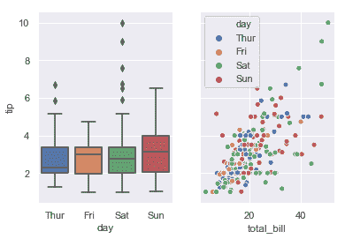

使用 figure-level 函数控制图像大小的方法和控制 matplotlib 图的方法有一点不同。figure-level 函数不会设置整个图的大小，而是调整每个组成图的子图的大小，并且对于子图设定高度与比例，不会去分别设定高度和宽度。这样的参数化形式使得控制图表大小更容易了，并不需要非得仔细计算到底结果图会包含多少行、多少列，即使这样容易让人比较晕：

```py
sns.relplot(x="time", y="firing_rate", col="align",
            hue="choice", size="coherence", style="choice",
            height=4.5, aspect=2 / 3,
            facet_kws=dict(sharex=False),
            kind="line", legend="full", data=dots);

```

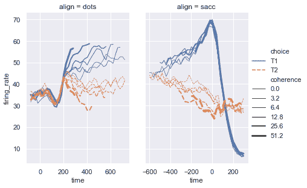

区别 figure-level 函数和 axes-level 函数的方法就是去看函数是否携带一个 `ax=` 参数。或者你可以查看他们的输出类型：axes-level 函数返回一个 matplotlib `axes`，figure-level 函数返回一个 [`FacetGrid`](generated/seaborn.FacetGrid.html#seaborn.FacetGrid "seaborn.FacetGrid")。

## 数据集结构可视化

在 seaborn 中创建多子图的可视化结果有两种方法，两种方法都可以刻画数据集的结构。第一种 
[`jointplot()`](generated/seaborn.jointplot.html#seaborn.jointplot "seaborn.jointplot") 方法注重单对单关系：

```py
iris = sns.load_dataset("iris")
sns.jointplot(x="sepal_length", y="petal_length", data=iris);

```

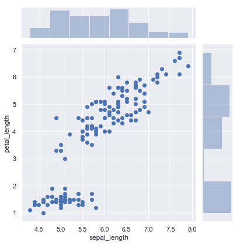

另一种是 [`pairplot()`](generated/seaborn.pairplot.html#seaborn.pairplot "seaborn.pairplot") ，提供对数据更为全面的可视化。对于每对数据间的关系以及边缘分布都有考察，你可以选择用哪里分类变量作为条件：

```py
sns.pairplot(data=iris, hue="species");

```


这两种方法在数据可视化都提供一些自定义选项，他们都是对于两个高度可自定义的多图作图函数 [`JointGrid`](generated/seaborn.JointGrid.html#seaborn.JointGrid "seaborn.JointGrid") 和 [`PairGrid`](generated/seaborn.PairGrid.html#seaborn.PairGrid "seaborn.PairGrid") 再封装。

## 自定义样式

Seaborn 库选择尽可能美观的设计，并且添加富于信息的标签。如果需要设计更为精致的图片可能会需要多执行一些步骤，这有多种方法。

第一种方法是使用 seaborn 给你的其他的主题。设置了不同的主题或者调色板样式会让整个图的效果都不一样：

```py
sns.set(style="ticks", palette="muted")
sns.relplot(x="total_bill", y="tip", col="time",
            hue="smoker", style="smoker", size="size",
            data=tips);

```

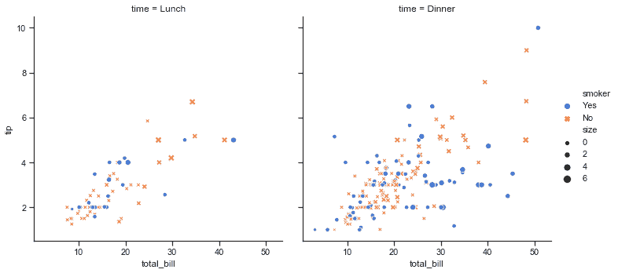

如果要仅针对图像设计，所有的 seaborn 函数都接受一系列的可选参数来改变默认的语义映射，比如颜色。（对颜色的恰当选择在数据可视化中非常关键，seaborn 提供了[附加支持]http://seaborn.pydata.org/tutorial/color_palettes.html#palette-tutorial) 来引导调色板的使用）。

最后，当 seaborn 的函数与 matploblib 函数具有显然一致性时（例如 [`scatterplot()`](generated/seaborn.scatterplot.html#seaborn.scatterplot "seaborn.scatterplot") 和 `plt.scatter`），多余的参数会被直接传给 matploblib 层：

```py
sns.relplot(x="total_bill", y="tip", col="time",
            hue="size", style="smoker", size="size",
            palette="YlGnBu", markers=["D", "o"], sizes=(10, 125),
            edgecolor=".2", linewidth=.5, alpha=.75,
            data=tips);

```

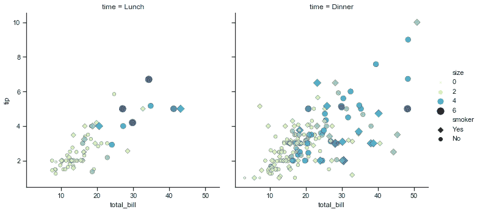

注意 [`relplot()`](generated/seaborn.relplot.html#seaborn.relplot "seaborn.relplot") 或者其他 figure-level 函数，因为当 [`relplot()`](generated/seaborn.relplot.html#seaborn.relplot "seaborn.relplot") 函数传递一些额外的关键字参数到 seaborn 底层的 axes-level 函数时，相当于将这些参数直接传给了底层 matplotlib 函数，这会使得你寻找对应文档变得有些麻烦，不过原则上是可以做到很高的自定义程度的。

有些 figure-level 的函数自定义可以通过传递额外参数到 [`FacetGrid`](generated/seaborn.FacetGrid.html#seaborn.FacetGrid "seaborn.FacetGrid") 来实现，你可以使用这个对象的方法来控制图像的属性。甚至可以修改需要被作图的 matploblib 对象的值达到效果：

```py
g = sns.catplot(x="total_bill", y="day", hue="time",
                height=3.5, aspect=1.5,
                kind="box", legend=False, data=tips);
g.add_legend(title="Meal")
g.set_axis_labels("Total bill ($)", "")
g.set(xlim=(0, 60), yticklabels=["Thursday", "Friday", "Saturday", "Sunday"])
g.despine(trim=True)
g.fig.set_size_inches(6.5, 3.5)
g.ax.set_xticks([5, 15, 25, 35, 45, 55], minor=True);
plt.setp(g.ax.get_yticklabels(), rotation=30);

```

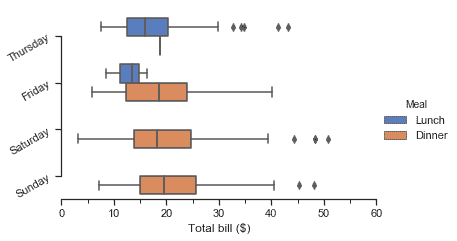

Figure-level 函数作用于需要高效显示数据的情况，所以如果要更精确的调整大小与组织形式，直接使用 matploblib 或者使用对应的 seaborn axes-level 函数。matploblib 具有易于理解和强大的接口，任何有关图像属性的值都可以通过接口来完成设置。最好是将高度抽象的 seaborn 接口和可深度自定义的 matplotlib 接口一起使用来制作达到[出版质量](https://github.com/wagnerlabpapers/Waskom_PNAS_2017)的最终成果。

## 组织数据集

之前提到过，如果你的数据整合的比较好，seaborn 的表现也会很出众。这种能称为做“长型”或者“整洁”数据在[这里](http://vita.had.co.nz/papers/tidy-data.html)被详细解释。这些方式可以大致概括为：

1. 每个变量占有一个列
2. 每个观测占有一个行

你的数据是否整洁了？一种比较好的思考方式是去想你要怎么画你的图，从这一点来讲，变量就是图中一种具有规律展现形式的元素。如果看看样例 `tips` 会比较好：

```py
tips.head()

```

|  | total_bill | tip | sex | smoker | day | time | size |
| --- | --- | --- | --- | --- | --- | --- | --- |
| 0 | 16.99 | 1.01 | Female | No | Sun | Dinner | 2 |
| --- | --- | --- | --- | --- | --- | --- | --- |
| 1 | 10.34 | 1.66 | Male | No | Sun | Dinner | 3 |
| --- | --- | --- | --- | --- | --- | --- | --- |
| 2 | 21.01 | 3.50 | Male | No | Sun | Dinner | 3 |
| --- | --- | --- | --- | --- | --- | --- | --- |
| 3 | 23.68 | 3.31 | Male | No | Sun | Dinner | 2 |
| --- | --- | --- | --- | --- | --- | --- | --- |
| 4 | 24.59 | 3.61 | Female | No | Sun | Dinner | 4 |
| --- | --- | --- | --- | --- | --- | --- | --- |

从某种意义上讲，使用这种组织方式开始可能会感觉尴尬，比如使用时间序列数据，将时间点作为观测值放在列中。我们[之前](#intro-stat-estimation)使用的 `fmri` 数据集展示了一个整洁的时间点在不同行间的组织形式：

```py
fmri.head()

```

|  | subject | timepoint | event | region | signal |
| --- | --- | --- | --- | --- | --- |
| 0 | s13 | 18 | stim | parietal | -0.017552 |
| --- | --- | --- | --- | --- | --- |
| 1 | s5 | 14 | stim | parietal | -0.080883 |
| --- | --- | --- | --- | --- | --- |
| 2 | s12 | 18 | stim | parietal | -0.081033 |
| --- | --- | --- | --- | --- | --- |
| 3 | s11 | 18 | stim | parietal | -0.046134 |
| --- | --- | --- | --- | --- | --- |
| 4 | s10 | 18 | stim | parietal | -0.037970 |
| --- | --- | --- | --- | --- | --- |

许多 seaborn 函数都提供了画出大范围数据图的功能，虽然在函数性上有所限制。要利用好整合较好的数据集，你肯定会使用 `pandas.melt` 函数来解构一个大的数据集。参考[这篇](https://tomaugspurger.github.io/modern-5-tidy.html) pandas 开发者写的博客。

## 下一步

继续往下看，你有多个选择。比如你可能想去[安装 seaborn](installing.html#installing)。然后你可以看看[制图样例](http://seaborn.pydata.org/examples/index.html#example-gallery)来了解 seaborn 到底可以绘制什么样的图。或者你可以阅读[官方教程](tutorial.html#tutorial)来深入了解你所需要的工具。你也可以查看附带样例的[接口参考](api.html#api-ref)来实现你不同的想法。
