# seaborn.scatterplot

```py
seaborn.scatterplot(x=None, y=None, hue=None, style=None, size=None, data=None, palette=None, hue_order=None, hue_norm=None, sizes=None, size_order=None, size_norm=None, markers=True, style_order=None, x_bins=None, y_bins=None, units=None, estimator=None, ci=95, n_boot=1000, alpha='auto', x_jitter=None, y_jitter=None, legend='brief', ax=None, **kwargs)
```

Draw a scatter plot with possibility of several semantic groupings.

The relationship between `x` and `y` can be shown for different subsets of the data using the `hue`, `size`, and `style` parameters. These parameters control what visual semantics are used to identify the different subsets. It is possible to show up to three dimensions independently by using all three semantic types, but this style of plot can be hard to interpret and is often ineffective. Using redundant semantics (i.e. both `hue` and `style` for the same variable) can be helpful for making graphics more accessible.

See the [tutorial](../tutorial/relational.html#relational-tutorial) for more information.

| Parameters: | **x, y** : names of variables in `data` or vector data, optional

> Input data variables; must be numeric. Can pass data directly or reference columns in `data`.

**hue** : name of variables in `data` or vector data, optional

> Grouping variable that will produce points with different colors. Can be either categorical or numeric, although color mapping will behave differently in latter case.

**size** : name of variables in `data` or vector data, optional

> Grouping variable that will produce points with different sizes. Can be either categorical or numeric, although size mapping will behave differently in latter case.

**style** : name of variables in `data` or vector data, optional

> Grouping variable that will produce points with different markers. Can have a numeric dtype but will always be treated as categorical.

**data** : DataFrame

> Tidy (“long-form”) dataframe where each column is a variable and each row is an observation.

**palette** : palette name, list, or dict, optional

> Colors to use for the different levels of the `hue` variable. Should be something that can be interpreted by [`color_palette()`](seaborn.color_palette.html#seaborn.color_palette "seaborn.color_palette"), or a dictionary mapping hue levels to matplotlib colors.

**hue_order** : list, optional

> Specified order for the appearance of the `hue` variable levels, otherwise they are determined from the data. Not relevant when the `hue` variable is numeric.

**hue_norm** : tuple or Normalize object, optional

> Normalization in data units for colormap applied to the `hue` variable when it is numeric. Not relevant if it is categorical.

**sizes** : list, dict, or tuple, optional

> An object that determines how sizes are chosen when `size` is used. It can always be a list of size values or a dict mapping levels of the `size` variable to sizes. When `size` is numeric, it can also be a tuple specifying the minimum and maximum size to use such that other values are normalized within this range.

**size_order** : list, optional

> Specified order for appearance of the `size` variable levels, otherwise they are determined from the data. Not relevant when the `size` variable is numeric.

**size_norm** : tuple or Normalize object, optional

> Normalization in data units for scaling plot objects when the `size` variable is numeric.

**markers** : boolean, list, or dictionary, optional

> Object determining how to draw the markers for different levels of the `style` variable. Setting to `True` will use default markers, or you can pass a list of markers or a dictionary mapping levels of the `style` variable to markers. Setting to `False` will draw marker-less lines. Markers are specified as in matplotlib.

**style_order** : list, optional

> Specified order for appearance of the `style` variable levels otherwise they are determined from the data. Not relevant when the `style` variable is numeric.

**{x,y}_bins** : lists or arrays or functions

> _Currently non-functional._

**units** : {long_form_var}

> Grouping variable identifying sampling units. When used, a separate line will be drawn for each unit with appropriate semantics, but no legend entry will be added. Useful for showing distribution of experimental replicates when exact identities are not needed.
> 
> _Currently non-functional._

**estimator** : name of pandas method or callable or None, optional

> Method for aggregating across multiple observations of the `y` variable at the same `x` level. If `None`, all observations will be drawn. _Currently non-functional._

**ci** : int or “sd” or None, optional

> Size of the confidence interval to draw when aggregating with an estimator. “sd” means to draw the standard deviation of the data. Setting to `None` will skip bootstrapping. _Currently non-functional._

**n_boot** : int, optional

> Number of bootstraps to use for computing the confidence interval. _Currently non-functional._

**alpha** : float

> Proportional opacity of the points.

**{x,y}_jitter** : booleans or floats

> _Currently non-functional._

**legend** : “brief”, “full”, or False, optional

> How to draw the legend. If “brief”, numeric `hue` and `size` variables will be represented with a sample of evenly spaced values. If “full”, every group will get an entry in the legend. If `False`, no legend data is added and no legend is drawn.

**ax** : matplotlib Axes, optional

> Axes object to draw the plot onto, otherwise uses the current Axes.

**kwargs** : key, value mappings

> Other keyword arguments are passed down to `plt.scatter` at draw time.

 |
| --- | --- |
| Returns: | **ax** : matplotlib Axes

> Returns the Axes object with the plot drawn onto it.

 |
| --- | --- |

See also

Show the relationship between two variables connected with lines to emphasize continuity.Draw a scatter plot with one categorical variable, arranging the points to show the distribution of values.

Examples

Draw a simple scatter plot between two variables:

```py
>>> import seaborn as sns; sns.set()
>>> import matplotlib.pyplot as plt
>>> tips = sns.load_dataset("tips")
>>> ax = sns.scatterplot(x="total_bill", y="tip", data=tips)

```

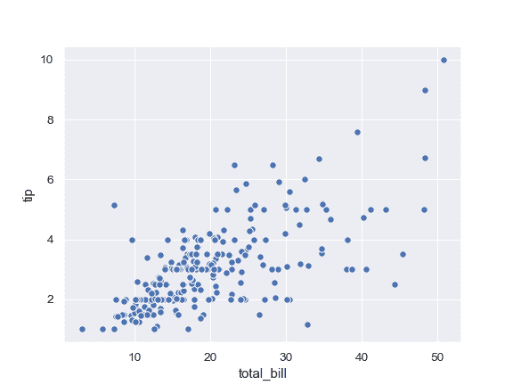

Group by another variable and show the groups with different colors:

```py
>>> ax = sns.scatterplot(x="total_bill", y="tip", hue="time",
...                      data=tips)

```

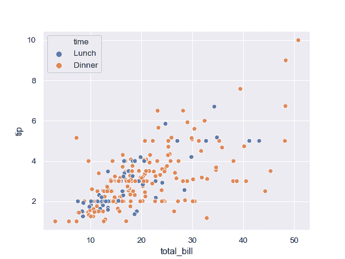

Show the grouping variable by varying both color and marker:

```py
>>> ax = sns.scatterplot(x="total_bill", y="tip",
...                      hue="time", style="time", data=tips)

```

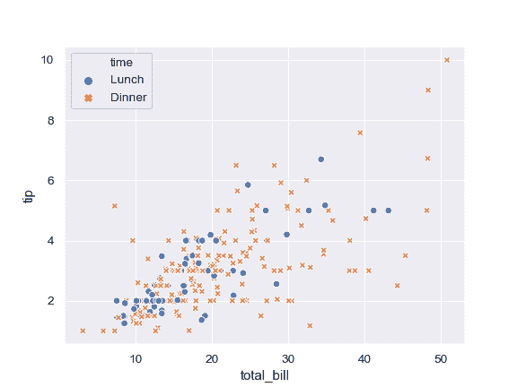

Vary colors and markers to show two different grouping variables:

```py
>>> ax = sns.scatterplot(x="total_bill", y="tip",
...                      hue="day", style="time", data=tips)

```

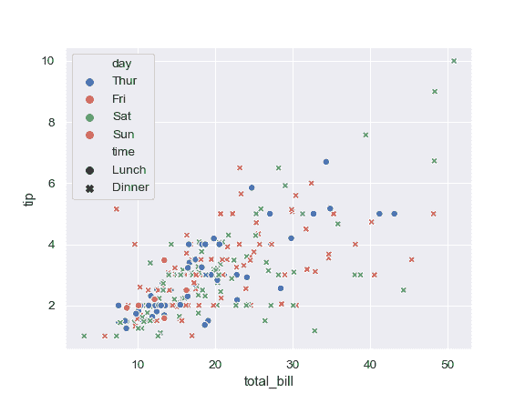

Show a quantitative variable by varying the size of the points:

```py
>>> ax = sns.scatterplot(x="total_bill", y="tip", size="size",
...                      data=tips)

```

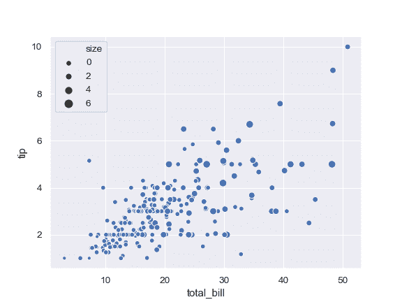

Also show the quantitative variable by also using continuous colors:

```py
>>> ax = sns.scatterplot(x="total_bill", y="tip",
...                      hue="size", size="size",
...                      data=tips)

```

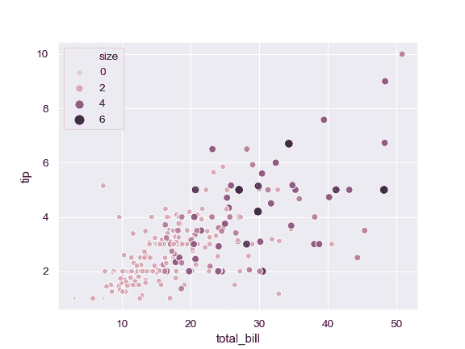

Use a different continuous color map:

```py
>>> cmap = sns.cubehelix_palette(dark=.3, light=.8, as_cmap=True)
>>> ax = sns.scatterplot(x="total_bill", y="tip",
...                      hue="size", size="size",
...                      palette=cmap,
...                      data=tips)

```

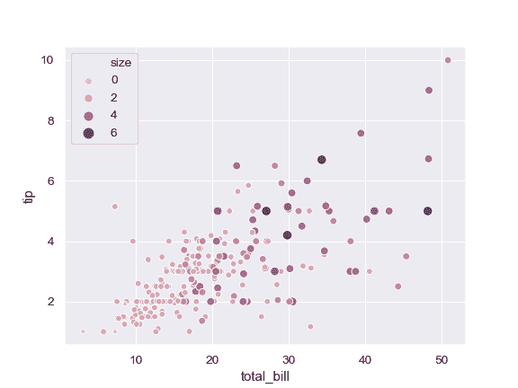

Change the minimum and maximum point size and show all sizes in legend:

```py
>>> cmap = sns.cubehelix_palette(dark=.3, light=.8, as_cmap=True)
>>> ax = sns.scatterplot(x="total_bill", y="tip",
...                      hue="size", size="size",
...                      sizes=(20, 200), palette=cmap,
...                      legend="full", data=tips)

```

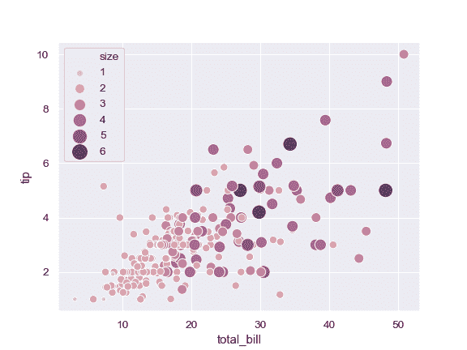

Use a narrower range of color map intensities:

```py
>>> cmap = sns.cubehelix_palette(dark=.3, light=.8, as_cmap=True)
>>> ax = sns.scatterplot(x="total_bill", y="tip",
...                      hue="size", size="size",
...                      sizes=(20, 200), hue_norm=(0, 7),
...                      legend="full", data=tips)

```

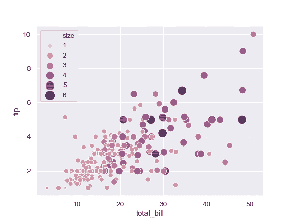

Vary the size with a categorical variable, and use a different palette:

```py
>>> cmap = sns.cubehelix_palette(dark=.3, light=.8, as_cmap=True)
>>> ax = sns.scatterplot(x="total_bill", y="tip",
...                      hue="day", size="smoker",
...                      palette="Set2",
...                      data=tips)

```

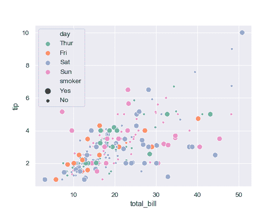

Use a specific set of markers:

```py
>>> markers = {"Lunch": "s", "Dinner": "X"}
>>> ax = sns.scatterplot(x="total_bill", y="tip", style="time",
...                      markers=markers,
...                      data=tips)

```

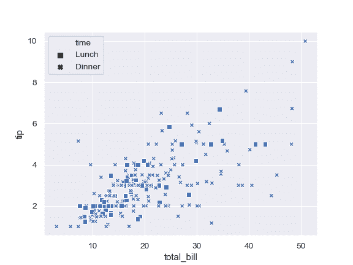

Control plot attributes using matplotlib parameters:

```py
>>> ax = sns.scatterplot(x="total_bill", y="tip",
...                      s=100, color=".2", marker="+",
...                      data=tips)

```

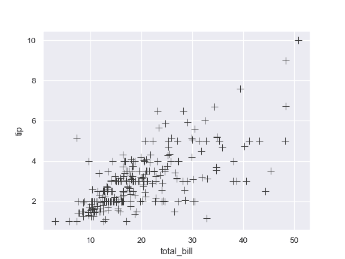

Pass data vectors instead of names in a data frame:

```py
>>> iris = sns.load_dataset("iris")
>>> ax = sns.scatterplot(x=iris.sepal_length, y=iris.sepal_width,
...                      hue=iris.species, style=iris.species)

```


Pass a wide-form dataset and plot against its index:

```py
>>> import numpy as np, pandas as pd; plt.close("all")
>>> index = pd.date_range("1 1 2000", periods=100,
...                       freq="m", name="date")
>>> data = np.random.randn(100, 4).cumsum(axis=0)
>>> wide_df = pd.DataFrame(data, index, ["a", "b", "c", "d"])
>>> ax = sns.scatterplot(data=wide_df)

```

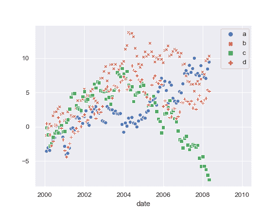