# **seaborn.lineplot**

> 译者：[cancan233](https://github.com/cancan233)

```python
seaborn.lineplot(x=None, y=None, hue=None, size=None, style=None, data=None, palette=None, hue_order=None, hue_norm=None, sizes=None, size_order=None, size_norm=None, dashes=True, markers=None, style_order=None, units=None, estimator='mean', ci=95, n_boot=1000, sort=True, err_style='band', err_kws=None, legend='brief', ax=None, **kwargs)
```

用不同语义分组绘制线型图

`x`和`y`之间的关系可以使用`hue`，`size`和`style`参数为数据的不同子集显示。这些参数控制用于识别不同子集的视觉语义。通过使用所有三种语义类型，可以独立地显示三个维度，但是这种画图样式可能难以解释并且通常是无效的。使用冗余语义（即同一变量的`hue`和`style`）有助于使图形更易于理解。

请查看[指南](http://seaborn.pydata.org/tutorial/relational.html#relational-tutoria)获取更多信息。

默认情况下，图标在每个`x`值处汇总多个`y`值，并显示集中趋势的估计值和该估计值的置信区间。

参数：`x,y`： `data`或向量数据中变量的名称，可选择。

> 输入数据变量；必须是数字。可以直接传递数据或引用`data`中的列。

`hue`: `data`或向量数据中的变量名，可选。

> 分组变量，将生成具有不同颜色的线条的变量。可以是分类或数字，但颜色映射在后一种情况下的行为会有所不同。

`size`: `data`或向量数据中的变量名，可选。

> 分组变量，将生成具有不同粗细的线条的变量。可以是分类或数字，但大小映射在后一种情况下的行为会有所不同。

`style`: `data`或向量数据中的变量名，可选。

> 分组变量，将生成具有不同样式和/或标记的线条的变量。可以是一种数字形式，但是始终会被视为分类。

`data`: 数据框架。

> 整洁（“长形式”）数据框，其中每列是变量，每行是观察量。

`palette`： 调色板名称，列表或字典，可选。

> 用于`hue`变量的不同级别的颜色。应该是[`color_palette()`](seaborn.color_palette.html#seaborn.color_palette "seaborn.color_palette")可以解释的东西，或者是将色调级别映射到 matplotlib 颜色的字典。

`hue_order`：列表，可选。

> 指定`hue`变量级别的出现顺序，否则它们是根据数据确定的。当`hue`变量是数字时不相关。

`hue_norm`： 原则或者时归一化对象，可选。

> 当数值为数字时，应用于`hue`变量的颜色图数据单元的归一化。 如果是分类的，则不相关。

`sizes`：列表，字典，或者元组。可选。

> 确定在使用`size`时如何选择大小的对象。它始终可以是大小值列表或`size`变量与大小的字典映射级别。当`size`是数字时，它也可以是一个元组，指定要使用的最小和最大大小，以便在此范围内对其他值进行规范化。

`size_norm`：原则或者时归一化对象，可选。

> 当`size`变量是数字时，用于缩放绘图对象的数据单元中的归一化。

`dashes`： 布尔值，列表或字典，可选。

> 确定如何为`style`变量的不同级别绘制线条的对象。设置为`True`将使用默认的短划线代码，或者您可以将短划线代码列表或`style`变量的字典映射级别传递给短划线代码。设置为`False`将对所有子集使用实线。线段在 matplotlib 中指定： `(segment, gap)`长度的元组，或用于绘制实线的空字符串。

`markers`： 布尔值，列表或字典，可选。

> 确定如何为`style`变量的不同级别绘制标记的对象。 设置为“True”将使用默认标记，或者您可以传递标记列表或将`style`变量的字典映射到标记。 设置为“False”将绘制无标记线。 标记在 matplotlib 中指定。

`style_order`：列表，可选。

> 指定`style`变量级别的出现顺序，否则它们是从数据中确定的。`style`变量时数字不相关的。

`units`： {long_form_var}

> 对变量识别抽样单位进行分组。使用时，将为每个单元绘制一个单独的行，并使用适当的语义。但不会添加任何图里条目。当不需要确切的身份时，可用于显示实验重复的分布。

`estimator`：pandas 方法的名称或可调用或无，可选。

> 在相同的`x`级别上聚合`y`变量的多个观察值的方法。如果`None`，将绘制所有观察结果。

`ci`：整数或`sd`或 None。可选。

> 与`estimator`聚合时绘制的置信区间大小。`sd`表示绘制数据的标准偏差。设置为`None`将跳过 bootstrap。

`n_boot`：整数，可选。

> 用于计算置信区间的 bootstrap 数。

`sort`：布尔值，可选。

> 如果为真，则数据将按 x 与 y 变量排序，否则行将按照它们在数据集中出现的顺序连接点。

`err_style`: `band`或`bars`，可选。

> 是否用半透明误差带或离散误差棒绘制置信区间。

`err_band`：关键字参数字典。

> 用于控制误差线美观的附加参数。 `kwargs`传递给`ax.fill_between`或`ax.errorbar`，具体取决于`err_style`。

`legend`： `brief`,`full`,或`False`。可选。

> 如何绘制图例。如果`brief`，则数字`hue`和`size`变量将用均匀间隔值的样本表示。如果`full`，则每个组都会在图例中输入一个条目。如果为`False`，则不添加图例数据且不绘制图例。

`ax`：matplotlib 轴。可选。

> 将绘图绘制到的 Axes 对象，否则使用当前轴。

`kwargs`：关键，价值映射。

> 其他关键字参数在绘制时传递给`plt.plot`。 

返回值：`ax`：matplotlib 轴

> 返回 Axes 对象，并在其上绘制绘图。

也可以看看

显示两个变量之间的关系，而不强调`x`变量的连续性。当两个变量时分类时，显示两个变量之间的关系。

例子

绘制单线图，其中错误带显示执行区间：

```py
>>> import seaborn as sns; sns.set()
>>> import matplotlib.pyplot as plt
>>> fmri = sns.load_dataset("fmri")
>>> ax = sns.lineplot(x="timepoint", y="signal", data=fmri)

```

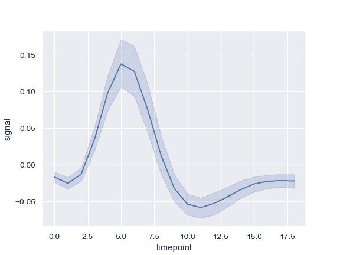

按另一个变量分组并显示具有不同颜色的组：

```py
>>> ax = sns.lineplot(x="timepoint", y="signal", hue="event",
...                   data=fmri)

```

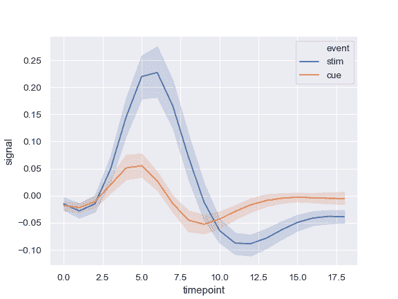

使用颜色和线条划线显示分组变量：

```py
>>> ax = sns.lineplot(x="timepoint", y="signal",
...                   hue="event", style="event", data=fmri)

```

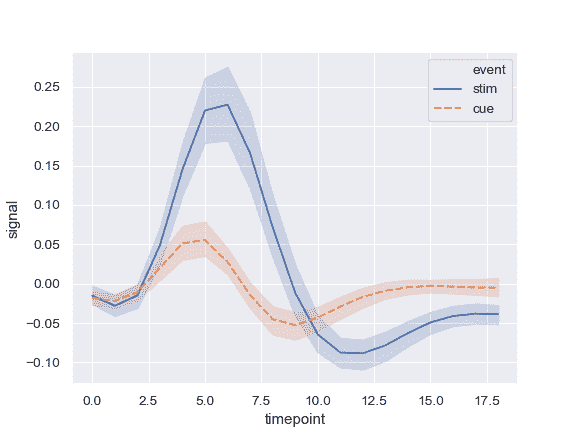

使用颜色和线条划线来表示两个不同的分组变量：

```py
>>> ax = sns.lineplot(x="timepoint", y="signal",
...                   hue="region", style="event", data=fmri)

```

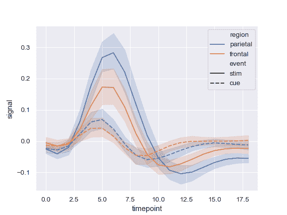

使用标记而不是破折号来标识组：

```py
>>> ax = sns.lineplot(x="timepoint", y="signal",
...                   hue="event", style="event",
...                   markers=True, dashes=False, data=fmri)

```

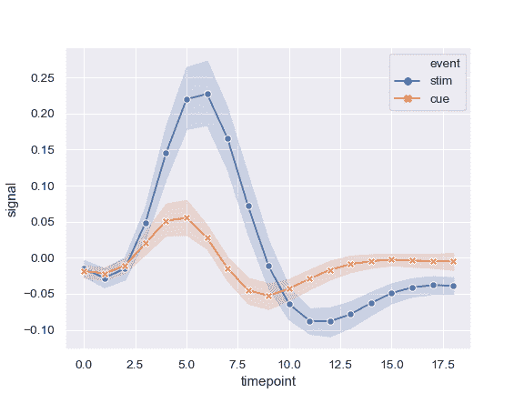

显示错误条而不是错误带并绘制标准错误：

```py
>>> ax = sns.lineplot(x="timepoint", y="signal", hue="event",
...                   err_style="bars", ci=68, data=fmri)

```

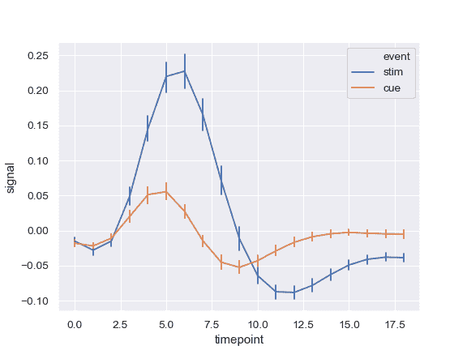

显示实验性重复而不是聚合：

```py
>>> ax = sns.lineplot(x="timepoint", y="signal", hue="event",
...                   units="subject", estimator=None, lw=1,
...                   data=fmri.query("region == 'frontal'"))

```

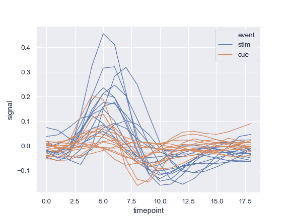

使用定量颜色映射：

```py
>>> dots = sns.load_dataset("dots").query("align == 'dots'")
>>> ax = sns.lineplot(x="time", y="firing_rate",
...                   hue="coherence", style="choice",
...                   data=dots)

```


对 colormap 使用不同的归一化：

```py
>>> from matplotlib.colors import LogNorm
>>> ax = sns.lineplot(x="time", y="firing_rate",
...                   hue="coherence", style="choice",
...                   hue_norm=LogNorm(), data=dots)

```

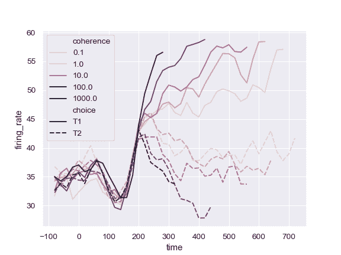

使用不同的调色板：

```py
>>> ax = sns.lineplot(x="time", y="firing_rate",
...                   hue="coherence", style="choice",
...                   palette="ch:2.5,.25", data=dots)

```

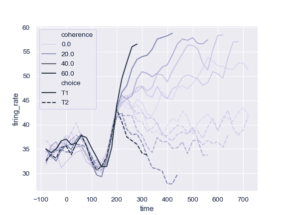

使用特定颜色值，将 hue 变量视为分类：

```py
>>> palette = sns.color_palette("mako_r", 6)
>>> ax = sns.lineplot(x="time", y="firing_rate",
...                   hue="coherence", style="choice",
...                   palette=palette, data=dots)

```

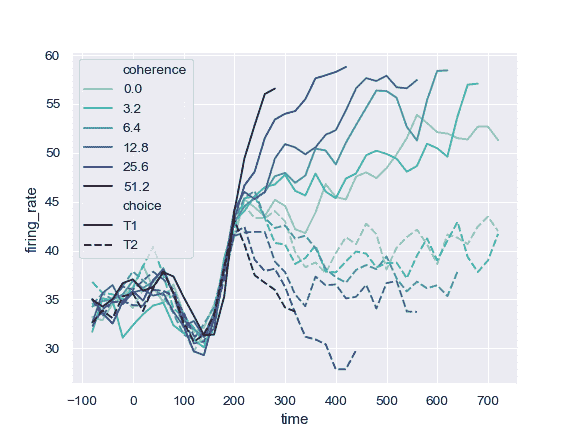

使用定量变量更改线条的宽度：

```py
>>> ax = sns.lineplot(x="time", y="firing_rate",
...                   size="coherence", hue="choice",
...                   legend="full", data=dots)

```

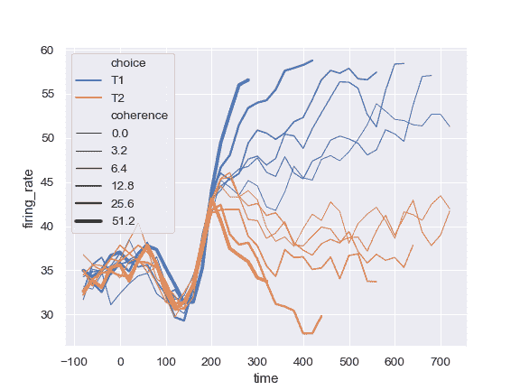

更改用于规范化 size 变量的线宽范围：

```py
>>> ax = sns.lineplot(x="time", y="firing_rate",
...                   size="coherence", hue="choice",
...                   sizes=(.25, 2.5), data=dots)

```

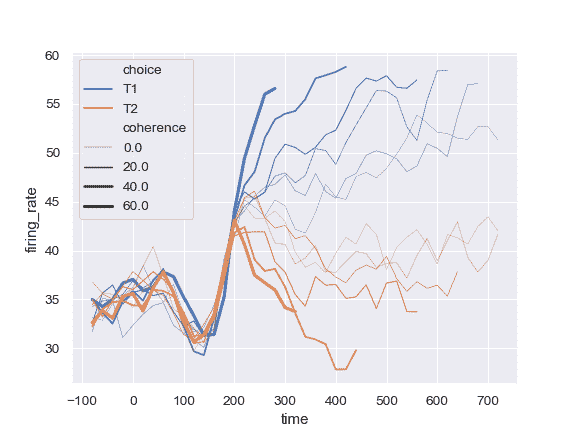

DataFrame 绘制：

```py
>>> import numpy as np, pandas as pd; plt.close("all")
>>> index = pd.date_range("1 1 2000", periods=100,
...                       freq="m", name="date")
>>> data = np.random.randn(100, 4).cumsum(axis=0)
>>> wide_df = pd.DataFrame(data, index, ["a", "b", "c", "d"])
>>> ax = sns.lineplot(data=wide_df)

```

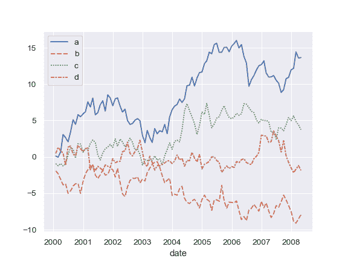

系列列表中绘制：

```py
>>> list_data = [wide_df.loc[:"2005", "a"], wide_df.loc["2003":, "b"]]
>>> ax = sns.lineplot(data=list_data)

```

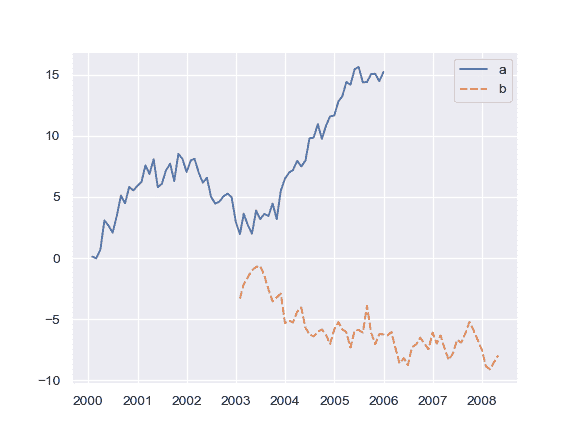

绘制单个系列，将 kwargs 传递给`plt.plot`：

```py
>>> ax = sns.lineplot(data=wide_df["a"], color="coral", label="line")

```

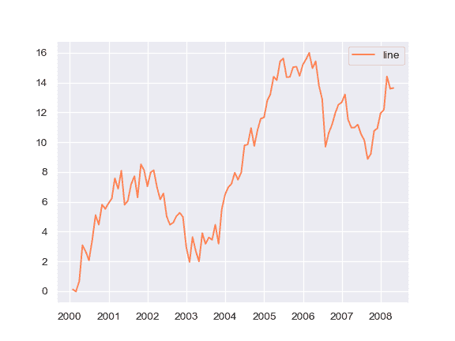

在数据集中出现的点处绘制线条：

```py
>>> x, y = np.random.randn(2, 5000).cumsum(axis=1)
>>> ax = sns.lineplot(x=x, y=y, sort=False, lw=1)

```

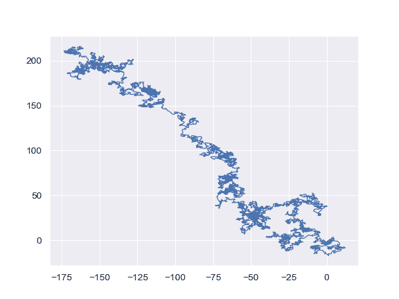
