# seaborn.stripplot

> 译者：[LIJIANcoder97](https://github.com/LIJIANcoder97)

```py
seaborn.stripplot(x=None, y=None, hue=None, data=None, order=None, hue_order=None, jitter=True, dodge=False, orient=None, color=None, palette=None, size=5, edgecolor='gray', linewidth=0, ax=None, **kwargs)
```

绘制一个散点图，其中一个变量是分类。

条形图可以单独绘制，但如果您想要显示所有观察结果以及底层分布的某些表示，它也是一个盒子或小提琴图的良好补充。

输入数据可以以多种格式传递，包括：

*   表示为列表，numpy 数组或 pandas Series 对象的数据向量直接传递给`x`，`y`和`hue`参数
*   在这种情况下，`x`，`y`和`hue`变量将决定数据的绘制方式。
*   “wide-form” DataFrame, 用于绘制每个数字列。
*   一个数组或向量列表。

在大多数情况下，可以使用 numpy 或 Python 对象，但最好使用 pandas 对象，因为关联的名称将用于注释轴。另外，您可以使用分组变量的分类类型来控制绘图元素的顺序。

此函数始终将其中一个变量视为分类，并在相关轴上的序数位置（0,1，... n）处绘制数据，即使数据具有数字或日期类型也是如此。

有关更多信息，请参阅[教程](http://seaborn.pydata.org/tutorial/categorical.html#categorical-tutorial)。

参数：`x, y, hue`： `数据`或矢量数据中的变量名称，可选

> 用于绘制长格式数据的输入。查看解释示例。

`data`：DataFrame, 数组, 数组列表, 可选

>用于绘图的数据集。如果 `x` 和 `y` 不存在，则将其解释为宽格式。否则预计它将是长格式的。

`order, hue_order`：字符串列表，可选

>命令绘制分类级别，否则从数据对象推断级别。

`jitter`：float, `True`/`1` 是特殊的，可选

>要应用的抖动量（仅沿分类轴）。 当您有许多点并且它们重叠时，这可能很有用，因此更容易看到分布。您可以指定抖动量（均匀随机变量支持的宽度的一半），或者仅使用`True`作为良好的默认值

`dodge`：bool, 可选

>使用 `hue` 嵌套时，将其设置为 `True` 将沿着分类轴分离不同色调级别的条带。否则，每个级别的点将相互叠加。

`orient`：“v” &#124; “h”, 可选

> 图的方向（垂直或水平）。这通常是从输入变量的 dtype 推断出来的，但可用于指定“分类”变量何时是数字或何时绘制宽格式数据。

`color`：matplotlib 颜色，可选

> 所有元素的颜色，或渐变调色板的种子。

`palette`：调色板名称，列表或字典，可选

> 用于色调变量的不同级别的颜色。应该是 [`color_palette()`](seaborn.color_palette.html#seaborn.color_palette "seaborn.color_palette"), 可以解释的东西，或者是将色调级别映射到 matplotlib 颜色的字典。

`size`：float, 可选

> 标记的直径，以磅为单位。（虽然 `plt.scatter` 用于绘制点，但这里的 `size` 参数采用“普通”标记大小而不是大小^ 2，如 `plt.scatter` 。

`edgecolor`：matplotlib 颜色，“灰色”是特殊的，可选的

>每个点周围线条的颜色。如果传递`"灰色"`，则亮度由用于点体的调色板决定。

`linewidth`：float, 可选

> 构图元素的灰线宽度。

`ax`：matplotlib 轴，可选

> 返回 Axes 对象，并在其上绘制绘图。


返回值：`ax`：matplotlib 轴

> 返回 Axes 对象，并在其上绘制绘图。


也可参看

分类散点图，其中点不重叠。可以与其他图一起使用来显示每个观察结果。带有类似 API 的传统盒须图。箱形图和核密度估计的组合。

例子

绘制单个水平条形图：

```py
>>> import seaborn as sns
>>> sns.set(style="whitegrid")
>>> tips = sns.load_dataset("tips")
>>> ax = sns.stripplot(x=tips["total_bill"])

```

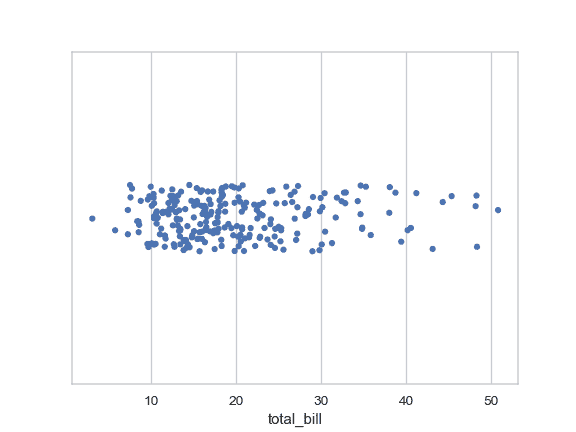

通过分类变量对条形图进行分组：

```py
>>> ax = sns.stripplot(x="day", y="total_bill", data=tips)

```


添加抖动以显示值的分布：

```py
>>> ax = sns.stripplot(x="day", y="total_bill", data=tips, jitter=True)

```

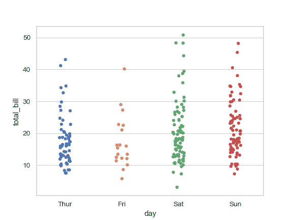

使用较少量的抖动：

```py
>>> ax = sns.stripplot(x="day", y="total_bill", data=tips, jitter=0.05)

```

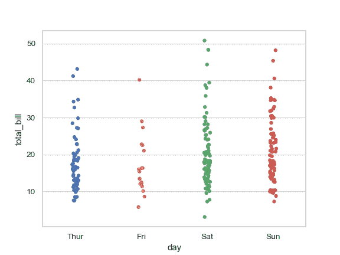

画水平条形图：

```py
>>> ax = sns.stripplot(x="total_bill", y="day", data=tips,
...                    jitter=True)

```

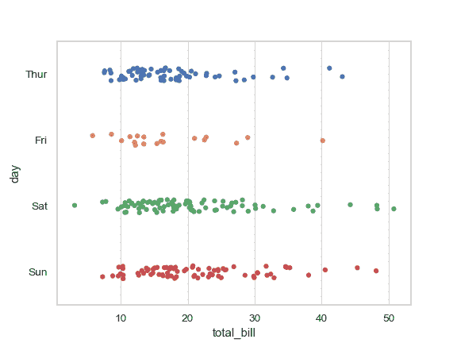

围绕要点绘制轮廓：

```py
>>> ax = sns.stripplot(x="total_bill", y="day", data=tips,
...                    jitter=True, linewidth=1)

```

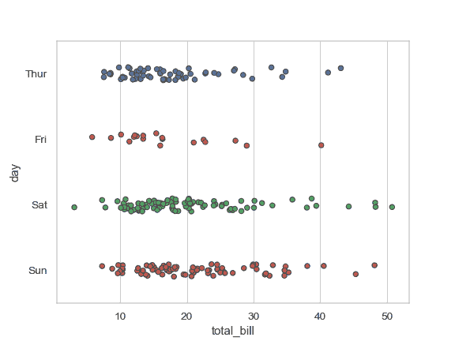

将条带嵌套在第二个分类变量中：

```py
>>> ax = sns.stripplot(x="sex", y="total_bill", hue="day",
...                    data=tips, jitter=True)

```

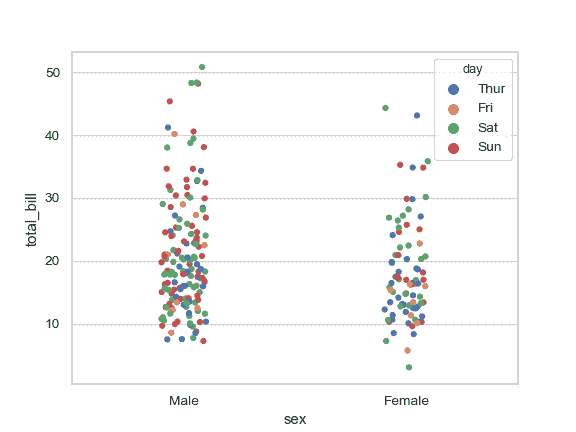

在主要分类轴上的不同位置绘制 `hue` 变量的每个级别：

```py
>>> ax = sns.stripplot(x="day", y="total_bill", hue="smoker",
...                    data=tips, jitter=True,
...                    palette="Set2", dodge=True)

```

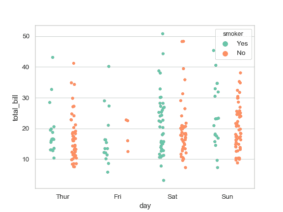

通过传递显式顺序来控制条带顺序：

```py
>>> ax = sns.stripplot(x="time", y="tip", data=tips,
...                    order=["Dinner", "Lunch"])

```

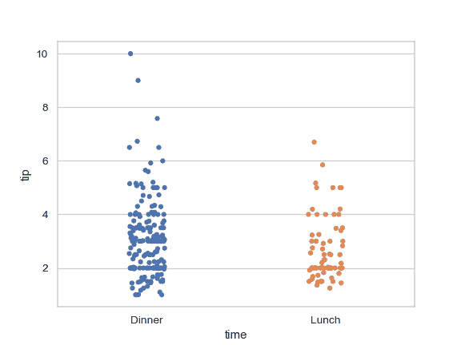

绘制具有大点和不同美感的条带：

```py
>>> ax =  sns.stripplot("day", "total_bill", "smoker", data=tips,
...                    palette="Set2", size=20, marker="D",
...                    edgecolor="gray", alpha=.25)

```

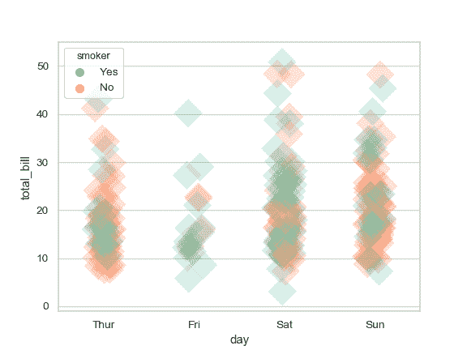

在箱形图上绘制观察条带：

```py
>>> ax = sns.boxplot(x="tip", y="day", data=tips, whis=np.inf)
>>> ax = sns.stripplot(x="tip", y="day", data=tips,
...                    jitter=True, color=".3")

```

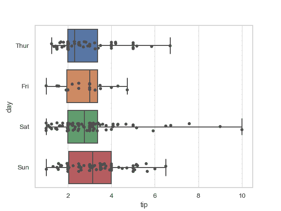

在小提琴情节的顶部绘制观察条带：
```py
>>> ax = sns.violinplot(x="day", y="total_bill", data=tips,
...                     inner=None, color=".8")
>>> ax = sns.stripplot(x="day", y="total_bill", data=tips, jitter=True)

```

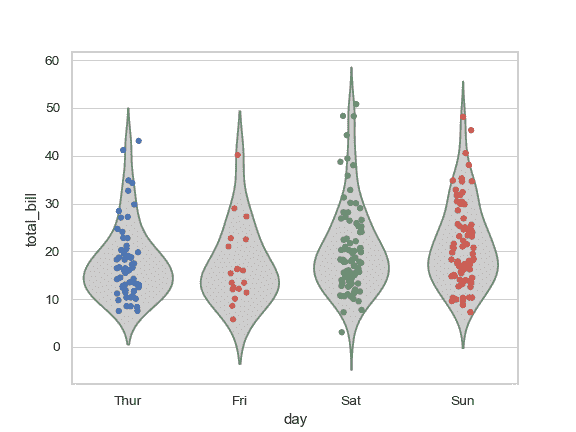

使用 [`catplot()`](seaborn.catplot.html#seaborn.catplot "seaborn.catplot") 组合[`stripplot()`](#seaborn.stripplot "seaborn.stripplot")和[`FacetGrid`](seaborn.FacetGrid.html#seaborn.FacetGrid "seaborn.FacetGrid")。这允许在其他分类变量中进行分组。使用[`catplot()`](seaborn.catplot.html#seaborn.catplot "seaborn.catplot")比直接使用[`FacetGrid`](seaborn.FacetGrid.html#seaborn.FacetGrid "seaborn.FacetGrid")更安全，因为它确保了跨方面的变量顺序的同步

```py
>>> g = sns.catplot(x="sex", y="total_bill",
...                 hue="smoker", col="time",
...                 data=tips, kind="strip",
...                 jitter=True,
...                 height=4, aspect=.7);

```

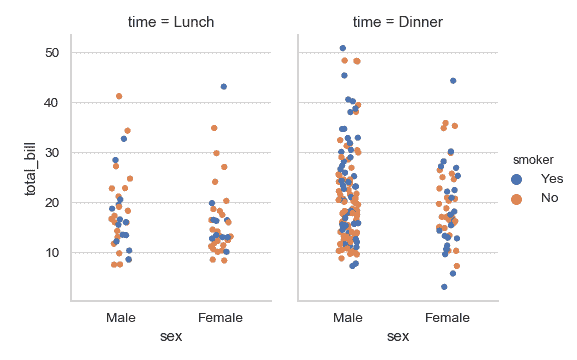
