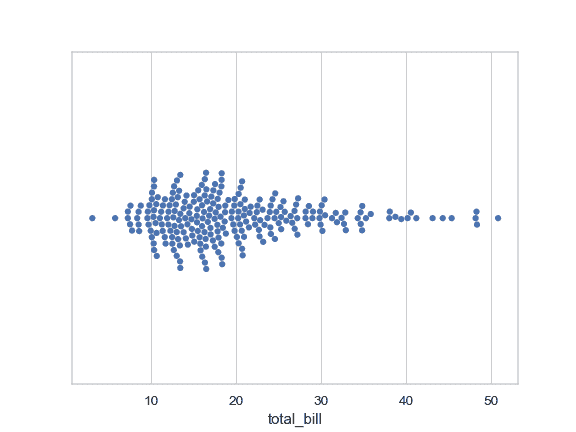
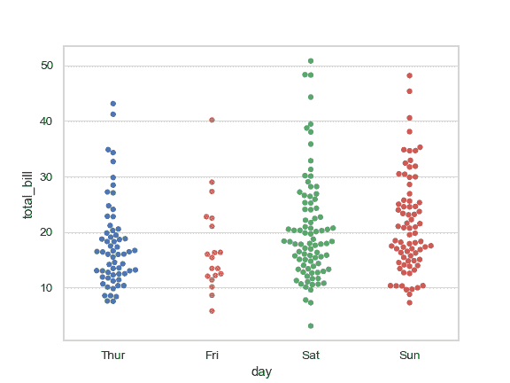
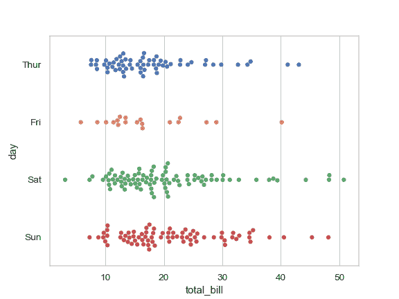
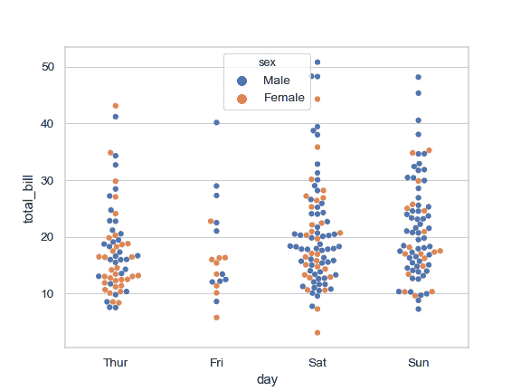
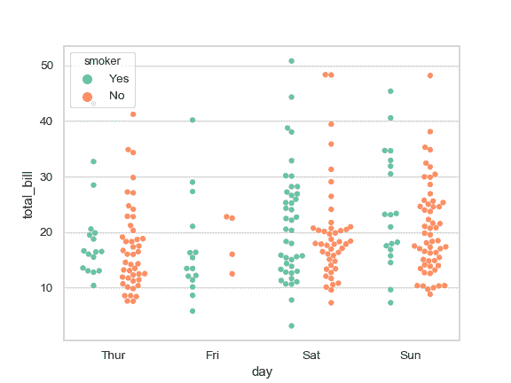
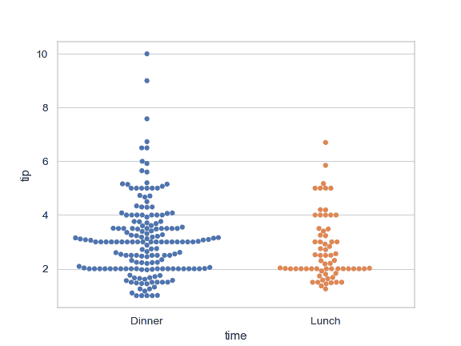
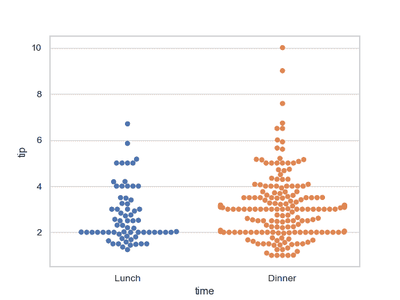
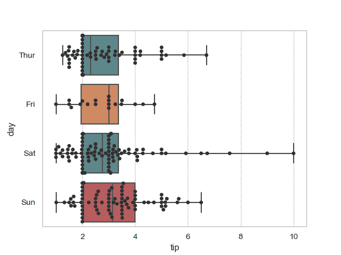
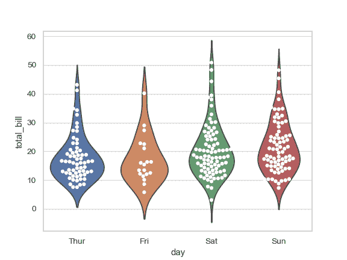

# seaborn.swarmplot

> 译者：[LIJIANcoder97](https://github.com/LIJIANcoder97)

```py
seaborn.swarmplot(x=None, y=None, hue=None, data=None, order=None, hue_order=None, dodge=False, orient=None, color=None, palette=None, size=5, edgecolor='gray', linewidth=0, ax=None, **kwargs)
```

绘制具有非重叠点的分类散点图。

此功能类似于 [`stripplot()`](seaborn.stripplot.html#seaborn.stripplot "seaborn.stripplot"),，但调整点（仅沿分类轴），以便它们不重叠。 这样可以更好地表示值的分布，但不能很好地扩展到大量观察值。这种情节有时被称为“诅咒”

一个群体图可以单独绘制，但如果你想要显示所有观察结果以及底层分布的一些表示，它也是一个盒子或小提琴图的良好补充。

正确排列点需要在数据和点坐标之间进行精确转换。这意味着必须在绘制绘图之前设置非默认轴限制。

输入数据可以以多种格式传递，包括：
*   表示为列表，numpy arrays 或 pandas Series objects 直接传递给`x`，`y`和/或`hue`参数。
*   “长格式” DataFrame, `x`，`y`和`hue`变量将决定数据的绘制方式
*   “宽格式”DataFrame，用于绘制每个数字列。
*   一个数组或向量列表。

在大多数情况下，可以使用 numpy 或 Python 对象，但最好使用 pandas 对象，因为关联的名称将用于注释轴。此外，您可以使用分类类型来分组变量来控制绘图元素的顺序。

此函数始终将其中一个变量视为分类，并在相关轴上的序数位置（0,1，... n）处绘制数据，即使数据具有数字或日期类型也是如此

有关更多信息，请参阅[教程](http://seaborn.pydata.org/tutorial/categorical.html#categorical-tutorial)。

参数：`x, y, hue`：`数据`或矢量数据中的变量名称，可选

> 用于绘制长格式数据的输入。查看解释示例。

`data`：DataFrame, array, or 或数组列表, 可选

> 用于绘图的数据集。 如果 `x` 和 `y` 是不存在的, 会被解释成 wide-form. 否则会被解释成 long-form.

`order, hue_order`：字符串列表，可选

> 命令绘制分类级别，否则从数据对象推断级别。

`dodge`：布尔，可选

> 使用`hue`嵌套时，将其设置为`True`将沿着分类轴分离不同色调级别的条带。 否则，每个级别的点将绘制在一个群中。

`orient`：“v” &#124; “h”, 可选

> 图的方向（垂直或水平）。这通常是从输入变量的 dtype 推断出来的，但可用于指定“分类”变量何时是数字或何时绘制宽格式数据。

`color`：matplotlib color, 可选

> 所有元素的颜色，或渐变调色板的种子。

`palette`：调色板名称, list, or dict, 可选

> 用于`hue`变量的不同级别的颜色。应该是[`color_palette()`](seaborn.color_palette.html#seaborn.color_palette "seaborn.color_palette"),可以解释的东西，或者是将色调级别映射到 matplotlib 颜色的字典。

`size`：float, 可选

> 标记的直径，以点为单位。 (尽管`plt.scatter`用于绘制点，但此处的`size`参数采用“普通”标记大小而不是大小^ 2，如`plt.scatter`。

`edgecolor`：matplotlib color, “灰色”是特殊的，可选

> 每个点周围线条的颜色。如果传递`"gray"`，则亮度由用于点体的调色板决定。

`linewidth`：float, 可选

> 构图元素的灰线宽度。

`ax`：matplotlib Axes, 可选

> Axes 对象将绘图绘制到，否则使用当前轴。


返回值：`ax`：matplotlib Axes

> 返回 Axes 对象，并在其上绘制绘图。


参看

带有类似 API 的传统盒须图。框图和核密度估计的组合。散点图，其中一个变量是分类的。可以与其他图一起使用以显示每个观察结果。使用类组合分类图：<cite>FacetGrid</cite>。

例

绘制单个水平群图：

```py
>>> import seaborn as sns
>>> sns.set(style="whitegrid")
>>> tips = sns.load_dataset("tips")
>>> ax = sns.swarmplot(x=tips["total_bill"])

```



通过分类变量对群组进行分组：

```py
>>> ax = sns.swarmplot(x="day", y="total_bill", data=tips)

```



绘制水平群：

```py
>>> ax = sns.swarmplot(x="total_bill", y="day", data=tips)

```



使用第二个分类变量为点着色：

```py
>>> ax = sns.swarmplot(x="day", y="total_bill", hue="sex", data=tips)

```



沿着分类轴拆分 `hue` 变量的每个级别：

```py
>>> ax = sns.swarmplot(x="day", y="total_bill", hue="smoker",
...                    data=tips, palette="Set2", dodge=True)

```



通过传递显式顺序来控制 swarm 顺序：

```py
>>> ax = sns.swarmplot(x="time", y="tip", data=tips,
...                    order=["Dinner", "Lunch"])

```



绘制使用更大的点

```py
>>> ax = sns.swarmplot(x="time", y="tip", data=tips, size=6)

```



在箱形图上绘制大量观察结果：

```py
>>> ax = sns.boxplot(x="tip", y="day", data=tips, whis=np.inf)
>>> ax = sns.swarmplot(x="tip", y="day", data=tips, color=".2")

```



在小提琴图的顶部画出大量的观察结果：

```py
>>> ax = sns.violinplot(x="day", y="total_bill", data=tips, inner=None)
>>> ax = sns.swarmplot(x="day", y="total_bill", data=tips,
...                    color="white", edgecolor="gray")

```



使用[`catplot()`](seaborn.catplot.html#seaborn.catplot "seaborn.catplot") 去组合 [`swarmplot()`](#seaborn.swarmplot "seaborn.swarmplot") 和 [`FacetGrid`](seaborn.FacetGrid.html#seaborn.FacetGrid "seaborn.FacetGrid"). 这允许在其他分类变量中进行分组。 使用 [`catplot()`](seaborn.catplot.html#seaborn.catplot "seaborn.catplot") 比直接使用 [`FacetGrid`](seaborn.FacetGrid.html#seaborn.FacetGrid "seaborn.FacetGrid") 更安全,因为它确保了跨 facet 的变量顺序的同步

```py
>>> g = sns.catplot(x="sex", y="total_bill",
...                 hue="smoker", col="time",
...                 data=tips, kind="swarm",
...                 height=4, aspect=.7);

```


