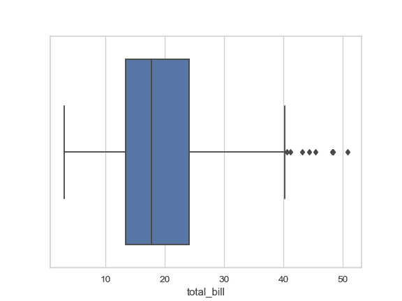
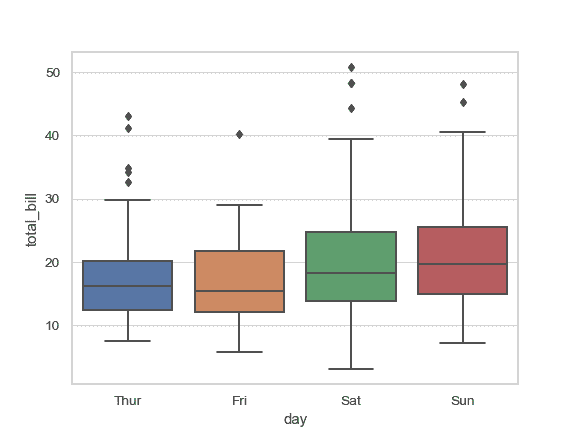
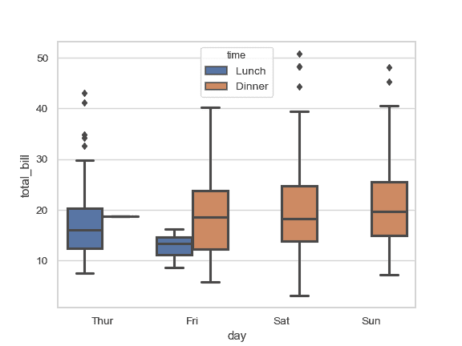
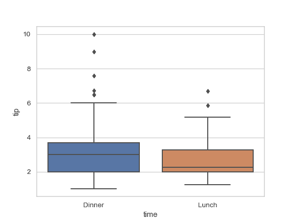
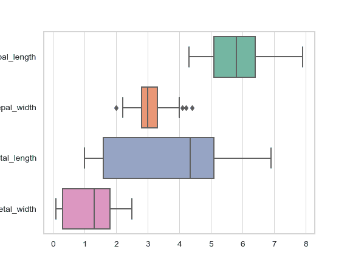
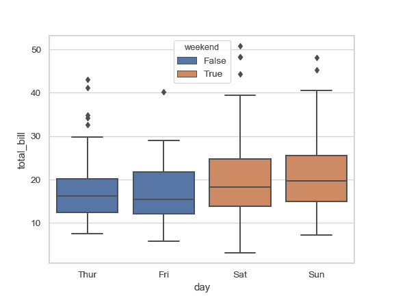
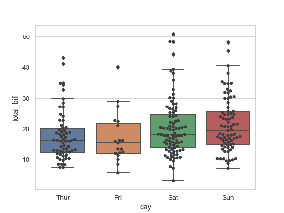
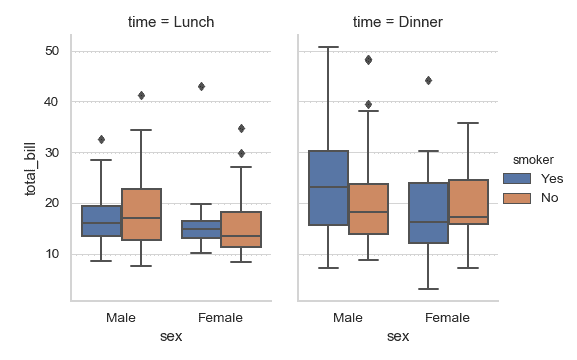

# seaborn.boxplot

> 译者：[FindNorthStar](https://github.com/FindNorthStar)

```py
seaborn.boxplot(x=None, y=None, hue=None, data=None, order=None, hue_order=None, orient=None, color=None, palette=None, saturation=0.75, width=0.8, dodge=True, fliersize=5, linewidth=None, whis=1.5, notch=False, ax=None, **kwargs)
```

seaborn.boxplot 接口的作用是绘制箱形图以展现与类别相关的数据分布状况。

箱形图（或盒须图）以一种利于变量之间比较或不同分类变量层次之间比较的方式来展示定量数据的分布。图中矩形框显示数据集的上下四分位数，而矩形框中延伸出的线段（触须）则用于显示其余数据的分布位置，剩下超过上下四分位间距的数据点则被视为“异常值”。

输入数据可以通过多种格式传入，包括：

*   格式为列表，numpy 数组或 pandas Series 对象的数据向量可以直接传递给`x`，`y`和`hue`参数。
*   对于长格式的 DataFrame，`x`，`y`，和`hue`参数会决定如何绘制数据。
*   对于宽格式的 DataFrame，每一列数值列都会被绘制。
*   一个数组或向量的列表。

在大多数情况下，可以使用 numpy 或 Python 对象，但更推荐使用 pandas 对象，因为与数据关联的列名/行名可以用于标注横轴/纵轴的名称。此外，您可以使用分类类型对变量进行分组以控制绘图元素的顺序。

此函数始终将其中一个变量视为分类，并在相关轴上的序数位置(0,1，... n)处绘制数据，即使数据属于数值类型或日期类型也是如此。

更多信息请参阅 [教程](../tutorial/categorical.html#categorical-tutorial)。

参数：`x, y, hue`：`数据`或向量数据中的变量名称，可选

> 用于绘制长格式数据的输入。查看样例以进一步理解。

`data`：DataFrame，数组，数组列表，可选

> 用于绘图的数据集。如果`x`和`y`都缺失，那么数据将被视为宽格式。否则数据被视为长格式。

`order, hue_order`：字符串列表，可选

> 控制分类变量（对应的条形图）的绘制顺序，若缺失则从数据中推断分类变量的顺序。

`orient`：“v” &#124; “h”，可选

> 控制绘图的方向（垂直或水平）。这通常是从输入变量的 dtype 推断出来的，但是当“分类”变量为数值型或绘制宽格式数据时可用于指定绘图的方向。

`color`：matplotlib 颜色，可选

> 所有元素的颜色，或渐变调色板的种子颜色。

`palette`：调色板名称，列表或字典，可选

> 用于`hue`变量的不同级别的颜色。可以从 [`color_palette()`](seaborn.color_palette.html#seaborn.color_palette "seaborn.color_palette") 得到一些解释，或者将色调级别映射到 matplotlib 颜色的字典。

`saturation`：float，可选

> 控制用于绘制颜色的原始饱和度的比例。通常大幅填充在轻微不饱和的颜色下看起来更好，如果您希望绘图颜色与输入颜色规格完美匹配可将其设置为`1`。

`width`：float，可选

> 不使用色调嵌套时完整元素的宽度，或主要分组变量一个级别的所有元素的宽度。

`dodge`：bool，可选

> 使用色调嵌套时，元素是否应沿分类轴移动。

`fliersize`：float，可选

> 用于表示异常值观察的标记的大小。

`linewidth`：float，可选

> 构图元素的灰线宽度。

`whis`：float，可选

> 控制在超过高低四分位数时 IQR 的比例，因此需要延长绘制的触须线段。超出此范围的点将被识别为异常值。

`notch`：boolean，可选

> 是否使矩形框“凹陷”以指示中位数的置信区间。还有其他几个参数可以控制凹槽的绘制方式；参见 `plt.boxplot` 以查看关于此问题的更多帮助信息。

`ax`：matplotlib 轴，可选

> 绘图时使用的 Axes 轴对象，否则使用当前 Axes 轴对象。

`kwargs`：键，值映射

> 其他在绘图时传给 `plt.boxplot` 的参数。


返回值：`ax`：matplotlib 轴

> 返回 Axes 对轴象，并在其上绘制绘图。


亦可参见

boxplot 和核密度估计的结合。当一个变量是分类变量的散点图。可以与其他图表结合使用以展示各自的观测结果。分类散点图的特点是其中数据点互不重叠。可以与其他图表结合使用以展示各自的观测结果。

示例

绘制一个单独的横向箱型图：

```py
>>> import seaborn as sns
>>> sns.set(style="whitegrid")
>>> tips = sns.load_dataset("tips")
>>> ax = sns.boxplot(x=tips["total_bill"])

```



根据分类变量分组绘制一个纵向的箱型图：

```py
>>> ax = sns.boxplot(x="day", y="total_bill", data=tips)

```



根据 2 个分类变量嵌套分组绘制一个箱型图：

```py
>>> ax = sns.boxplot(x="day", y="total_bill", hue="smoker",
...                  data=tips, palette="Set3")

```


当一些数据为空时根据嵌套分组绘制一个箱型图：

```py
>>> ax = sns.boxplot(x="day", y="total_bill", hue="time",
...                  data=tips, linewidth=2.5)

```



通过显式传入参数指定顺序控制箱型图的显示顺序：

```py
>>> ax = sns.boxplot(x="time", y="tip", data=tips,
...                  order=["Dinner", "Lunch"])

```



针对 DataFrame 里每一个数值型变量绘制箱型图：

```py
>>> iris = sns.load_dataset("iris")
>>> ax = sns.boxplot(data=iris, orient="h", palette="Set2")

```



使用 `hue` 参数无需改变箱型图的位置或宽度：

```py
>>> tips["weekend"] = tips["day"].isin(["Sat", "Sun"])
>>> ax = sns.boxplot(x="day", y="total_bill", hue="weekend",
...                  data=tips, dodge=False)

```



使用 [`swarmplot()`](seaborn.swarmplot.html#seaborn.swarmplot "seaborn.swarmplot") 展示箱型图顶部的数据点：

```py
>>> ax = sns.boxplot(x="day", y="total_bill", data=tips)
>>> ax = sns.swarmplot(x="day", y="total_bill", data=tips, color=".25")

```



把 [`catplot()`](seaborn.catplot.html#seaborn.catplot "seaborn.catplot") 与 [`pointplot()`](seaborn.pointplot.html#seaborn.pointplot "seaborn.pointplot") 以及 [`FacetGrid`](seaborn.FacetGrid.html#seaborn.FacetGrid "seaborn.FacetGrid") 结合起来使用。这允许您通过额外的分类变量进行分组。使用 [`catplot()`](seaborn.catplot.html#seaborn.catplot "seaborn.catplot") 比直接使用 [`FacetGrid`](seaborn.FacetGrid.html#seaborn.FacetGrid "seaborn.FacetGrid") 更为安全，因为它保证了不同切面上变量同步的顺序：

```py
>>> g = sns.catplot(x="sex", y="total_bill",
...                 hue="smoker", col="time",
...                 data=tips, kind="box",
...                 height=4, aspect=.7);

```

