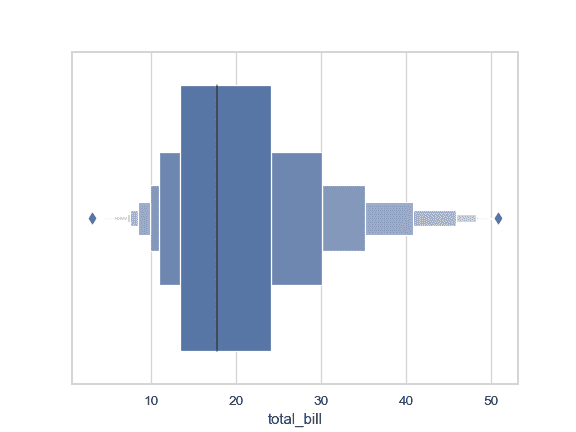
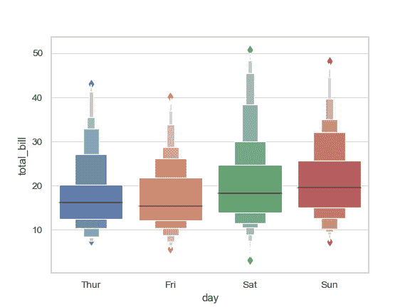
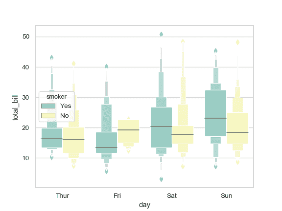
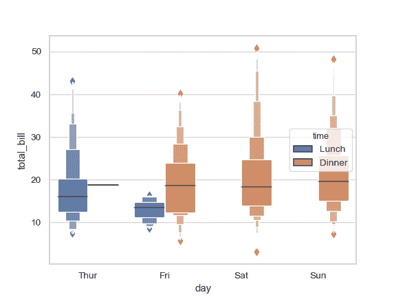
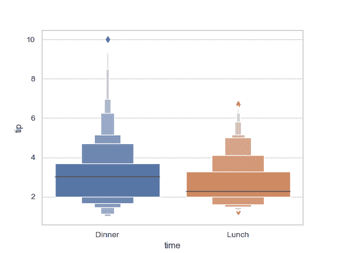
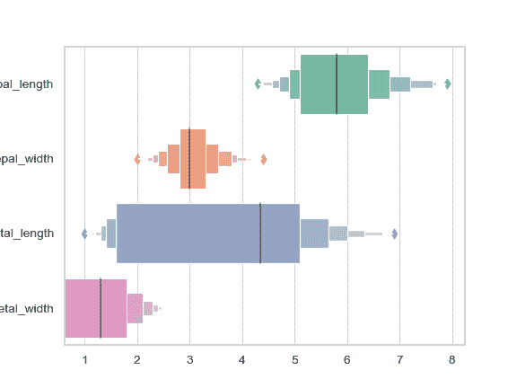
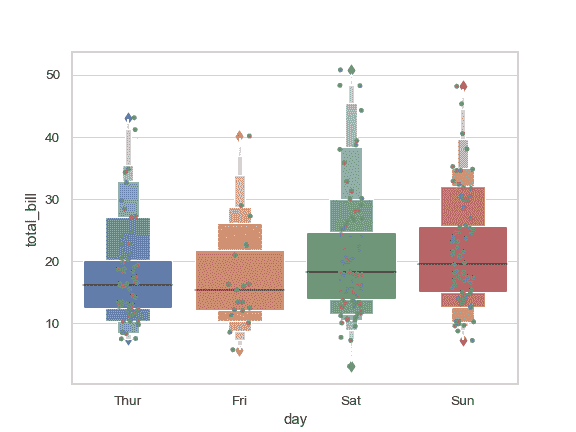
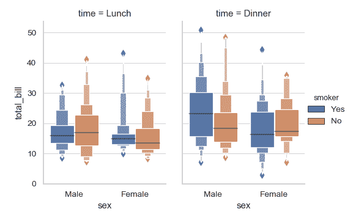

# seaborn.boxenplot

> 译者：[FindNorthStar](https://github.com/FindNorthStar)

```py
seaborn.boxenplot(x=None, y=None, hue=None, data=None, order=None, hue_order=None, orient=None, color=None, palette=None, saturation=0.75, width=0.8, dodge=True, k_depth='proportion', linewidth=None, scale='exponential', outlier_prop=None, ax=None, **kwargs)
```

为更大的数据集绘制增强的箱型图。

这种风格的绘图最初被命名为“信值图”，因为它显示了大量被定义为“置信区间”的分位数。它类似于绘制分布的非参数表示的箱形图，其中所有特征对应于实际观察的数值点。通过绘制更多分位数，它提供了有关分布形状的更多信息，特别是尾部数据的分布。欲了解更详细的解释，您可以阅读介绍该绘图的论文：

[https://vita.had.co.nz/papers/letter-value-plot.html](https://vita.had.co.nz/papers/letter-value-plot.html)

输入数据可以通过多种格式传入，包括：

*   格式为列表，numpy 数组或 pandas Series 对象的数据向量可以直接传递给`x`，`y`和`hue`参数。
*   对于长格式的 DataFrame，`x`，`y`，和`hue`参数会决定如何绘制数据。
*   对于宽格式的 DataFrame，每一列数值列都会被绘制。
*   一个数组或向量的列表。

在大多数情况下，可以使用 numpy 或 Python 对象，但更推荐使用 pandas 对象，因为与数据关联的列名/行名可以用于标注横轴/纵轴的名称。此外，您可以使用分类类型对变量进行分组以控制绘图元素的顺序。

此函数始终将其中一个变量视为分类，并在相关轴上的序数位置(0,1，... n)处绘制数据，即使数据属于数值类型或日期类型也是如此。

更多信息请参阅 [教程](http://seaborn.pydata.org/tutorial/categorical.html#categorical-tutorial)。

参数：`x, y, hue`：`data`或向量数据中的变量名称，可选

> 用于绘制长格式数据的输入。查看样例以进一步理解。

`data`：DataFrame，数组，数组列表，可选

> 用于绘图的数据集。如果`x`和`y`都缺失，那么数据将被视为宽格式。否则数据被视为长格式。

`order, hue_order`：字符串列表，可选

> 控制分类变量（对应的条形图）的绘制顺序，若缺失则从数据中推断分类变量的顺序。

`orient`：“v” &#124; “h”，可选

> 控制绘图的方向（垂直或水平）。这通常是从输入变量的 dtype 推断出来的，但是当“分类”变量为数值型或绘制宽格式数据时可用于指定绘图的方向。

`color`：matplotlib 颜色，可选

> 所有元素的颜色，或渐变调色板的种子颜色。

`palette`：调色板名称，列表或字典，可选

> 用于`hue`变量的不同级别的颜色。可以从 [`color_palette()`](seaborn.color_palette.html#seaborn.color_palette "seaborn.color_palette") 得到一些解释，或者将色调级别映射到 matplotlib 颜色的字典。

`saturation`：float，可选

> 控制用于绘制颜色的原始饱和度的比例。通常大幅填充在轻微不饱和的颜色下看起来更好，如果您希望绘图颜色与输入颜色规格完美匹配可将其设置为`1`。

`width`：float，可选

> 不使用色调嵌套时完整元素的宽度，或主要分组变量一个级别的所有元素的宽度。

`dodge`：bool，可选

> 使用色调嵌套时，元素是否应沿分类轴移动。

`k_depth`：“proportion” &#124; “tukey” &#124; “trustworthy”，可选

> 通过增大百分比的粒度控制绘制的盒形图数目。所有方法都在 Wickham 的论文中有详细描述。每个参数代表利用不同的统计特性对异常值的数量做出不同的假设。

`linewidth`：float，可选

> 构图元素的灰线宽度。

`scale`：“linear” &#124; “exponential” &#124; “area”

> 用于控制增强箱型图宽度的方法。所有参数都会给显示效果造成影响。 “linear” 通过恒定的线性因子减小宽度，“exponential” 使用未覆盖的数据的比例调整宽度， “area” 与所覆盖的数据的百分比成比例。

`outlier_prop`：float，可选

> 被认为是异常值的数据比例。与 `k_depth` 结合使用以确定要绘制的百分位数。默认值为 0.007 作为异常值的比例。该参数取值应在[0,1]范围内。

`ax`：matplotlib 轴，可选

> 绘图时使用的 Axes 轴对象，否则使用当前 Axes 轴对象。

`kwargs`：键，值映射

> 其他在绘制时传递给`plt.plot`和`plt.scatter`参数。


返回值：`ax`：matplotlib 轴

> 返回 Axes 对轴象，并在其上绘制绘图。


亦可参见

boxplot 和核密度估计的结合。一个传统的箱型图具有类似的 API。

示例

绘制一个独立的横向增强箱型图：

```py
>>> import seaborn as sns
>>> sns.set(style="whitegrid")
>>> tips = sns.load_dataset("tips")
>>> ax = sns.boxenplot(x=tips["total_bill"])

```



根据分类变量分组绘制一个纵向的增强箱型图：

```py
>>> ax = sns.boxenplot(x="day", y="total_bill", data=tips)

```



根据 2 个分类变量嵌套分组绘制一个增强箱型图：

```py
>>> ax = sns.boxenplot(x="day", y="total_bill", hue="smoker",
...                    data=tips, palette="Set3")

```



当一些数据为空时根据嵌套分组绘制一个增强箱型图：

```py
>>> ax = sns.boxenplot(x="day", y="total_bill", hue="time",
...                    data=tips, linewidth=2.5)

```



通过显式传入参数指定顺序控制箱型图的显示顺序：

```py
>>> ax = sns.boxenplot(x="time", y="tip", data=tips,
...                    order=["Dinner", "Lunch"])

```



针对 DataFrame 里每一个数值型变量绘制增强箱型图：

```py
>>> iris = sns.load_dataset("iris")
>>> ax = sns.boxenplot(data=iris, orient="h", palette="Set2")

```



使用 [`stripplot()`](seaborn.stripplot.html#seaborn.stripplot "seaborn.stripplot") 显示箱型图顶部的数据点：

```py
>>> ax = sns.boxenplot(x="day", y="total_bill", data=tips)
>>> ax = sns.stripplot(x="day", y="total_bill", data=tips,
...                    size=4, jitter=True, color="gray")

```



将 [`catplot()`](seaborn.catplot.html#seaborn.catplot "seaborn.catplot") to combine [`boxenplot()`](#seaborn.boxenplot "seaborn.boxenplot") 以及 [`FacetGrid`](seaborn.FacetGrid.html#seaborn.FacetGrid "seaborn.FacetGrid") 结合起来使用。这允许您通过额外的分类变量进行分组。使用 [`catplot()`](seaborn.catplot.html#seaborn.catplot "seaborn.catplot") 比直接使用 [`FacetGrid`](seaborn.FacetGrid.html#seaborn.FacetGrid "seaborn.FacetGrid") 更为安全，因为它保证了不同切面上变量同步的顺序：

```py
>>> g = sns.catplot(x="sex", y="total_bill",
...                 hue="smoker", col="time",
...                 data=tips, kind="boxen",
...                 height=4, aspect=.7);

```


