# seaborn.pointplot

> 译者：[FindNorthStar](https://github.com/FindNorthStar)

```py
seaborn.pointplot(x=None, y=None, hue=None, data=None, order=None, hue_order=None, estimator=<function mean>, ci=95, n_boot=1000, units=None, markers='o', linestyles='-', dodge=False, join=True, scale=1, orient=None, color=None, palette=None, errwidth=None, capsize=None, ax=None, **kwargs)
```

通过绘制散点连线显示数据点的估计值和置信区间。

点图代表散点图位置的数值变量的中心趋势估计，并使用误差线提供关于该估计的不确定性的一些指示。

点图比条形图在聚焦一个或多个分类变量的不同级别之间的比较时更为有用。点图尤其善于表现交互作用：一个分类变量的层次之间的关系如何在第二个分类变量的层次之间变化。连接来自相同 `色调` 等级的每个点的线允许交互作用通过斜率的差异进行判断，这使得更容易对几组数据点或数据线的高度进行比较。

重要的一点是点图仅显示平均值（或其他估计值），但在许多情况下，显示分类变量的每个级别的值的分布可能会带有更多信息。在这种情况下，其他绘图方法，例如箱型图或小提琴图可能更合适。

输入数据可以通过多种格式传入，包括：

*   格式为列表，numpy 数组或 pandas Series 对象的数据向量可以直接传递给`x`，`y`和`hue`参数。
*   对于长格式的 DataFrame，`x`，`y`，和`hue`参数会决定如何绘制数据。
*   对于宽格式的 DataFrame，每一列数值列都会被绘制。
*   一个数组或向量的列表。

在大多数情况下，可以使用 numpy 或 Python 对象，但更推荐使用 pandas 对象，因为与数据关联的列名/行名可以用于标注横轴/纵轴的名称。此外，您可以使用分类类型对变量进行分组以控制绘图元素的顺序。

此函数始终将其中一个变量视为分类，并在相关轴上的序数位置(0,1，... n)处绘制数据，即使数据属于数值类型或日期类型也是如此。

更多信息请参阅 [教程](http://seaborn.pydata.org/tutorial/categorical.html#categorical-tutorial)。

参数：`x, y, hue`：`data`或向量数据中的变量名称，可选

> 用于绘制长格式数据的输入。查看样例以进一步理解。

`data`：DataFrame，数组，数组列表，可选

> 于绘图的数据集。如果`x`和`y`都缺失，那么数据将被视为宽格式。否则数据被视为长格式。

`order, hue_order`：字符串列表，可选

> 控制绘图的方向（垂直或水平）。这通常是从输入变量的 dtype 推断出来的，但是当“分类”变量为数值型或绘制宽格式数据时可用于指定绘图的方向。

`estimator`：调用函数实现向量 -&gt; 标量的映射，可选

> 在每个分箱内进行估计的统计函数。

`ci`：float 或 “sd” 或 None，可选

> 在估计值附近绘制置信区间的尺寸大小。如果是“sd”，则跳过引导阶段并绘制观察数据点的标准差。如果为 `None`，则不会执行引导过程，并且不会绘制误差块。

`n_boot`：int，可选

> 计算置信区间时使用的引导迭代次数。

`units`：`data` 或 vector data 中变量的名称，可选

> 采样单元的标识符，用于执行多级引导过程（计算置信区间等）并能够处理重复测量的设定。

`markers`：字符串或字符串列表，可选

> 用于每个`hue`色调的级别的标记。

`linestyles`：字符串或字符串列表，可选

> 用于每个`hue`色调的级别的线条风格。

`dodge`：bool 或 float，可选

> 用于沿着分类轴分离`hue`变量的每个级别数据点的数量。

`join`：bool，可选

> 如果为`True`，则在`hue`级别相同的点估计值之间绘制线条。

`scale`：float，可选

> 绘图元素的比例因子。

`orient`：“v” &#124; “h”，可选

> 控制绘图的方向（垂直或水平）。这通常是从输入变量的 dtype 推断出来的，但是当“分类”变量为数值型或绘制宽格式数据时可用于指定绘图的方向。

`color`：matplotlib 颜色，可选

> 所有元素的颜色，或渐变调色板的种子颜色。

`palette`：调色板名称，列表或字典，可选

> 用于`hue`变量的不同级别的颜色。可以从 [`color_palette()`](seaborn.color_palette.html#seaborn.color_palette "seaborn.color_palette") 得到一些解释，或者将色调级别映射到 matplotlib 颜色的字典。

`errwidth`：float，可选

> 误差线（和上下限指示线）的厚度。

`capsize`：float，可选

> 误差线“上下限指示线”的宽度。

`ax`：matplotlib 轴，可选

> 绘图时使用的 Axes 轴对象，否则使用当前 Axes 轴对象。


返回值：`ax`：matplotlib 轴

> 返回 Axes 对轴象，并在其上绘制绘图。


亦可参见

使用线条显示数据点的估计值和置信区间。将分类类别的绘图与该类结合使用：<cite>FacetGrid</cite>。

示例

绘制一组按分类变量分组的纵向点图：

```py
>>> import seaborn as sns
>>> sns.set(style="darkgrid")
>>> tips = sns.load_dataset("tips")
>>> ax = sns.pointplot(x="time", y="total_bill", data=tips)

```

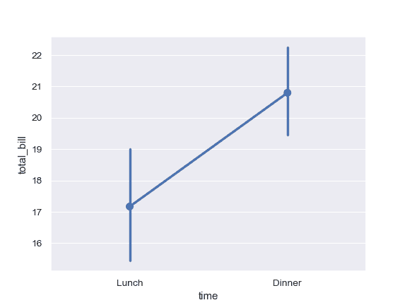

通过两个嵌套分组的变量绘制一组纵向的点图：

```py
>>> ax = sns.pointplot(x="time", y="total_bill", hue="smoker",
...                    data=tips)

```

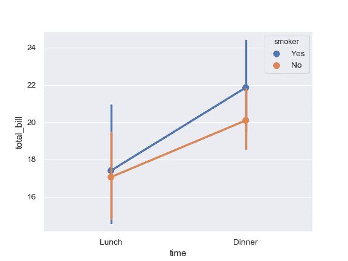

沿着分类轴分离不同色调级别的点：

```py
>>> ax = sns.pointplot(x="time", y="total_bill", hue="smoker",
...                    data=tips, dodge=True)

```

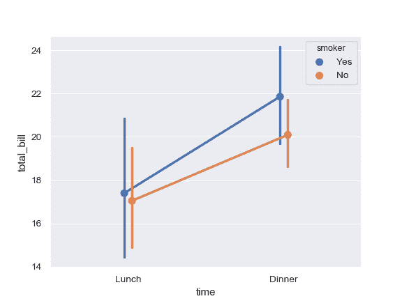

根据色调级别使用不同的标记和线条样式：

```py
>>> ax = sns.pointplot(x="time", y="total_bill", hue="smoker",
...                    data=tips,
...                    markers=["o", "x"],
...                    linestyles=["-", "--"])

```

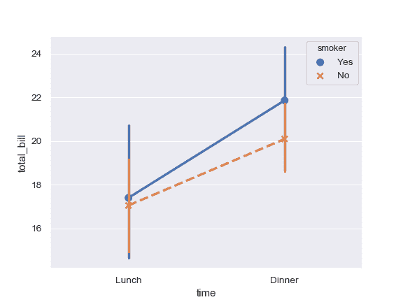

绘制一组横向的点图：

```py
>>> ax = sns.pointplot(x="tip", y="day", data=tips)

```

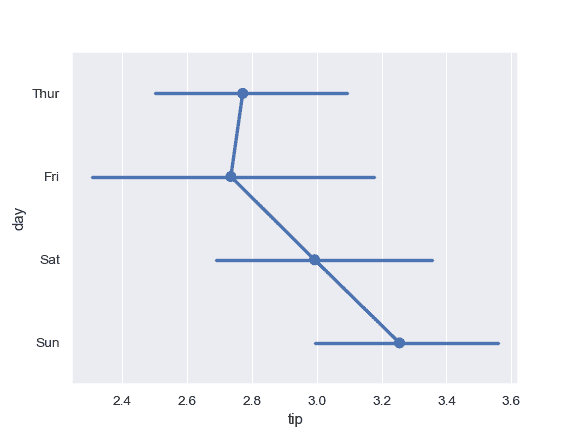

不要绘制每个点的连接线：

```py
>>> ax = sns.pointplot(x="tip", y="day", data=tips, join=False)

```

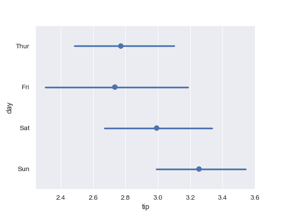

对单层图使用不同的颜色：

```py
>>> ax = sns.pointplot("time", y="total_bill", data=tips,
...                    color="#bb3f3f")

```

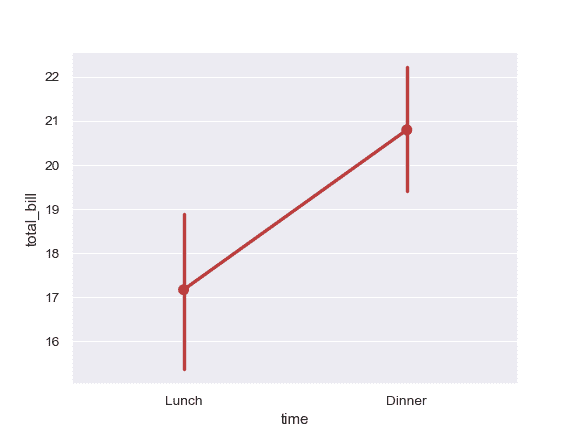

为数据点使用不同的调色板：

```py
>>> ax = sns.pointplot(x="time", y="total_bill", hue="smoker",
...                    data=tips, palette="Set2")

```

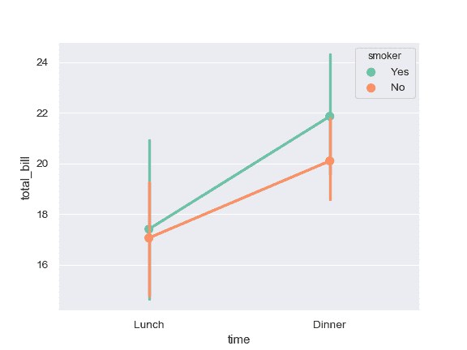

通过显式传入参数指定顺序控制点的显示顺序：

```py
>>> ax = sns.pointplot(x="time", y="tip", data=tips,
...                    order=["Dinner", "Lunch"])

```

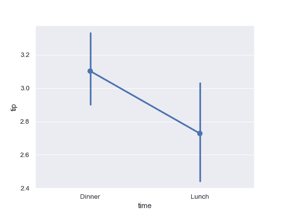

用中位数作为集中趋势的估计：

```py
>>> from numpy import median
>>> ax = sns.pointplot(x="day", y="tip", data=tips, estimator=median)

```

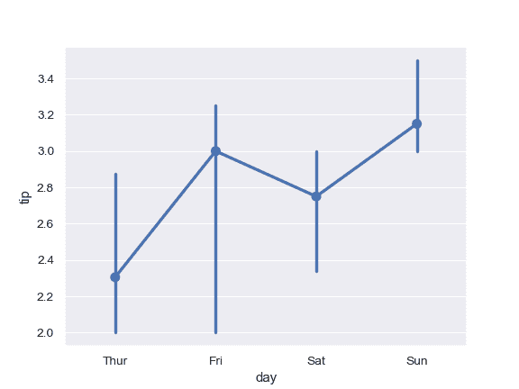

用误差线显示均值的标准误差：

```py
>>> ax = sns.pointplot(x="day", y="tip", data=tips, ci=68)

```

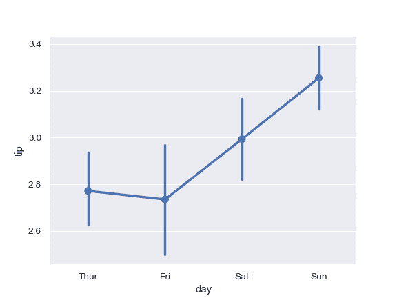

显示观测值的标准偏差而不是置信区间：

```py
>>> ax = sns.pointplot(x="day", y="tip", data=tips, ci="sd")

```

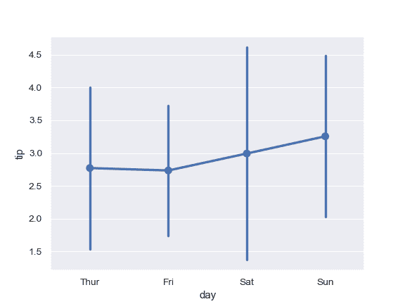

将“上下限指示线”增加到误差线的顶部和底部：

```py
>>> ax = sns.pointplot(x="day", y="tip", data=tips, capsize=.2)

```

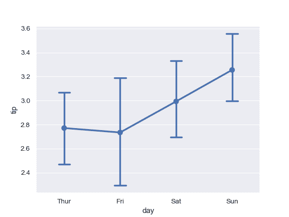

将 [`catplot()`](seaborn.catplot.html#seaborn.catplot "seaborn.catplot") 与 [`barplot()`](seaborn.barplot.html#seaborn.barplot "seaborn.barplot") 以及 [`FacetGrid`](seaborn.FacetGrid.html#seaborn.FacetGrid "seaborn.FacetGrid")结合使用。这允许您通过额外的分类变量进行分组。使用 [`catplot()`](seaborn.catplot.html#seaborn.catplot "seaborn.catplot") 比直接使用 [`FacetGrid`](seaborn.FacetGrid.html#seaborn.FacetGrid "seaborn.FacetGrid") 更为安全，因为它保证了不同切面上变量同步的顺序：

```py
>>> g = sns.catplot(x="sex", y="total_bill",
...                 hue="smoker", col="time",
...                 data=tips, kind="point",
...                 dodge=True,
...                 height=4, aspect=.7);

```

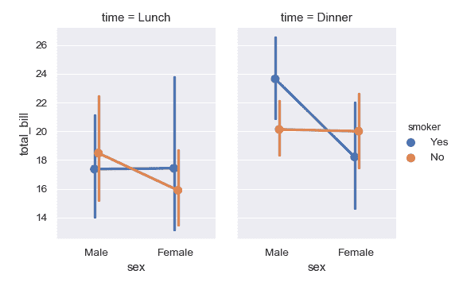