# seaborn.barplot

> 译者：[melon-bun](https://github.com/melon-bun)

```py
seaborn.barplot(x=None, y=None, hue=None, data=None, order=None, hue_order=None, estimator=<function mean>, ci=95, n_boot=1000, units=None, orient=None, color=None, palette=None, saturation=0.75, errcolor='.26', errwidth=None, capsize=None, dodge=True, ax=None, **kwargs)
```

条形图以矩形条的方式展示数据的点估值和置信区间

条形图用每个矩形的高度来表示数值变量的集中趋势的估计值，并提供误差条来显示估计值得不确定度。条形图的纵轴是从零开始的，这对于 0 值是有意义的情况是非常好的。

对于数据集中的 0 值没有实际意义的情况，散点图可以让您专注于一个或多个分类变量之间的差异。

要注意的是，条形图只显示平均值（或者其他的估计值），但是在大部分情况下，展示数值在不同分类变量上的分布会更有用。如果要表示出数据的分布，用箱型图或者小提琴图会更恰当。

输入数据的格式可以不同，包括：

*   以列表，numpy array 或者 pandas 中的 Series object 表示的向量。这些向量可以直接传入 `x`, `y`, 以及 `hue` 参数。
*   长表, x 值，y 值和色相变量决定了数据是如何绘制的。
*   宽表，每个列的数值都会被绘制出来.
*   数组或者列表的向量。

大多数情况下，您可以使用 numpy 的对象或者 python 的对象，但是用 pandas 对象更好，因为相关的列名会被标注在图标上。 另外，为了控制绘图元素 您也可以可以用分类类型来组合不同的变量。

这个函数始终把一个变量当做分类变量，即使这个数据是数值类型或者日期类型，并且按照序数顺序绘制在相关的轴上。

详情请看[教程](../tutorial/categorical.html#categorical-tutorial)。

参数：`x, y, hue`：`data` 中的变量名词或者向量, optional

> 用于绘制 long-form 数据的变量名称.

`data`：DataFrame, 数组, 数组列表, optional

> 用于绘图的数据集。如果数据集有 x 和 y，数据集会被认为是 long-form，否则会被认为是 wide-form。

`order, hue_order`：字符串列表, optional

> 绘制类别变量的顺序，如果没有，则从数据对象中推断绘图顺序。

`estimator`：映射向量 -&gt; 标量, optional

> 统计函数用于估计每个分类纸条中的值。.

`ci`：float or “sd” or None, optional

> 估计值周围的置信区间大小。如果输入的是 “sd”（标准差），会跳过 bootstrapping 的过程，只绘制数据的标准差。 如果输入是的是`None`, 不会执行 botstrapping，而且错误条也不会绘制。

`n_boot`：int, optional

> 计算置信区间需要的 Boostrap 迭代次数。

`units`：name of variable in `data` or vector data, optional

> 采样单元的标识符，用于执行多级 bootstrap 并解释重复测量设计。

`orient`：“v” &#124; “h”, optional

> 绘图的方向（垂直或水平）。这通常是从输入变量的数据类型推断出来的，但是可以用来指定“分类”变量是数字还是宽格式数据。

`color`：matplotlib color, optional

> 作用于所有元素的颜色，或者渐变色的种子。

`palette`：palette name, list, or dict, optional

> 不同级别的 `hue` 变量的颜色。 颜色要能被 [`color_palette()`]解释(seaborn.color_palette.html#seaborn.color_palette "seaborn.color_palette"), 或者一个能映射到 matplotlib 颜色的字典。

`saturation`：float, optional

>  Proportion of the original saturation to draw colors at. Large patches often look better with slightly desaturated colors, but set this to `1` if you want the plot colors to perfectly match the input color spec.

`errcolor`：matplotlib color

> 表示置信区间的线的颜色。

`errwidth`：float, optional

> 误差条的线的厚度。

`capsize`：float, optional

> 误差条端部的宽度。

**dodge** : 布尔型, optional

> When hue nesting is used, whether elements should be shifted along the categorical axis.

`ax`：matplotlib Axes, optional

> 指定一个 Axes 用于绘图，如果不指定，则使用当前的 Axes。

`kwargs`：key, value mappings

> 其他的关键词参数在绘图时通过 `plt.bar` 传入。

返回值：`ax`：matplotlib Axes

> 返回有图表绘制的 Axes 对象。


See also

显示每个分类 bin 中的观察计数。使用散点图图示符显示点估计和置信区间。将分类图与类相结合:<cite>FacetGrid</cite>.

Examples

绘制一组按类别变量分组的垂直条形图：

```py
>>> import seaborn as sns
>>> sns.set(style="whitegrid")
>>> tips = sns.load_dataset("tips")
>>> ax = sns.barplot(x="day", y="total_bill", data=tips)

```

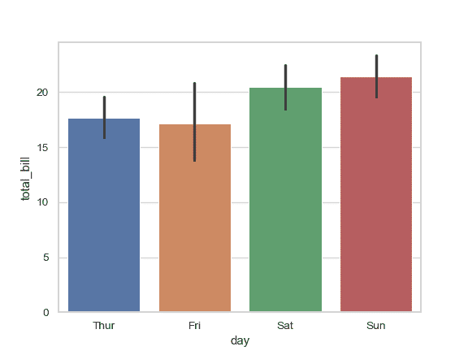

绘制一组由两个变量嵌套分组的垂直条形图：

```py
>>> ax = sns.barplot(x="day", y="total_bill", hue="sex", data=tips)

```


绘制一组水平条形图：

```py
>>> ax = sns.barplot(x="tip", y="day", data=tips)

```

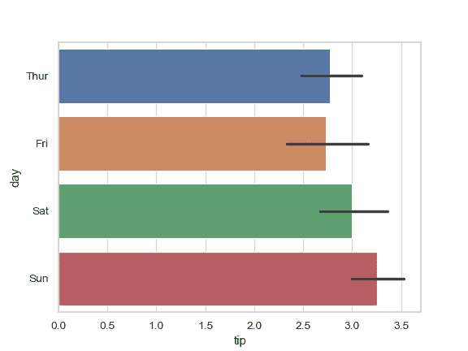

通过传入一个显式的顺序来控制条柱的顺序：

```py
>>> ax = sns.barplot(x="time", y="tip", data=tips,
...                  order=["Dinner", "Lunch"])

```

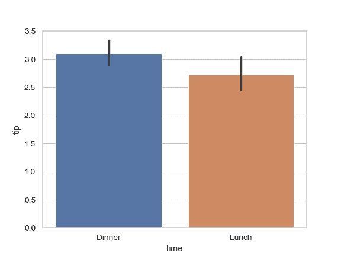

用中值来评估数据的集中趋势：

```py
>>> from numpy import median
>>> ax = sns.barplot(x="day", y="tip", data=tips, estimator=median)

```

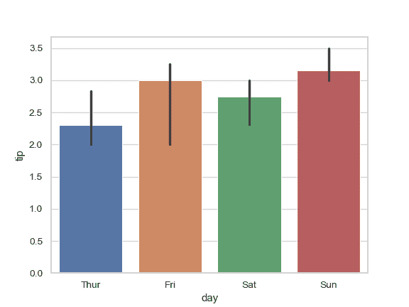

用误差条显示平均值的标准误差：

```py
>>> ax = sns.barplot(x="day", y="tip", data=tips, ci=68)

```

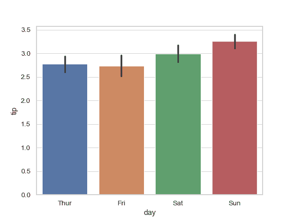

展示数据的标准差：

```py
>>> ax = sns.barplot(x="day", y="tip", data=tips, ci="sd")

```

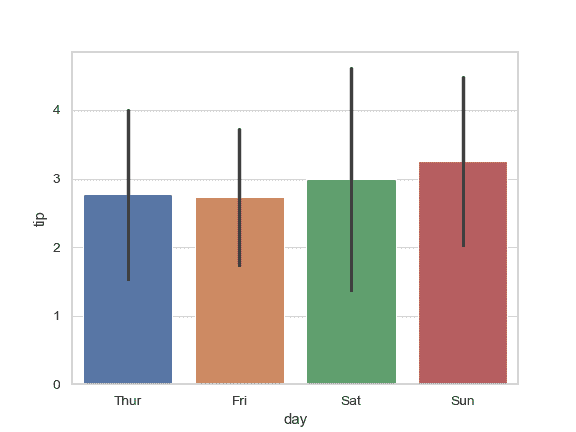

给误差条增加“端点”：

```py
>>> ax = sns.barplot(x="day", y="tip", data=tips, capsize=.2)

```

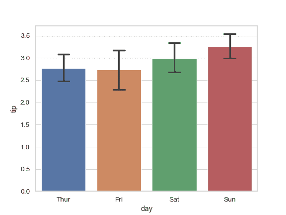

使用一个不同的调色盘来绘制图案：

```py
>>> ax = sns.barplot("size", y="total_bill", data=tips,
...                  palette="Blues_d")

```


在不改变条柱的位置或者宽度的前提下，使用 `hue` :

```py
>>> tips["weekend"] = tips["day"].isin(["Sat", "Sun"])
>>> ax = sns.barplot(x="day", y="total_bill", hue="weekend",
...                  data=tips, dodge=False)

```

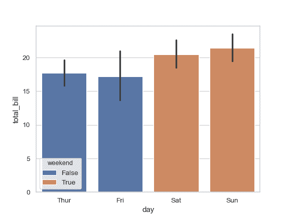

用同一种颜色绘制所有条柱：

```py
>>> ax = sns.barplot("size", y="total_bill", data=tips,
...                  color="salmon", saturation=.5)

```

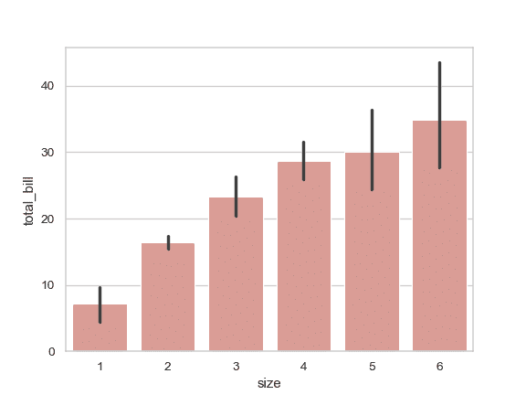

用 `plt.bar` 关键字参数进一步改变图表的样式：

```py
>>> ax = sns.barplot("day", "total_bill", data=tips,
...                  linewidth=2.5, facecolor=(1, 1, 1, 0),
...                  errcolor=".2", edgecolor=".2")

```

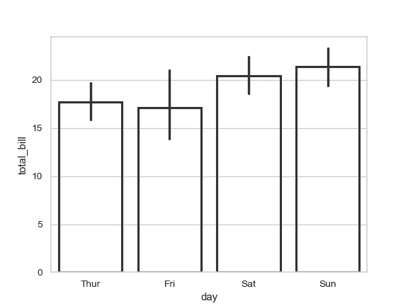

使用 [`catplot()`](seaborn.catplot.html#seaborn.catplot "seaborn.catplot") 来结合 [`barplot()`](#seaborn.barplot "seaborn.barplot") 和 [`FacetGrid`](seaborn.FacetGrid.html#seaborn.FacetGrid "seaborn.FacetGrid"). 这允许数据根据额外的类别变量分组。使用 [`catplot()`](seaborn.catplot.html#seaborn.catplot "seaborn.catplot") 比直接使用 [`FacetGrid`](seaborn.FacetGrid.html#seaborn.FacetGrid "seaborn.FacetGrid") 更安全, 因为它可以确保变量在不同的 facet 之间保持同步:

```py
>>> g = sns.catplot(x="sex", y="total_bill",
...                 hue="smoker", col="time",
...                 data=tips, kind="bar",
...                 height=4, aspect=.7);

```

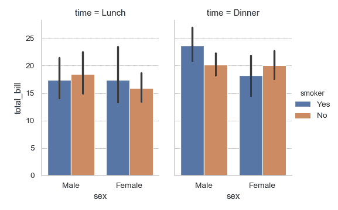
