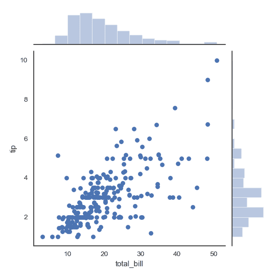
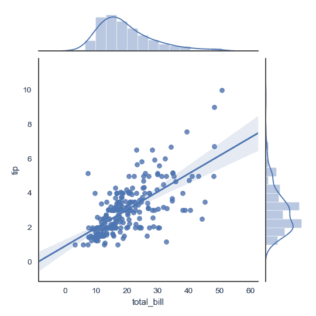
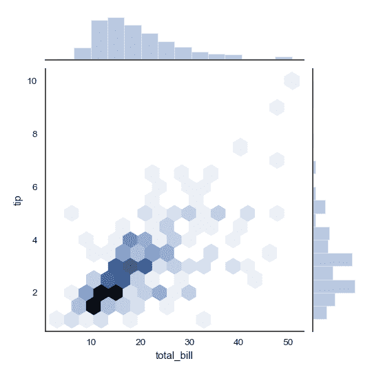
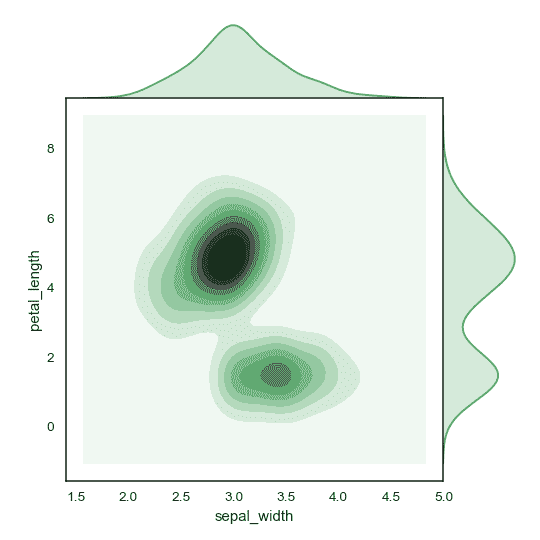
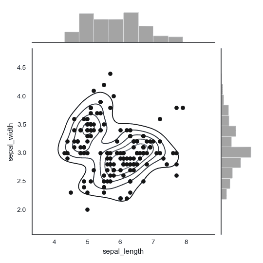
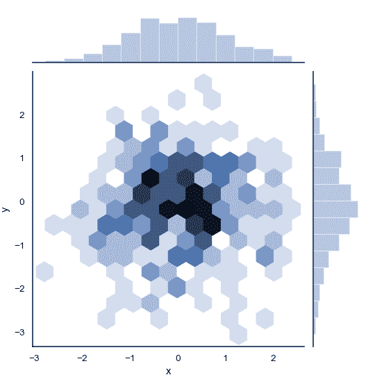
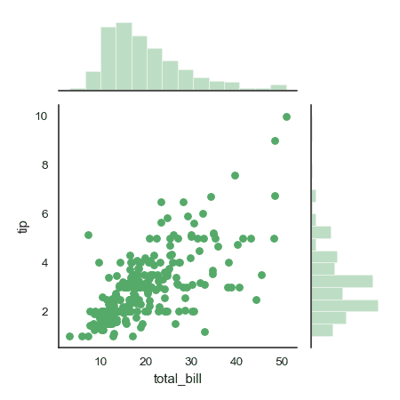
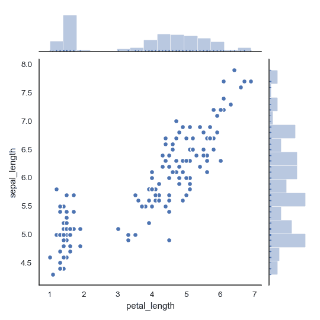

# seaborn.jointplot

> 译者：[Stuming](https://github.com/Stuming)

```py
seaborn.jointplot(x, y, data=None, kind='scatter', stat_func=None, color=None, height=6, ratio=5, space=0.2, dropna=True, xlim=None, ylim=None, joint_kws=None, marginal_kws=None, annot_kws=None, **kwargs)
```

绘制两个变量的双变量及单变量图。

这个函数提供调用[`JointGrid`](seaborn.JointGrid.html#seaborn.JointGrid "seaborn.JointGrid")类的便捷接口，以及一些封装好的绘图类型。这是一个轻量级的封装，如果需要更多的灵活性，应当直接使用[`JointGrid`](seaborn.JointGrid.html#seaborn.JointGrid "seaborn.JointGrid").

参数：`x, y`：strings 或者 vectors

> `data`中的数据或者变量名。

`data`：DataFrame, 可选

> 当`x`和`y`为变量名时的 DataFrame.

`kind`：{ “scatter” &#124; “reg” &#124; “resid” &#124; “kde” &#124; “hex” }, 可选

> 绘制图像的类型。

`stat_func`：可调用的，或者 None, 可选

> 已过时

`color`：matplotlib 颜色, 可选

> 用于绘制元素的颜色。

`height`：numeric, 可选

> 图像的尺寸（方形）。

`ratio`：numeric, 可选

>  中心轴的高度与侧边轴高度的比例

`space`：numeric, 可选

> 中心和侧边轴的间隔大小

`dropna`：bool, 可选

> 如果为 True, 移除`x`和`y`中的缺失值。

`{x, y}lim`：two-tuples, 可选

> 绘制前设置轴的范围。

`{joint, marginal, annot}_kws`：dicts, 可选

> 额外的关键字参数。

`kwargs`：键值对

> 额外的关键字参数会被传给绘制中心轴图像的函数，取代`joint_kws`字典中的项。


返回值：`grid`：[`JointGrid`](seaborn.JointGrid.html#seaborn.JointGrid "seaborn.JointGrid")

> [`JointGrid`](seaborn.JointGrid.html#seaborn.JointGrid "seaborn.JointGrid")对象.


参考

绘制图像的 Grid 类。如果需要更多的灵活性，可以直接使用 Grid 类。

示例

绘制带有侧边直方图的散点图:

```py
>>> import numpy as np, pandas as pd; np.random.seed(0)
>>> import seaborn as sns; sns.set(style="white", color_codes=True)
>>> tips = sns.load_dataset("tips")
>>> g = sns.jointplot(x="total_bill", y="tip", data=tips)

```



添加回归线及核密度拟合:

```py
>>> g = sns.jointplot("total_bill", "tip", data=tips, kind="reg")

```



将散点图替换为六角形箱体图:

```py
>>> g = sns.jointplot("total_bill", "tip", data=tips, kind="hex")

```



将散点图和直方图替换为密度估计，并且将侧边轴与中心轴对齐:

```py
>>> iris = sns.load_dataset("iris")
>>> g = sns.jointplot("sepal_width", "petal_length", data=iris,
...                   kind="kde", space=0, color="g")

```



绘制散点图，添加中心密度估计:

```py
>>> g = (sns.jointplot("sepal_length", "sepal_width",
...                    data=iris, color="k")
...         .plot_joint(sns.kdeplot, zorder=0, n_levels=6))

```



不适用 Pandas, 直接传输向量，随后给轴命名:

```py
>>> x, y = np.random.randn(2, 300)
>>> g = (sns.jointplot(x, y, kind="hex")
...         .set_axis_labels("x", "y"))

```



绘制侧边图空间更大的图像:

```py
>>> g = sns.jointplot("total_bill", "tip", data=tips,
...                   height=5, ratio=3, color="g")

```



传递关键字参数给后续绘制函数:

```py
>>> g = sns.jointplot("petal_length", "sepal_length", data=iris,
...                   marginal_kws=dict(bins=15, rug=True),
...                   annot_kws=dict(stat="r"),
...                   s=40, edgecolor="w", linewidth=1)

```

