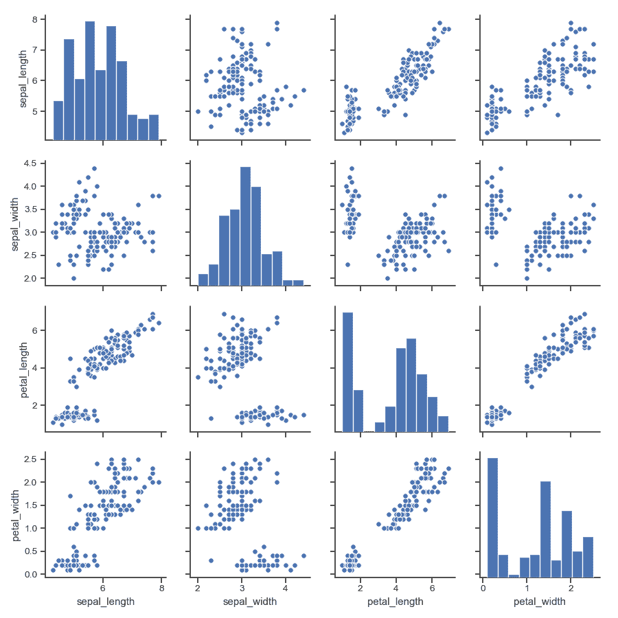
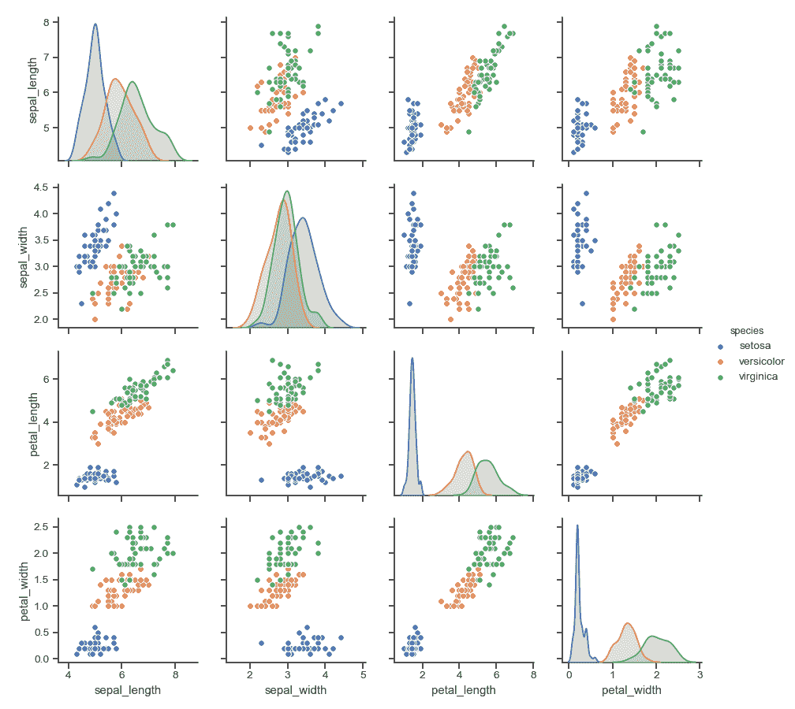
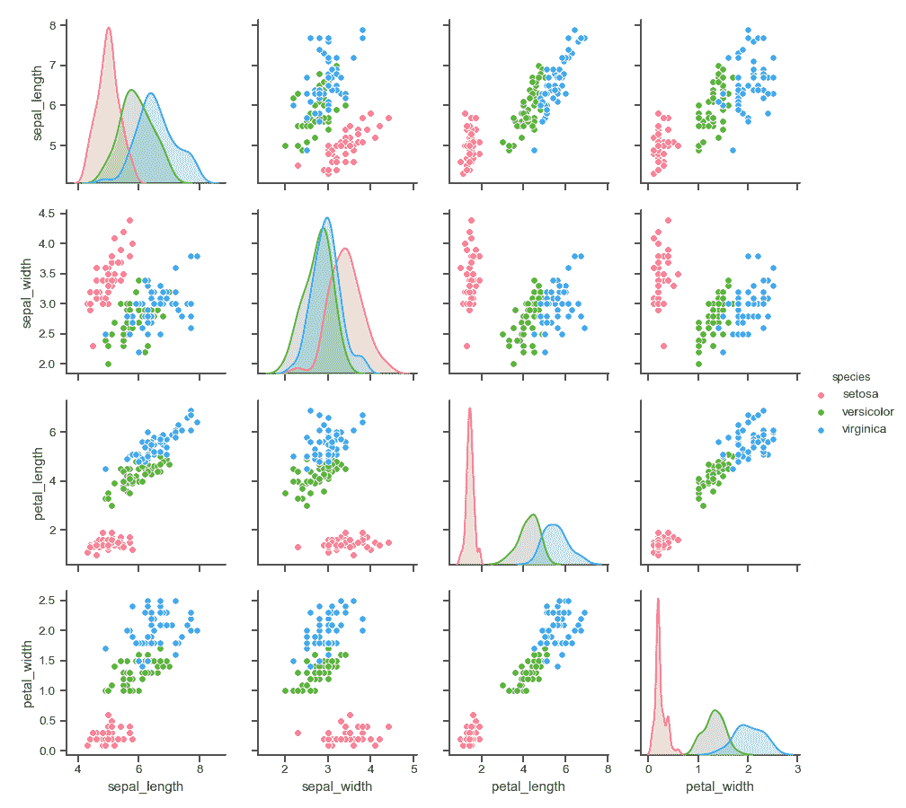
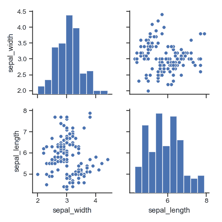
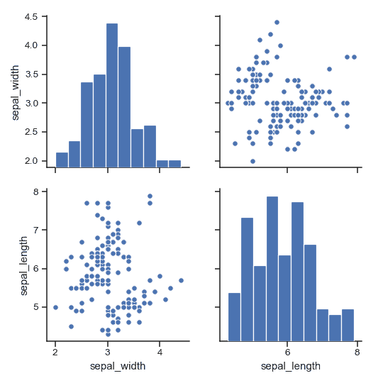
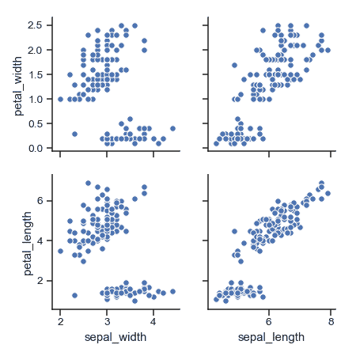
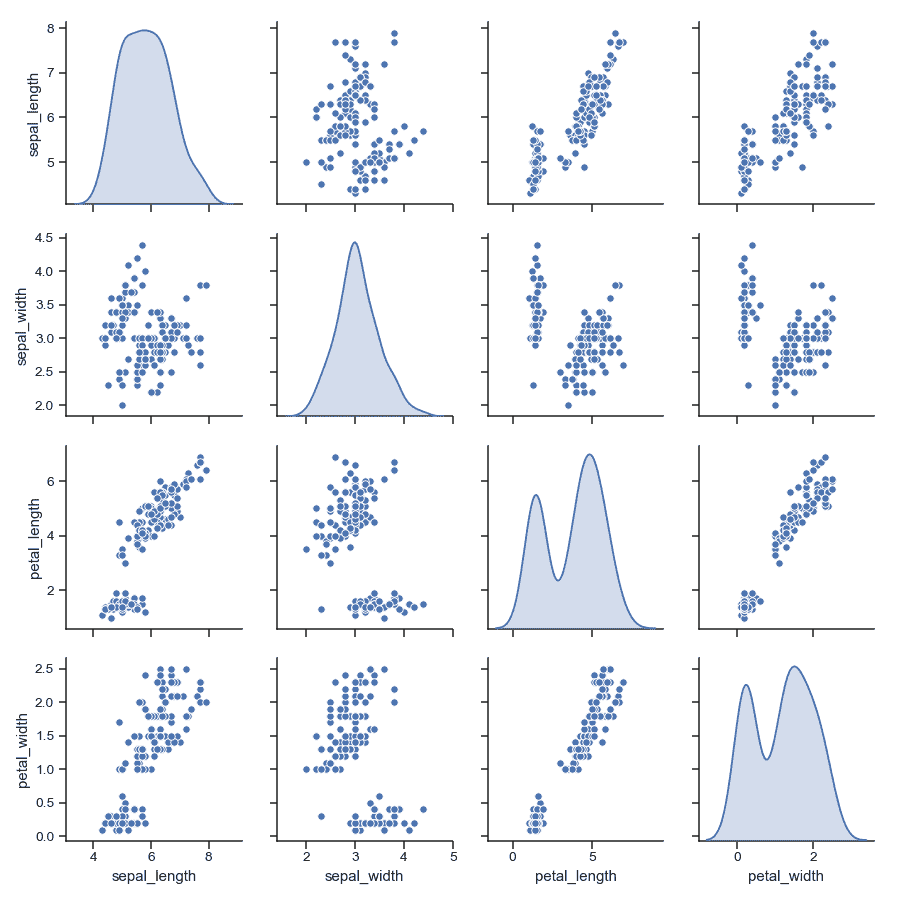
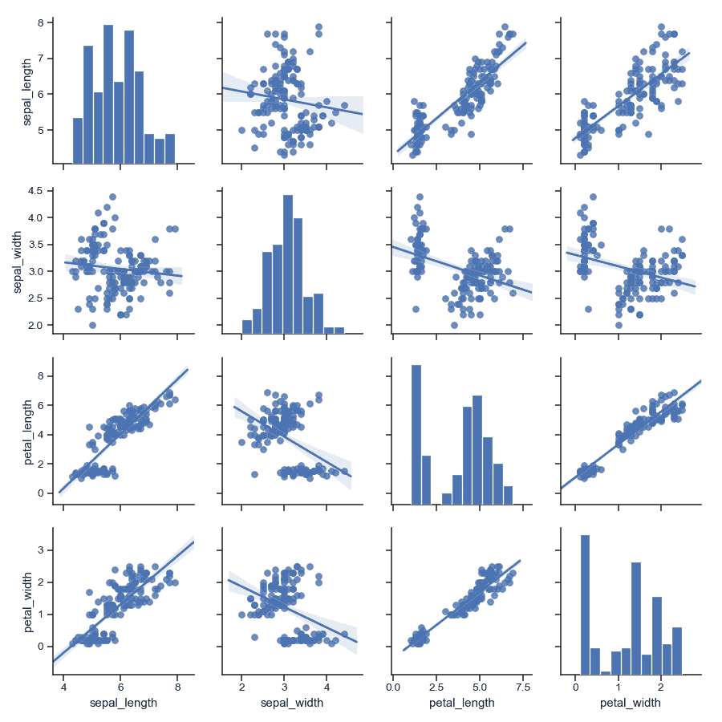
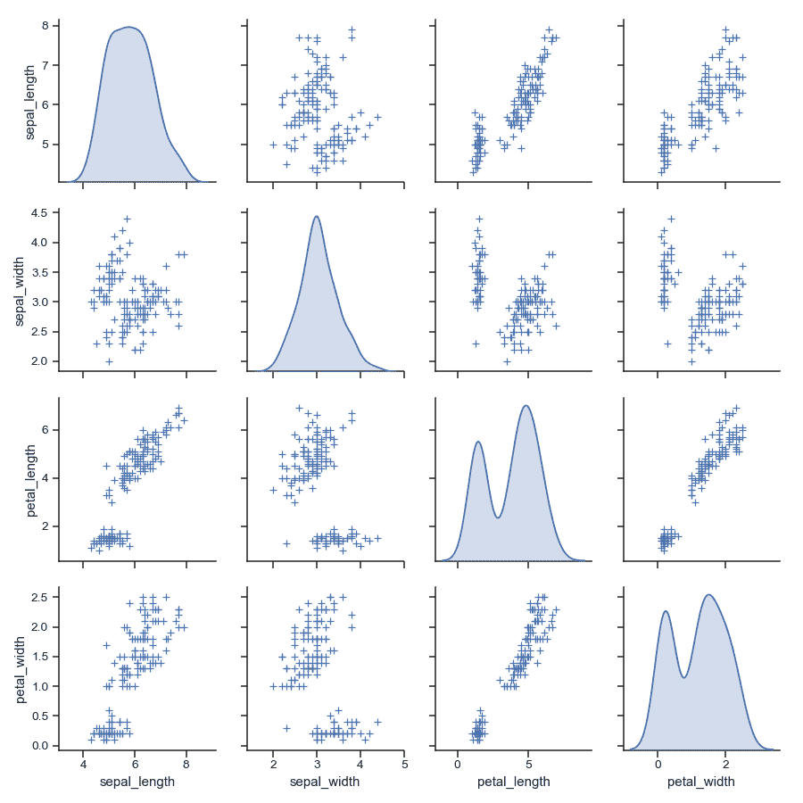

# seaborn.pairplot

> 译者：[cancan233](https://github.com/cancan233)

```py
seaborn.pairplot(data, hue=None, hue_order=None, palette=None, vars=None, x_vars=None, y_vars=None, kind='scatter', diag_kind='auto', markers=None, height=2.5, aspect=1, dropna=True, plot_kws=None, diag_kws=None, grid_kws=None, size=None)
```

绘制数据集中的成对关系

默认情况下，此函数将创建一个 Axes 网络，以便`data`中的每个变量将在 y 轴上共享一行，并在 x 轴上共享一列。对角轴的处理方式并不同，以此绘制一个图表来显示该列中变量的数据的单变量分布。

还可以显示变量的子集或在行和列上绘制不同的变量。

这是[`PairGrid`](seaborn.PairGrid.html#seaborn.PairGrid "seaborn.PairGrid")的高级界面，旨在简化一些常见的样式。如果你需要更多的灵活性，你应该直接使用[`PairGrid`](seaborn.PairGrid.html#seaborn.PairGrid "seaborn.PairGrid")。

参数：`data`：数据框架

> 整洁（长形式）数据框，其中每列是变量，每行是观察量。

`hue`：字符串（变量名），可选。

> `data`中的变量将绘图方面映射到不同的颜色。

`hue_order`：字符串列表。

> 命令调色板中的色调变量的级别。

`palette`：字典或 seaborn 调色板。

> 用于映射`hue`变量的颜色集。如果是字典，关键字应该是`hue`变量中的值。

`vars`：变量名列表，可选。

> 要使用的`data`中的变量，否则每一列使用数字的数据类型。

`{x, y}_vars`：变量名列表，可选。

> `data`中的变量分别用于图的行和列；即制作非方形图。

`kind`：{‘scatter’, ‘reg’}, 可选。

> 一种非等同关系的图类型

`diag_kind`：{‘auto’, ‘hist’, ‘kde’}, 可选

> 对角线子图的一种图形。默认值取决于是否使用`hue`。

`markers`：单个 matplotlit 标记代码或列表，可选

> 要么是用于所有数据点的标记，要么是长度和色调变量中的级别数相同的标记列表，这样不同颜色的点也会有不同的散点图标记。

`height`：标量，可选。

> 每个刻面的高度（以英寸为单位）

`aspect`：标量，可选。

> Aspect\*height 给出每个刻面的宽度（以英寸为单位）

`dropna`：布尔值，可选。

> 在绘图之前删除数据中的缺失值。

`{plot, diag, grid}_kws`：字典，可选。

> 关键字参数的字典。

返回值：`grid`：PairGrid

> 返回底层的`PairGrid`实例以进一步调整。

也可以看看

子图网络可以更灵活地绘制成对关系。

范例

绘制联合关系地散点图和单变量分布的直方图：

```py
>>> import seaborn as sns; sns.set(style="ticks", color_codes=True)
>>> iris = sns.load_dataset("iris")
>>> g = sns.pairplot(iris)

```



通过绘图元素的颜色显示分类变量的不同级别：

```py
>>> g = sns.pairplot(iris, hue="species")

```



使用不同的调色板：

```py
>>> g = sns.pairplot(iris, hue="species", palette="husl")

```



为`hue`变量的每个级别使用不同的标记：

```py
>>> g = sns.pairplot(iris, hue="species", markers=["o", "s", "D"])

```


绘制变量的子集：

```py
>>> g = sns.pairplot(iris, vars=["sepal_width", "sepal_length"])

```



绘制更大的图：

```py
>>> g = sns.pairplot(iris, height=3,
...                  vars=["sepal_width", "sepal_length"])

```



在行和列中绘制不同的变量：

```py
>>> g = sns.pairplot(iris,
...                  x_vars=["sepal_width", "sepal_length"],
...                  y_vars=["petal_width", "petal_length"])

```



对单变量图使用核密度估计：

```py
>>> g = sns.pairplot(iris, diag_kind="kde")

```



将线性回归模型拟合到散点图：

```py
>>> g = sns.pairplot(iris, kind="reg")

```



将关键字参数传递给底层函数（直接使用[`PairGrid`](seaborn.PairGrid.html#seaborn.PairGrid "seaborn.PairGrid")可能更容易）

```py
>>> g = sns.pairplot(iris, diag_kind="kde", markers="+",
...                  plot_kws=dict(s=50, edgecolor="b", linewidth=1),
...                  diag_kws=dict(shade=True))

```


