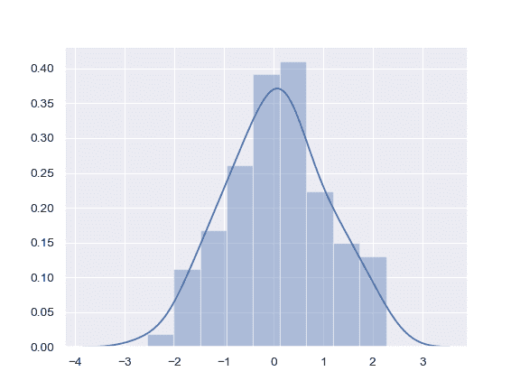
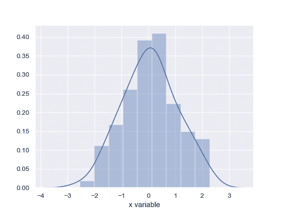
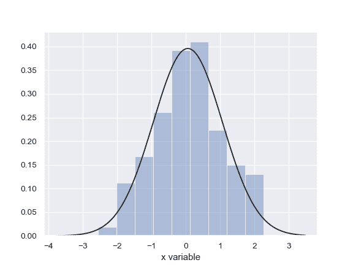
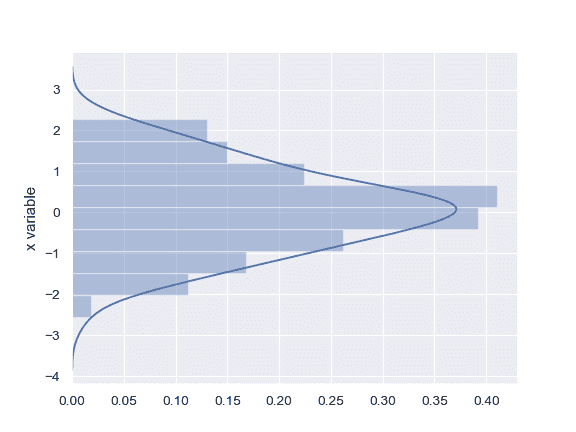
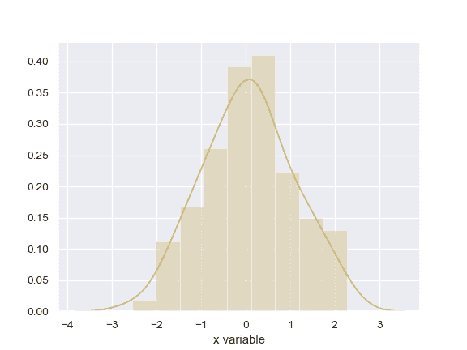
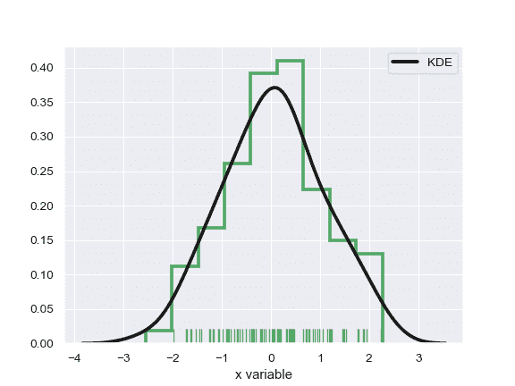

# seaborn.distplot

```py
seaborn.distplot(a, bins=None, hist=True, kde=True, rug=False, fit=None, hist_kws=None, kde_kws=None, rug_kws=None, fit_kws=None, color=None, vertical=False, norm_hist=False, axlabel=None, label=None, ax=None)
```

Flexibly plot a univariate distribution of observations.

This function combines the matplotlib `hist` function (with automatic calculation of a good default bin size) with the seaborn [`kdeplot()`](seaborn.kdeplot.html#seaborn.kdeplot "seaborn.kdeplot") and [`rugplot()`](seaborn.rugplot.html#seaborn.rugplot "seaborn.rugplot") functions. It can also fit `scipy.stats` distributions and plot the estimated PDF over the data.

参数：`a`：Series, 1d-array, or list.

> Observed data. If this is a Series object with a `name` attribute, the name will be used to label the data axis.

`bins`：argument for matplotlib hist(), or None, optional

> Specification of hist bins, or None to use Freedman-Diaconis rule.

`hist`：bool, optional

> Whether to plot a (normed) histogram.

`kde`：bool, optional

> Whether to plot a gaussian kernel density estimate.

`rug`：bool, optional

> Whether to draw a rugplot on the support axis.

`fit`：random variable object, optional

> An object with &lt;cite&gt;fit&lt;/cite&gt; method, returning a tuple that can be passed to a &lt;cite&gt;pdf&lt;/cite&gt; method a positional arguments following an grid of values to evaluate the pdf on.

`{hist, kde, rug, fit}_kws`：dictionaries, optional

> Keyword arguments for underlying plotting functions.

`color`：matplotlib color, optional

> Color to plot everything but the fitted curve in.

`vertical`：bool, optional

> If True, observed values are on y-axis.

`norm_hist`：bool, optional

> If True, the histogram height shows a density rather than a count. This is implied if a KDE or fitted density is plotted.

`axlabel`：string, False, or None, optional

> Name for the support axis label. If None, will try to get it from a.namel if False, do not set a label.

`label`：string, optional

> Legend label for the relevent component of the plot

`ax`：matplotlib axis, optional

> if provided, plot on this axis


返回值：`ax`：matplotlib Axes

> Returns the Axes object with the plot for further tweaking.


See also

Show a univariate or bivariate distribution with a kernel density estimate.Draw small vertical lines to show each observation in a distribution.

Examples

Show a default plot with a kernel density estimate and histogram with bin size determined automatically with a reference rule:

```py
>>> import seaborn as sns, numpy as np
>>> sns.set(); np.random.seed(0)
>>> x = np.random.randn(100)
>>> ax = sns.distplot(x)

```



Use Pandas objects to get an informative axis label:

```py
>>> import pandas as pd
>>> x = pd.Series(x, name="x variable")
>>> ax = sns.distplot(x)

```



Plot the distribution with a kernel density estimate and rug plot:

```py
>>> ax = sns.distplot(x, rug=True, hist=False)

```


Plot the distribution with a histogram and maximum likelihood gaussian distribution fit:

```py
>>> from scipy.stats import norm
>>> ax = sns.distplot(x, fit=norm, kde=False)

```



Plot the distribution on the vertical axis:

```py
>>> ax = sns.distplot(x, vertical=True)

```



Change the color of all the plot elements:

```py
>>> sns.set_color_codes()
>>> ax = sns.distplot(x, color="y")

```



Pass specific parameters to the underlying plot functions:

```py
>>> ax = sns.distplot(x, rug=True, rug_kws={"color": "g"},
...                   kde_kws={"color": "k", "lw": 3, "label": "KDE"},
...                   hist_kws={"histtype": "step", "linewidth": 3,
...                             "alpha": 1, "color": "g"})

```

