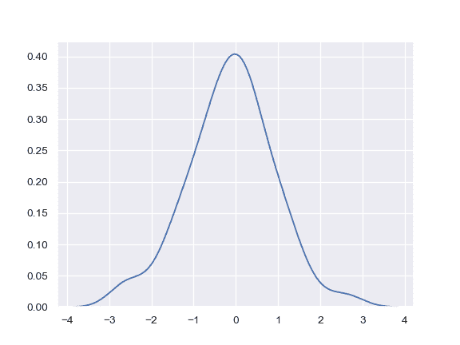
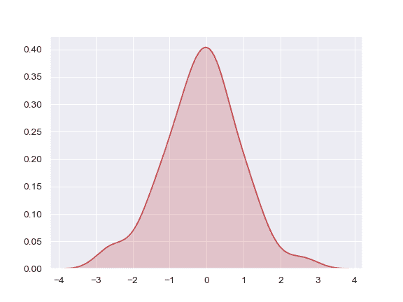
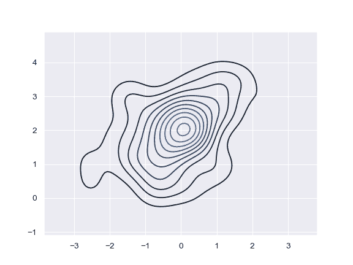
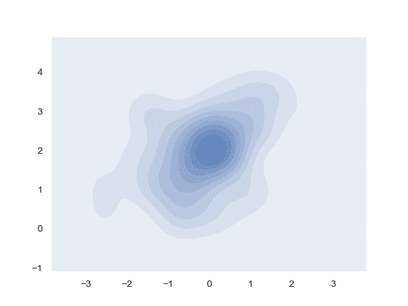
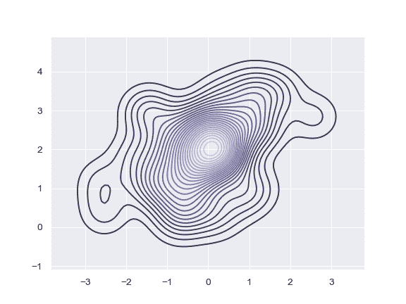
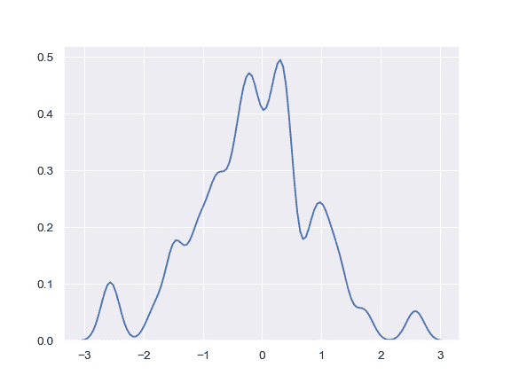
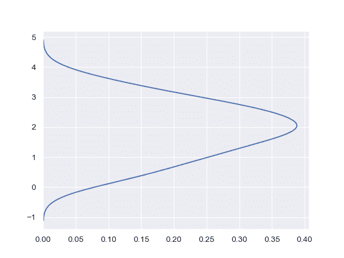
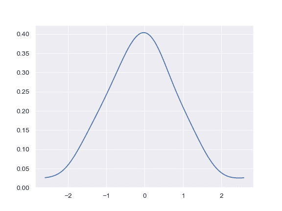
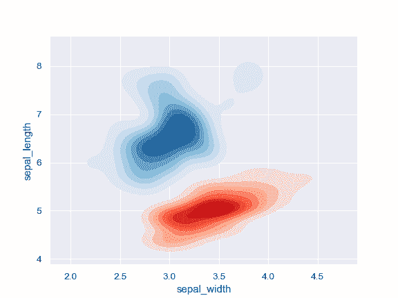

# seaborn.kdeplot

> 译者：[hyuuo](https://github.com/hyuuo)

```py
seaborn.kdeplot(data, data2=None, shade=False, vertical=False, kernel='gau', bw='scott', gridsize=100, cut=3, clip=None, legend=True, cumulative=False, shade_lowest=True, cbar=False, cbar_ax=None, cbar_kws=None, ax=None, **kwargs)
```

拟合并绘制单变量或双变量核密度估计图。

参数：`data`：一维阵列

> 输入数据

**data2：一维阵列，可选。

> 第二输入数据。如果存在，将估计双变量 KDE。 

`shade`：布尔值，可选参数。

> 如果为 True，则在 KDE 曲线下方的区域中增加阴影（或者在数据为双变量时使用填充的轮廓绘制）。

`vertical`：布尔值，可选参数。

> 如果为 True，密度图将显示在 x 轴。

`kernel`：{‘gau’ &#124; ‘cos’ &#124; ‘biw’ &#124; ‘epa’ &#124; ‘tri’ &#124; ‘triw’ }，可选参数

>  要拟合的核的形状代码，双变量 KDE 只能使用高斯核。

`bw`：{‘scott’ &#124; ‘silverman’ &#124; scalar &#124; pair of scalars }，可选参数

> 用于确定双变量图的每个维的核大小、标量因子或标量的参考方法的名称。需要注意的是底层的计算库对此参数有不同的交互：`statsmodels`直接使用它，而`scipy`将其视为数据标准差的缩放因子。

`gridsize`：整型数据，可选参数。

> 评估网格中的离散点数。

`cut`：标量，可选参数。

> 绘制估计值以从极端数据点切割* bw。

`clip`：一对标量，可选参数。

> 用于拟合 KDE 图的数据点的上下限值。可以为双变量图提供一对（上，下）边界。

`legend`：布尔值，可选参数。

> 如果为 True，为绘制的图像添加图例或者标记坐标轴。

`cumulative`：布尔值，可选参数。

> 如果为 True，则绘制 kde 估计图的累积分布。

`shade_lowest`：布尔值，可选参数。

> 如果为 True，则屏蔽双变量 KDE 图的最低轮廓。绘制单变量图或“shade = False”时无影响。当你想要在同一轴上绘制多个密度时，可将此参数设置为“False”。

`cbar`：布尔值，可选参数。

> 如果为 True 并绘制双变量 KDE 图，为绘制的图像添加颜色条。

`cbar_ax`：matplotlib axes，可选参数。

> 用于绘制颜色条的坐标轴，若为空，就在主轴绘制颜色条。

`cbar_kws`：字典，可选参数。

> `fig.colorbar（）`的关键字参数。

`ax`：matplotlib axes，可选参数。

> 要绘图的坐标轴，若为空，则使用当前轴。

`kwargs`：键值对

> 其他传递给`plt.plot（）`或`plt.contour {f}`的关键字参数，具体取决于是绘制单变量还是双变量图。

返回值：`ax`：matplotlib Axes

> 绘图的坐标轴。

**另请参见**

[`distplot`](seaborn.distplot.html#seaborn.distplot "seaborn.distplot")

灵活绘制单变量观测值分布图。

[`jointplot`](seaborn.jointplot.html#seaborn.jointplot "seaborn.jointplot")

绘制一个具有双变量和边缘分布的联合数据集。

范例

绘制一个简单的单变量分布：

```py
>>> import numpy as np; np.random.seed(10)
>>> import seaborn as sns; sns.set(color_codes=True)
>>> mean, cov = [0, 2], [(1, .5), (.5, 1)]
>>> x, y = np.random.multivariate_normal(mean, cov, size=50).T
>>> ax = sns.kdeplot(x)

```



在密度曲线下使用不同的颜色着色：

```py
>>> ax = sns.kdeplot(x, shade=True, color="r")

```



绘制一个双变量分布：

```py
>>> ax = sns.kdeplot(x, y)

```



使用填充轮廓：

```py
>>> ax = sns.kdeplot(x, y, shade=True)

```



使用更多的轮廓级别和不同的调色板：

```py
>>> ax = sns.kdeplot(x, y, n_levels=30, cmap="Purples_d")

```



使用窄带宽：

```py
>>> ax = sns.kdeplot(x, bw=.15)

```



在纵轴上绘制密度分布：

```py
>>> ax = sns.kdeplot(y, vertical=True)

```



将密度曲线限制在数据范围内:

```py
>>> ax = sns.kdeplot(x, cut=0)

```



为轮廓添加一个颜色条:

```py
>>> ax = sns.kdeplot(x, y, cbar=True)

```


为双变量密度图绘制两个阴影：

```py
>>> iris = sns.load_dataset("iris")
>>> setosa = iris.loc[iris.species == "setosa"]
>>> virginica = iris.loc[iris.species == "virginica"]
>>> ax = sns.kdeplot(setosa.sepal_width, setosa.sepal_length,
...                  cmap="Reds", shade=True, shade_lowest=False)
>>> ax = sns.kdeplot(virginica.sepal_width, virginica.sepal_length,
...                  cmap="Blues", shade=True, shade_lowest=False)

```


