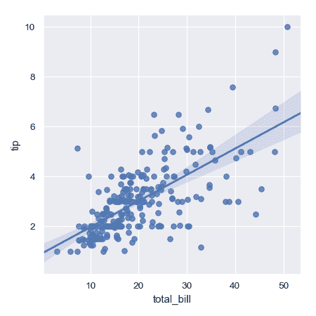
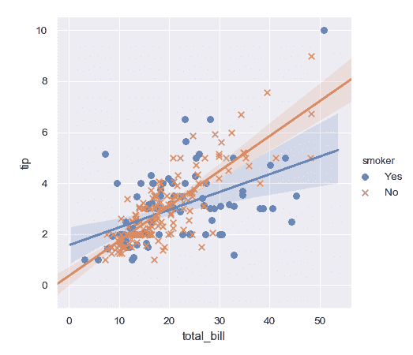
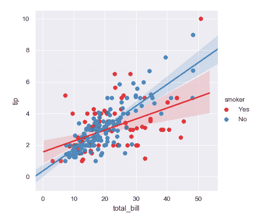
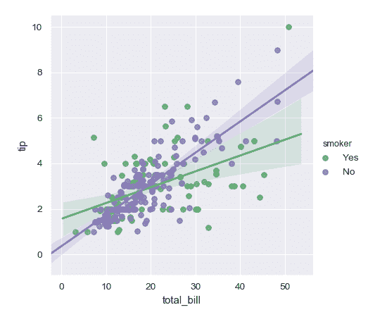
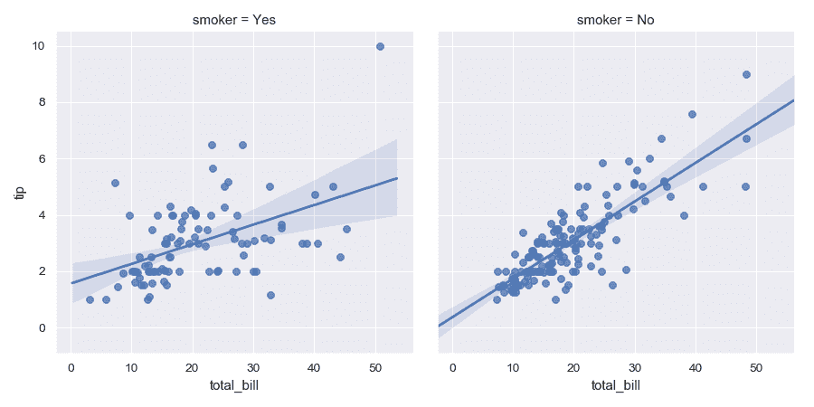
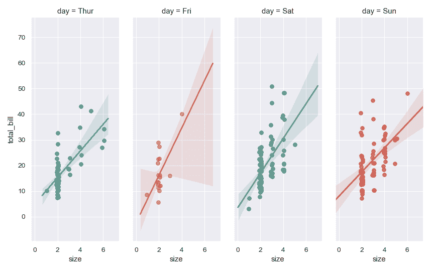
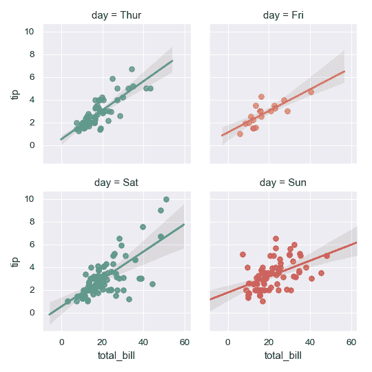
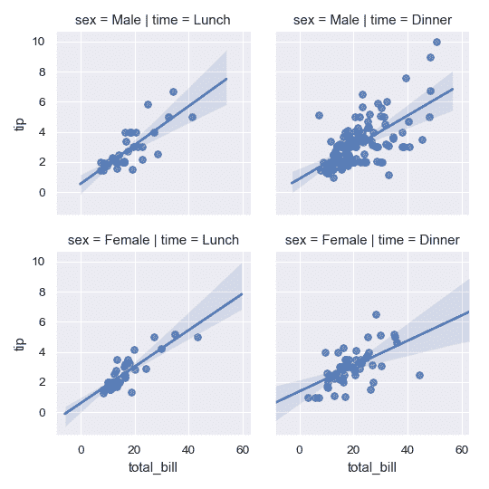
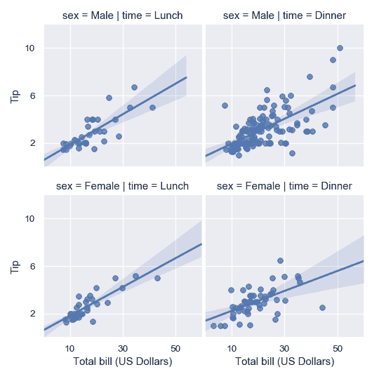

# seaborn.lmplot

> 译者：[P3n9W31](https://github.com/P3n9W31)

```py
seaborn.lmplot(x, y, data, hue=None, col=None, row=None, palette=None, col_wrap=None, height=5, aspect=1, markers='o', sharex=True, sharey=True, hue_order=None, col_order=None, row_order=None, legend=True, legend_out=True, x_estimator=None, x_bins=None, x_ci='ci', scatter=True, fit_reg=True, ci=95, n_boot=1000, units=None, order=1, logistic=False, lowess=False, robust=False, logx=False, x_partial=None, y_partial=None, truncate=False, x_jitter=None, y_jitter=None, scatter_kws=None, line_kws=None, size=None)
```

在 FacetGrid 对象上绘制数据和回归模型。

这个函数结合了 [`regplot()`](seaborn.regplot.html#seaborn.regplot "seaborn.regplot") 和 [`FacetGrid`](seaborn.FacetGrid.html#seaborn.FacetGrid "seaborn.FacetGrid")。 它预期作为一个能够将回归模型运用在数据集处于不同条件下的子数据集的方便的接口

在考虑如何将变量分配到不同方面时，一般规则是使用 `hue` 进行最重要的比较，然后使用  `col`  和  `row `。 但是，请始终考虑您的特定数据集以及您正在创建的可视化目标。

估算回归模型有许多互斥的选项。 有关详细信息，请参阅 [tutorial](http://seaborn.pydata.org/tutorial/regression.html#regression-tutorial) 。

此函数的参数涵盖了 [`FacetGrid`](seaborn.FacetGrid.html#seaborn.FacetGrid "seaborn.FacetGrid")中的大多数选项，尽管这样，偶尔还是会出现您需要直接使用该类和 [`regplot()`](seaborn.regplot.html#seaborn.regplot "seaborn.regplot") 的情况。

参数：`x, y`：字符串，可选

> 输入变量; 这些应该是`data`中的列名。

`data`：DataFrame

> Tidy (“long-form”)格式的 DataFrame，其中每列为一个变量，每行为一个观测样本。

`hue, col, row`：字符串

> 定义数据子集的变量，将在网格中的不同构面上绘制。 请参阅`* _order`参数以控制此变量的级别顺序。

`palette`： 调色板名称，列表或字典，可选

> 用于`hue`变量的不同级别的颜色。 应该是 [`color_palette()`](seaborn.color_palette.html#seaborn.color_palette "seaborn.color_palette")可以解释的东西，或者是将色调级别映射到 matplotlib 颜色的字典。

`col_wrap`：整数，可选

> 以此宽度“包裹”列变量，以便列分面（facet）跨越多行。 与`row` 分面（facet）不兼容。

`height`： 标量，可选

> 每个分面（facet）的高度（以英寸为单位）。 另见：`aspect`。

`aspect`：标量，可选

> 每个分面（facet）的纵横比，因此`aspect * height`给出每个分面（facet）的宽度，单位为英寸。

`markers`：matplotlib 标记代码或标记代码列表，可选

> 散点图的标记。如果是列表，列表中的每个标记将用于`hue`变量的每个级别。

`share{x,y}`：布尔值，‘col’,或 ‘row’ ，可选

> 如果为 true，则分面（facet）之间将跨列共享 y 轴和/或跨行共享 x 轴。

`{hue,col,row}_order`：列表，可选

> 分面变量的级别顺序。在默认情况下，这将是级别在“data”中出现的顺序，或者，如果变量是 pandas 的分类类别变量，则为类别的顺序。

`legend`：布尔值，可选

> 如果为“True”并且有一个`hue`变量，则添加一个图例。

`legend_out`：布尔值，可选

> 如果为“True”，图形尺寸将被扩展，图例将被绘制在图像中部右侧之外。

`x_estimator`：可调用的映射向量->标量，可选

> 将此函数应用于`x`的每个唯一值并绘制结果的估计值。当`x`是离散变量时，这是十分有用的。如果给出`x_ci`，则该估计将被引导并且将绘制置信区间。

`x_bins`：整数或向量，可选

> 将`x`变量加入离散区间，然后估计中心趋势和置信区间。 此分箱仅影响散点图的绘制方式; 回归仍然适合原始数据。该参数被解释为均匀大小（不必要间隔）的箱的数量或箱中心的位置。使用此参数时，它意味着`x_estimator`的默认值为`numpy.mean`。

`x_ci`：“ci”。“sd”， 在[0,100]间的整数或 None，可选

> 绘制“x”离散值的集中趋势时使用的置信区间的大小。 如果为`“ci”`，遵循`ci`参数的值。 如果是“sd”，则跳过 bootstrapping 并显示每个 bin 中观察值的标准偏差。

`scatter`：布尔值，可选

> 如果为 `True`，则绘制带有基础观测值（或`x_estimator` 值）的散点图。

`fit_reg`：布尔值，可选

> 如果为 `True`，则估计并绘制与 `x` 和 `y` 变量相关的回归模型。

`ci`：在[0,100]间的整数或 None，可选

> 回归估计的置信区间的大小。这将使用回归线周围的半透明带绘制。 使用自助法（bootstrap）估计置信区间; 对于大型数据集，建议通过将此参数设置为 None 来避免该计算。

`n_boot`：整数，可选

> 用于估计`ci`的自助法（bootstrap）重采样数。 默认值试图在时间和稳定性之间找到平衡; 你可能希望为“最终”版本的图像增加此值。

`units`：`data`中的变量名，可选

> 如果`x`和`y`观察结果嵌套在采样单元中，则可以在此处指定。在通过对所有的单元和观察样本（在单元内）执行重新采样的多级自助法（multilevel bootstrap）来计算置信区间时将考虑这一点。 否则，这不会影响估计或绘制回归的方式。

`order`：整数，可选

> 如果`order`大于 1，使用`numpy.polyfit`来估计多项式回归。

`logistic`：布尔值，可选

> 如果为“True”，则假设`y`是二元变量并使用`statsmodels`来估计逻辑回归模型。 请注意，这比线性回归的计算密集程度要大得多，因此您可能希望减少引导程序重新采样（`n_boot`）的数量或将 `ci`设置为“无”。

`lowess`：布尔值，可选

> 如果为“True”，则使用`statsmodels`来估计非参数 lowess 模型（局部加权线性回归）。 请注意，目前无法为此类模型绘制置信区间。

`robust`：布尔值，可选

> 如果为“True”，则使用`statsmodels`来估计稳健回归。 这将削弱异常值。 请注意，这比标准线性回归的计算密集程度要大得多，因此您可能希望减少引导程序重新采样（`n_boot`）的数量或将 `ci`设置为“无”。

`logx`：布尔值，可选

> 如果为 `True`，则估计形式 y~log（x）的线性回归，但在输入空间中绘制散点图和回归模型。 请注意，`x`必须为正才能正常工作。

`{x,y}_partial`： `data`中的字符串或矩阵

> 混淆（Confounding）变量以在绘图之前退回`x`或`y`变量。

`truncate`：布尔值，可选

> 默认情况下，绘制回归线以在绘制散点图后填充 x 轴限制。 如果`truncate`是`True`，它将改为受到数据本身限制的限制。

`{x,y}_jitter`：浮点数，可选

> 将此大小的均匀随机噪声添加到“x”或“y”变量中。 在拟合回归之后，噪声被添加到数据的副本中，并且仅影响散点图的外观。 在绘制采用离散值的变量时，这会很有用。

`{scatter,line}_kws`：字典

> 传递给`plt.scatter`和`plt.plot`的附加关键字参数。


也可以查看

绘制数据和条件模型 fit.Subplot 网格用于绘制条件关系。合并  [`regplot()`](seaborn.regplot.html#seaborn.regplot "seaborn.regplot") 和 [`PairGrid`](seaborn.PairGrid.html#seaborn.PairGrid "seaborn.PairGrid") （与`kind =“reg”`一起使用时）。

注意

 [`regplot()`](seaborn.regplot.html#seaborn.regplot "seaborn.regplot") 与 [`lmplot()`](#seaborn.lmplot "seaborn.lmplot") 函数是紧密关联的，但是前者是一个坐标轴级别的函数，而后者则是一个联合了[`regplot()`](seaborn.regplot.html#seaborn.regplot "seaborn.regplot") 与 [`FacetGrid `](seaborn.FacetGrid.html#seaborn.FacetGrid "seaborn.FacetGrid")的图像级别的函数。

示例

这些例子集中在基本的回归模型图上，以展示各种方面的选项; 请参阅 [`regplot()`](seaborn.regplot.html#seaborn.regplot "seaborn.regplot") 文档，以演示绘制数据和模型的其他选项。 还有其他一些如何使用 [`FacetGrid`](seaborn.FacetGrid.html#seaborn.FacetGrid "seaborn.FacetGrid") 文档中的返回对象操作绘图的示例。

绘制两个变量之间的简单线性关系：

```py
>>> import seaborn as sns; sns.set(color_codes=True)
>>> tips = sns.load_dataset("tips")
>>> g = sns.lmplot(x="total_bill", y="tip", data=tips)

```



条件在第三个变量上并绘制不同颜色的水平：

```py
>>> g = sns.lmplot(x="total_bill", y="tip", hue="smoker", data=tips)

```


使用不同的标记和颜色，以便绘图更容易再现为黑白：

```py
>>> g = sns.lmplot(x="total_bill", y="tip", hue="smoker", data=tips,
...                markers=["o", "x"])

```



使用不同的调色板：

```py
>>> g = sns.lmplot(x="total_bill", y="tip", hue="smoker", data=tips,
...                palette="Set1")

```



使用字典将`hue`级别映射到颜色：

```py
>>> g = sns.lmplot(x="total_bill", y="tip", hue="smoker", data=tips,
...                palette=dict(Yes="g", No="m"))

```



绘制不同列中第三个变量的级别：

```py
>>> g = sns.lmplot(x="total_bill", y="tip", col="smoker", data=tips)

```



更改构面的高度和纵横比：

```py
>>> g = sns.lmplot(x="size", y="total_bill", hue="day", col="day",
...                data=tips, height=6, aspect=.4, x_jitter=.1)

```



将列变量的级别换行为多行：

```py
>>> g = sns.lmplot(x="total_bill", y="tip", col="day", hue="day",
...                data=tips, col_wrap=2, height=3)

```



两个变量上的条件形成一个完整的网格：

```py
>>> g = sns.lmplot(x="total_bill", y="tip", row="sex", col="time",
...                data=tips, height=3)

```



在返回的 [`FacetGrid`](seaborn.FacetGrid.html#seaborn.FacetGrid "seaborn.FacetGrid") 实例上使用方法来进一步调整图像：

```py
>>> g = sns.lmplot(x="total_bill", y="tip", row="sex", col="time",
...                data=tips, height=3)
>>> g = (g.set_axis_labels("Total bill (US Dollars)", "Tip")
...       .set(xlim=(0, 60), ylim=(0, 12),
...            xticks=[10, 30, 50], yticks=[2, 6, 10])
...       .fig.subplots_adjust(wspace=.02))

```

