# seaborn.regplot

> 译者：[P3n9W31](https://github.com/P3n9W31)

```py
seaborn.regplot(x, y, data=None, x_estimator=None, x_bins=None, x_ci='ci', scatter=True, fit_reg=True, ci=95, n_boot=1000, units=None, order=1, logistic=False, lowess=False, robust=False, logx=False, x_partial=None, y_partial=None, truncate=False, dropna=True, x_jitter=None, y_jitter=None, label=None, color=None, marker='o', scatter_kws=None, line_kws=None, ax=None)
```

绘制数据和线性回归模型拟合。

估算回归模型有许多互斥的选项。查看这个[教程](http://seaborn.pydata.org/tutorial/regression.html#regression-tutorial) 来了解更多的信息。

参数：**x，y：字符串，序列（series）或者是向量数组（vector array）**

> 输入变量。 如果是字符串，应该与`data`中的列名相对应。 使用 pandas 对象时，轴将被 Series 的名字标记。

`data`：DataFrame

> Tidy (“long-form”)格式的 DataFrame，其中每列为一个变量，每行为一个观测样本。

`x_estimator`：可调用的映射向量 -&gt;标量，可选 

> 将此函数应用于`x`的每个唯一值并绘制结果的估计值。当`x`是离散变量时，这是十分有用的。如果给出`x_ci`，则该估计将被引导并且将绘制置信区间。

`x_bins`：整数或向量，可选

> 将`x`变量加入离散区间，然后估计中心趋势和置信区间。 此分箱仅影响散点图的绘制方式; 回归仍然适合原始数据。该参数被解释为均匀大小（不必要间隔）的箱的数量或箱中心的位置。使用此参数时，它意味着`x_estimator`的默认值为`numpy.mean`。

`x_ci`："ci"，'sd'，位于 [0, 100]之间的整数或 None，可选

> 绘制“x”离散值的集中趋势时使用的置信区间的大小。 如果为`“ci”`，遵循`ci`参数的值。 如果是“sd”，则跳过 bootstrapping 并显示每个 bin 中观察值的标准偏差。

`scatter`：布尔值，可选

> 如果为 `True`，则绘制带有基础观测值（或`x_estimator` 值）的散点图。

`fit_reg`：布尔值，可选

> 如果为 `True`，则估计并绘制与 `x` 和 `y` 变量相关的回归模型。

`ci`：位于 [0, 100]之间的整数或 None，可选

> 回归估计的置信区间的大小。这将使用回归线周围的半透明带绘制。 使用自助法（bootstrap）估计置信区间; 对于大型数据集，建议通过将此参数设置为 None 来避免该计算。

`n_boot`：整数，可选

> 用于估计`ci`的自助法（bootstrap）重采样数。 默认值试图在时间和稳定性之间找到平衡; 你可能希望为“最终”版本的图像增加此值。

`units`： `data`,中的变量名，可选

> 如果`x`和`y`观察结果嵌套在采样单元中，则可以在此处指定。在通过对所有的单元和观察样本（在单元内）执行重新采样的多级自助法（multilevel bootstrap）来计算置信区间时将考虑这一点。 否则，这不会影响估计或绘制回归的方式。

`order`：整数，可选

> 如果`order`大于 1，使用`numpy.polyfit`来估计多项式回归。

`logistic`：布尔值，可选

> 如果为“True”，则假设`y`是二元变量并使用`statsmodels`来估计逻辑回归模型。 请注意，这比线性回归的计算密集程度要大得多，因此您可能希望减少引导程序重新采样（`n_boot`）的数量或将 `ci`设置为“无”。

`lowess`：布尔值，可选

> 如果为“True”，则使用`statsmodels`来估计非参数 lowess 模型（局部加权线性回归）。 请注意，目前无法为此类模型绘制置信区间。

`robust`：布尔值，可选

> 如果为“True”，则使用`statsmodels`来估计稳健回归。 这将削弱异常值。 请注意，这比标准线性回归的计算密集程度要大得多，因此您可能希望减少引导程序重新采样（`n_boot`）的数量或将 `ci`设置为“无”。

`logx`：布尔值，可选

> 如果为 `True`，则估计形式 y~log（x）的线性回归，但在输入空间中绘制散点图和回归模型。 请注意，`x`必须为正才能正常工作。

`{x,y}_partial`： `data` 中的字符串或矩阵

> 混淆（Confounding）变量以在绘图之前退回`x`或`y`变量。

`truncate`：布尔值，可选

> 默认情况下，绘制回归线以在绘制散点图后填充 x 轴限制。 如果`truncate`是`True`，它将改为受到数据本身限制的限制。

`{x,y}_jitter`：浮点数，可选

> 将此大小的均匀随机噪声添加到“x”或“y”变量中。 在拟合回归之后，噪声被添加到数据的副本中，并且仅影响散点图的外观。 在绘制采用离散值的变量时，这会很有用。

`label`：字符串

> 要应用于散点图或回归线（如果`scatter`为'False`）的标签，以便在图例中使用。

`color`：matplotlib 颜色

> 适用于所有绘图元素的颜色; 将被`scatter_kws`或`line_kws`中传递的颜色取代。

`marker`：matplotlib 标记代码或标记代码列表，可选

> 散点图的标记。

`{scatter,line}_kws`：字典

> 传递给`plt.scatter`和`plt.plot`的附加关键字参数。

`ax`：matplotlib Axes 对象，可选

> 绘制到指定轴对象，否则在当前轴对象上绘图。


返回值：`ax`：matplotlib Axes 对象

> 包含了图像的 Axes 对象。


也可以看看

结合 [`regplot()`](#seaborn.regplot "seaborn.regplot") 和 [`FacetGrid`](seaborn.FacetGrid.html#seaborn.FacetGrid "seaborn.FacetGrid") 来绘制数据集中的多个线性关系。 结合 [`regplot()`](#seaborn.regplot "seaborn.regplot") 和 [`JointGrid`](seaborn.JointGrid.html#seaborn.JointGrid "seaborn.JointGrid") （与`kind="reg"`一起使用时）。结合  [`regplot()`](#seaborn.regplot "seaborn.regplot") 和 [`PairGrid`](seaborn.PairGrid.html#seaborn.PairGrid "seaborn.PairGrid") （当用于` kind =“reg”`）。绘制线性回归模型的残差。

注意

 [`regplot()`](#seaborn.regplot "seaborn.regplot") 和 [`lmplot()`](seaborn.lmplot.html#seaborn.lmplot "seaborn.lmplot") 函数密切相关，但是前者是坐标轴级别的函数，而后者是结合了[`regplot()`](#seaborn.regplot "seaborn.regplot") 和 [`FacetGrid`](seaborn.FacetGrid.html#seaborn.FacetGrid "seaborn.FacetGrid")的图像级别的函数。

通过 [`jointplot()`](seaborn.jointplot.html#seaborn.jointplot "seaborn.jointplot") 和 [`pairplot()`](seaborn.pairplot.html#seaborn.pairplot "seaborn.pairplot") 函数来组合 [`regplot()`](#seaborn.regplot "seaborn.regplot") 和 [`JointGrid`](seaborn.JointGrid.html#seaborn.JointGrid "seaborn.JointGrid") 或 [`PairGrid`](seaborn.PairGrid.html#seaborn.PairGrid "seaborn.PairGrid") 是十分容易的，虽然这些函数不直接接受所有 [`regplot()`](#seaborn.regplot "seaborn.regplot")的参数。

例子

绘制 DataFrame 中两个变量之间的关系：

```py
>>> import seaborn as sns; sns.set(color_codes=True)
>>> tips = sns.load_dataset("tips")
>>> ax = sns.regplot(x="total_bill", y="tip", data=tips)

```

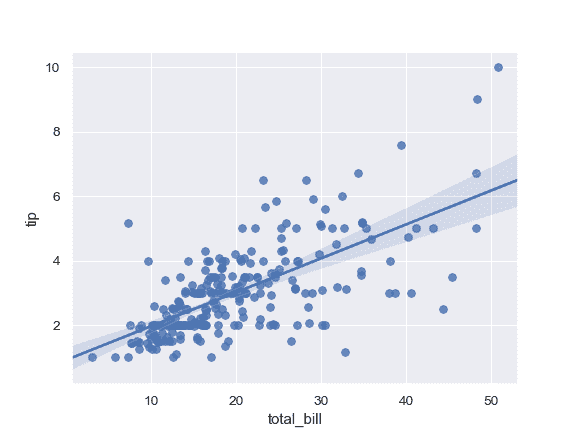

利用两个定义为 numpy 数组的变量进行绘图; 使用不同的颜色：

```py
>>> import numpy as np; np.random.seed(8)
>>> mean, cov = [4, 6], [(1.5, .7), (.7, 1)]
>>> x, y = np.random.multivariate_normal(mean, cov, 80).T
>>> ax = sns.regplot(x=x, y=y, color="g")

```

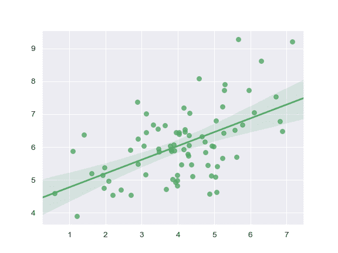

利用两个定义为 pandas Series 的变量来进行绘图; 使用不同的标记：

```py
>>> import pandas as pd
>>> x, y = pd.Series(x, name="x_var"), pd.Series(y, name="y_var")
>>> ax = sns.regplot(x=x, y=y, marker="+")

```

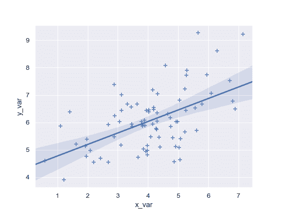

使用 68％置信区间，该区间对应于估计的标准误差：

```py
>>> ax = sns.regplot(x=x, y=y, ci=68)

```

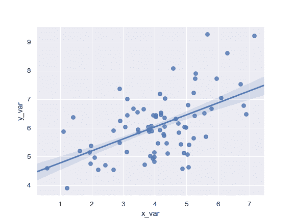

使用离散的`x`变量进行绘图并添加一些抖动：

```py
>>> ax = sns.regplot(x="size", y="total_bill", data=tips, x_jitter=.1)

```

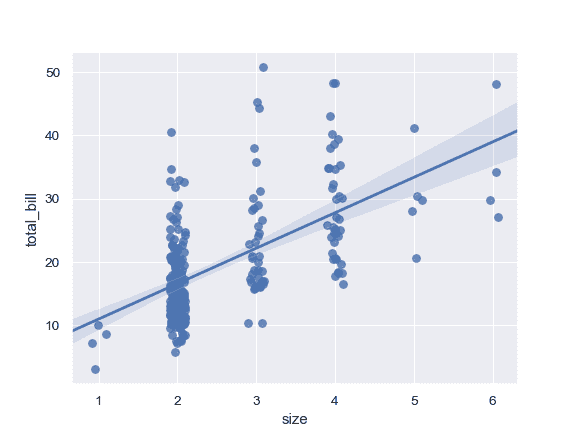

绘制一个离散的`x`变量，显示唯一值的均值和置信区间：

```py
>>> ax = sns.regplot(x="size", y="total_bill", data=tips,
...                  x_estimator=np.mean)

```

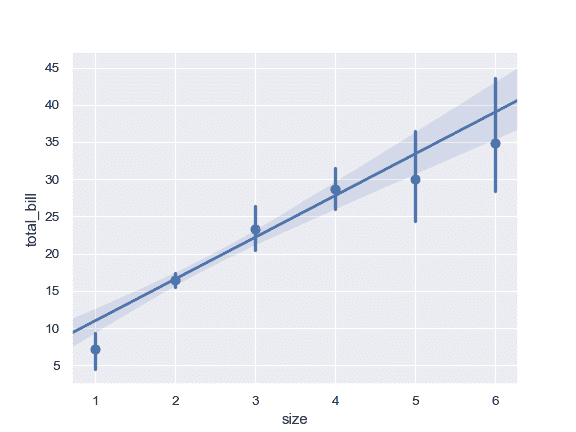

将连续的变量划分为分离的区间并进行绘图：

```py
>>> ax = sns.regplot(x=x, y=y, x_bins=4)

```

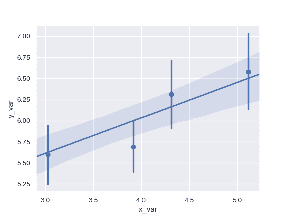

拟合高阶多项式回归并截断模型预测：

```py
>>> ans = sns.load_dataset("anscombe")
>>> ax = sns.regplot(x="x", y="y", data=ans.loc[ans.dataset == "II"],
...                  scatter_kws={"s": 80},
...                  order=2, ci=None, truncate=True)

```

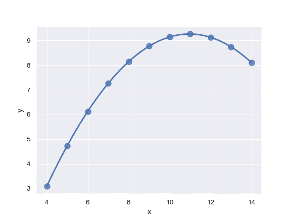

拟合稳健回归并且不绘制置信区间：

```py
>>> ax = sns.regplot(x="x", y="y", data=ans.loc[ans.dataset == "III"],
...                  scatter_kws={"s": 80},
...                  robust=True, ci=None)

```

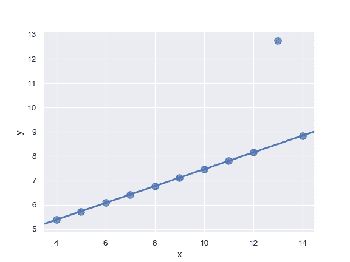

对数据运用逻辑回归; 抖动 y 变量并使用较少的 bootstrap 迭代：

```py
>>> tips["big_tip"] = (tips.tip / tips.total_bill) > .175
>>> ax = sns.regplot(x="total_bill", y="big_tip", data=tips,
...                  logistic=True, n_boot=500, y_jitter=.03)

```

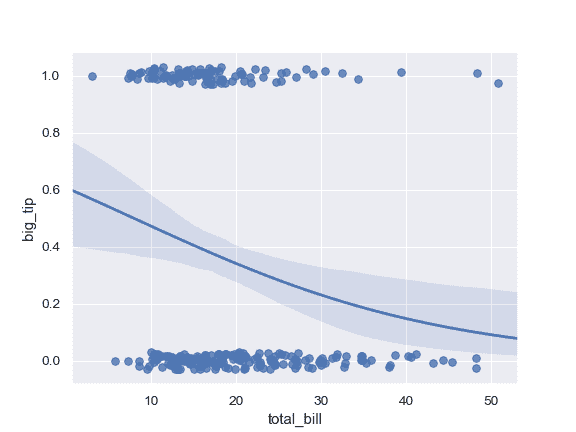

使用 log(x) 拟合回归模型并截断模型预测：

```py
>>> ax = sns.regplot(x="size", y="total_bill", data=tips,
...                  x_estimator=np.mean, logx=True, truncate=True)

```

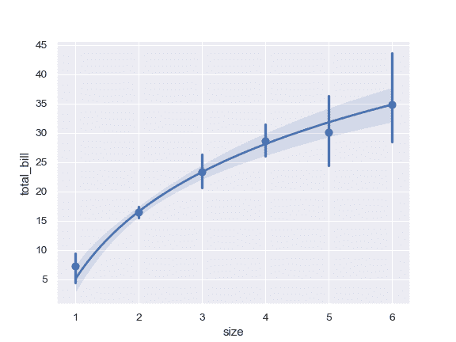