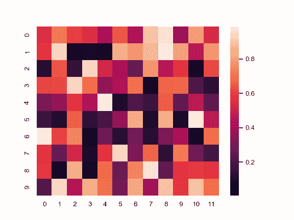
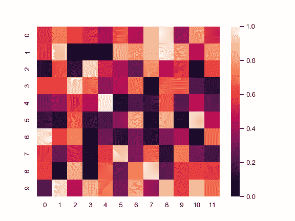
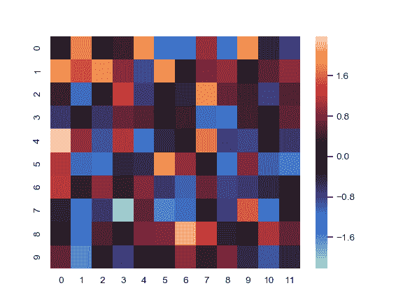
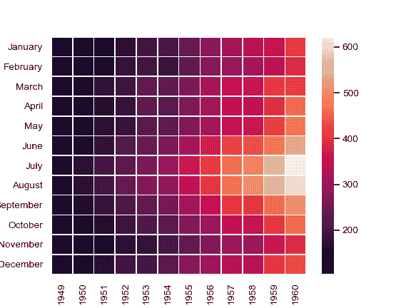
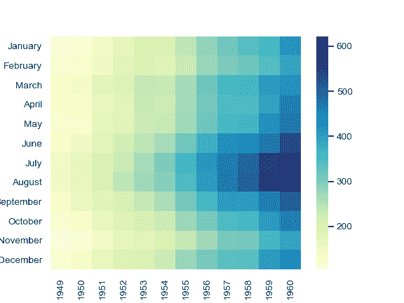
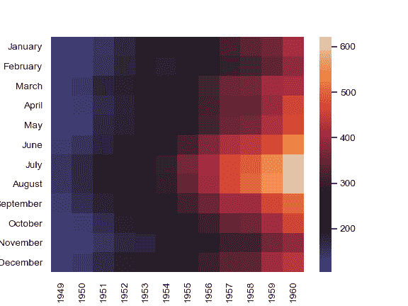
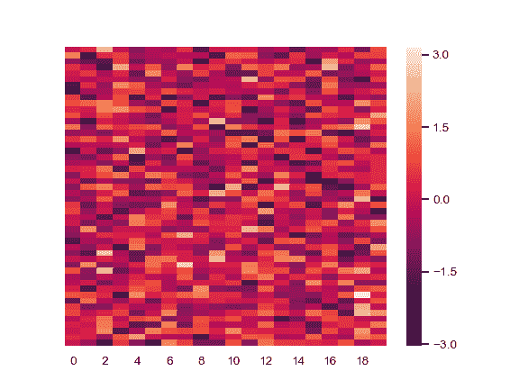
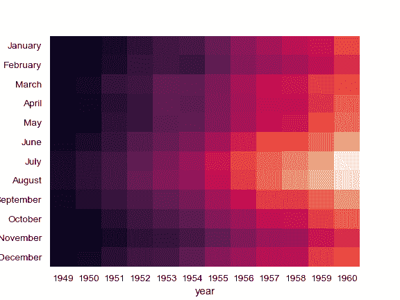
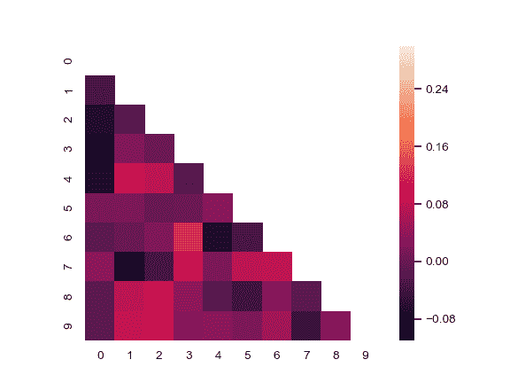

# seaborn.heatmap

> 译者：[hyuuo](https://github.com/hyuuo)

```py
seaborn.heatmap(data, vmin=None, vmax=None, cmap=None, center=None, robust=False, annot=None, fmt='.2g', annot_kws=None, linewidths=0, linecolor='white', cbar=True, cbar_kws=None, cbar_ax=None, square=False, xticklabels='auto', yticklabels='auto', mask=None, ax=None, **kwargs)
```

将矩形数据绘制为颜色编码矩阵。

这是一个坐标轴级的函数，如果没有提供给`ax`参数，它会将热力图绘制到当前活动的轴中。除非`cbar`为 False 或为`cbar_ax`提供单独的 Axes，否则将使用此轴空间的一部分绘制颜色图。

参数：`data`：矩形数据集

> 可以强制转换为 ndarray 格式数据的 2 维数据集。如果提供了 Pandas DataFrame 数据，索引/列信息将用于标记列和行。

`vmin, vmax`：浮点型数据，可选参数。

> 用于锚定色彩映射的值，否则它们是从数据和其他关键字参数推断出来的。

`cmap`：matplotlib 颜色条名称或者对象，或者是颜色列表，可选参数。

> 从数据值到颜色空间的映射。 如果没有提供，默认值将取决于是否设置了“center”。

`center`：浮点数，可选参数。

> 绘制有色数据时将色彩映射居中的值。 如果没有指定，则使用此参数将更改默认的`cmap`。

`robust`：布尔值，可选参数。

> 如果是 True，并且`vmin`或`vmax`为空，则使用稳健分位数而不是极值来计算色彩映射范围。

`annot`:布尔值或者矩形数据，可选参数。

> 如果为 True，则在每个热力图单元格中写入数据值。 如果数组的形状与`data`相同，则使用它来代替原始数据注释热力图。

`fmt`：字符串，可选参数。

> 添加注释时要使用的字符串格式代码。

`annot_kws`：字典或者键值对，可选参数。

> 当`annot`为 True 时，`ax.text`的关键字参数。

`linewidths`：浮点数，可选参数。

> 划分每个单元格的行的宽度。

`linecolor`：颜色，可选参数

> 划分每个单元的线条的颜色。

`cbar`：布尔值，可选参数。

> 描述是否绘制颜色条。

`cbar_kws`：字典或者键值对，可选参数。

> *fig.colorbar*的关键字参数。

`cbar_ax`：matplotlib Axes，可选参数。

> 用于绘制颜色条的轴，否则从主轴获取。

`square`：布尔值，可选参数。

> 如果为 True，则将坐标轴方向设置为“equal”，以使每个单元格为方形。

`xticklabels, yticklabels`：“auto”，布尔值，类列表值，或者整形数值，可选参数。

> 如果为 True，则绘制数据框的列名称。如果为 False，则不绘制列名称。如果是列表，则将这些替代标签绘制为 xticklabels。如果是整数，则使用列名称，但仅绘制每个 n 标签。如果是“auto”，将尝试密集绘制不重叠的标签。

`mask`：布尔数组或者 DataFrame 数据，可选参数。

> 如果为空值，数据将不会显示在`mask`为 True 的单元格中。 具有缺失值的单元格将自动被屏蔽。

`ax`：matplotlib Axes，可选参数。

> 绘制图的坐标轴，否则使用当前活动的坐标轴。

`kwargs`：其他关键字参数。

> 所有其他关键字参数都传递给`ax.pcolormesh`。

返回值：`ax`：matplotlib Axes

> 热力图的轴对象。

**另请参见**

[`clustermap`](seaborn.clustermap.html#seaborn.clustermap "seaborn.clustermap")

使用分层聚类绘制矩阵以排列行和列。

范例

为 numpy 数组绘制热力图：

```py
>>> import numpy as np; np.random.seed(0)
>>> import seaborn as sns; sns.set()
>>> uniform_data = np.random.rand(10, 12)
>>> ax = sns.heatmap(uniform_data)

```



更改默认的 colormap 范围：

```py
>>> ax = sns.heatmap(uniform_data, vmin=0, vmax=1)

```



使用发散色图绘制以 0 为中心的数据的热力图：

```py
>>> normal_data = np.random.randn(10, 12)
>>> ax = sns.heatmap(normal_data, center=0)

```



使用特定的行和列标签绘制 dataframe：

```py
>>> flights = sns.load_dataset("flights")
>>> flights = flights.pivot("month", "year", "passengers")
>>> ax = sns.heatmap(flights)

```


使用整数格式的数字值注释每个小单元格：

```py
>>> ax = sns.heatmap(flights, annot=True, fmt="d")

```


在每个单元格之间添加线：

```py
>>> ax = sns.heatmap(flights, linewidths=.5)

```



使用不同的 colormap：

```py
>>> ax = sns.heatmap(flights, cmap="YlGnBu")

```



将 colormap 置于特定值的中心：

```py
>>> ax = sns.heatmap(flights, center=flights.loc["January", 1955])

```



绘制每个其他列标签，而不绘制行标签：

```py
>>> data = np.random.randn(50, 20)
>>> ax = sns.heatmap(data, xticklabels=2, yticklabels=False)

```



不绘制颜色条：

```py
>>> ax = sns.heatmap(flights, cbar=False)

```



在不同的坐标轴方向绘制颜色条：

```py
>>> grid_kws = {"height_ratios": (.9, .05), "hspace": .3}
>>> f, (ax, cbar_ax) = plt.subplots(2, gridspec_kw=grid_kws)
>>> ax = sns.heatmap(flights, ax=ax,
...                  cbar_ax=cbar_ax,
...                  cbar_kws={"orientation": "horizontal"})

```


使用遮罩绘制矩阵中的一部分

```py
>>> corr = np.corrcoef(np.random.randn(10, 200))
>>> mask = np.zeros_like(corr)
>>> mask[np.triu_indices_from(mask)] = True
>>> with sns.axes_style("white"):
...     ax = sns.heatmap(corr, mask=mask, vmax=.3, square=True)

```


