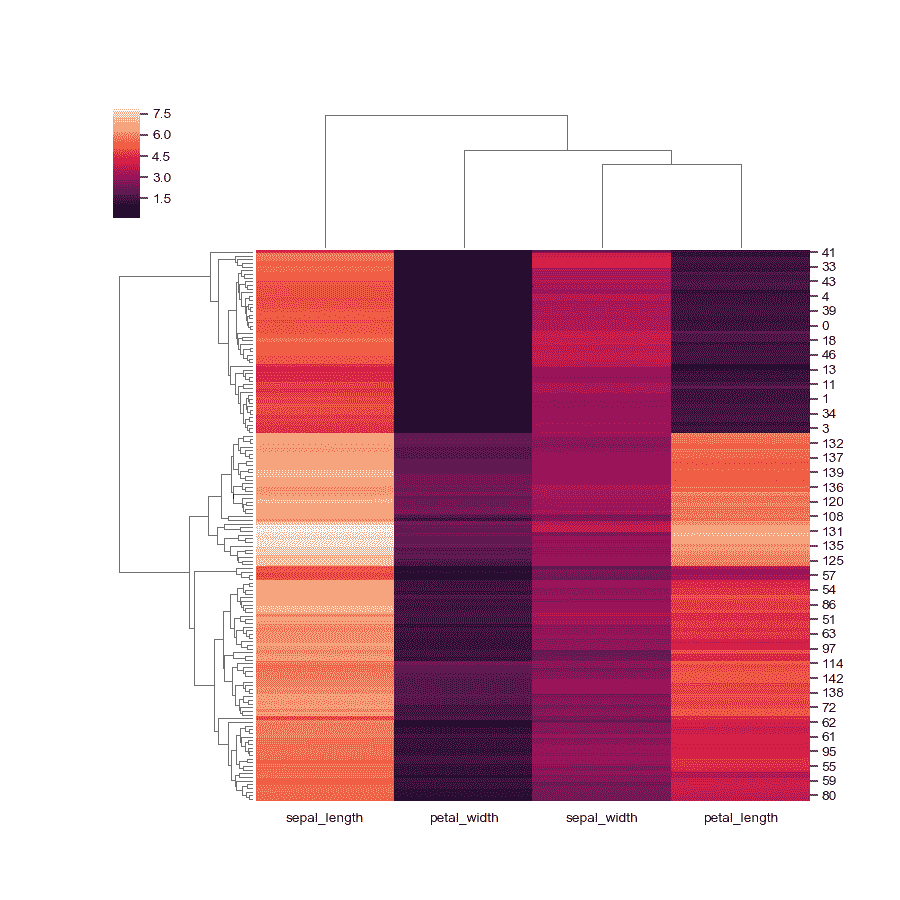
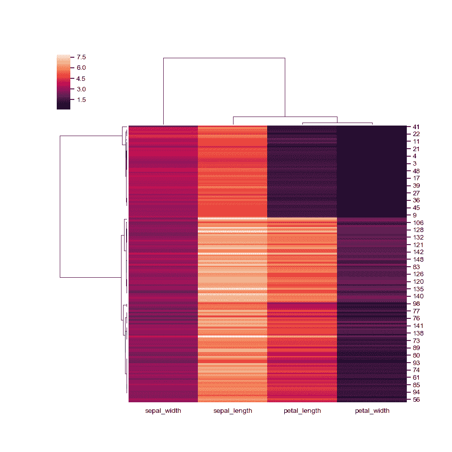
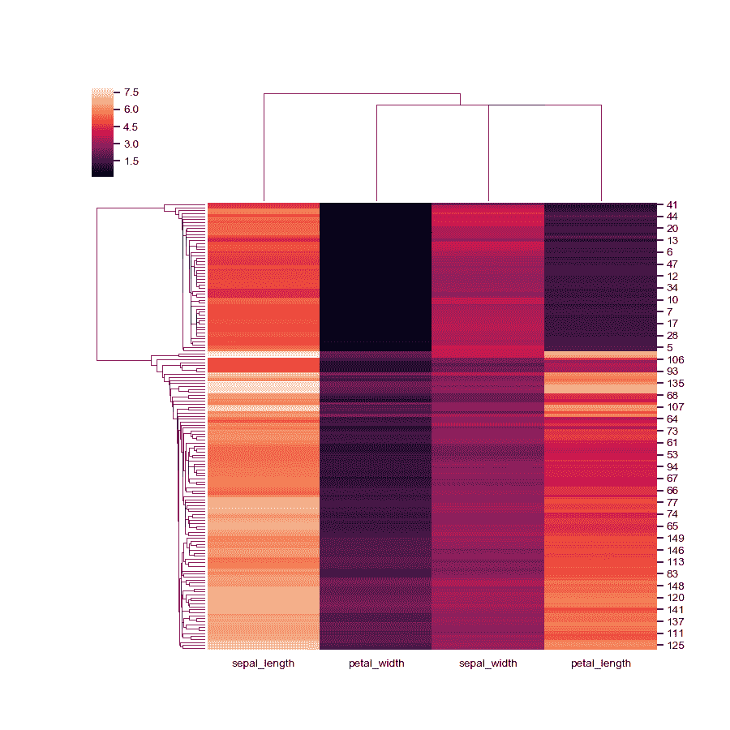
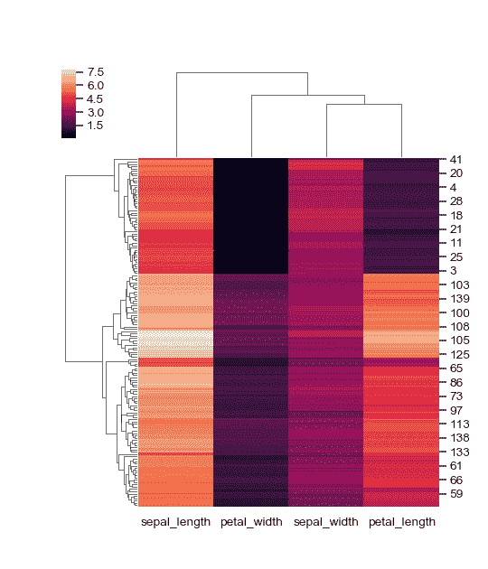
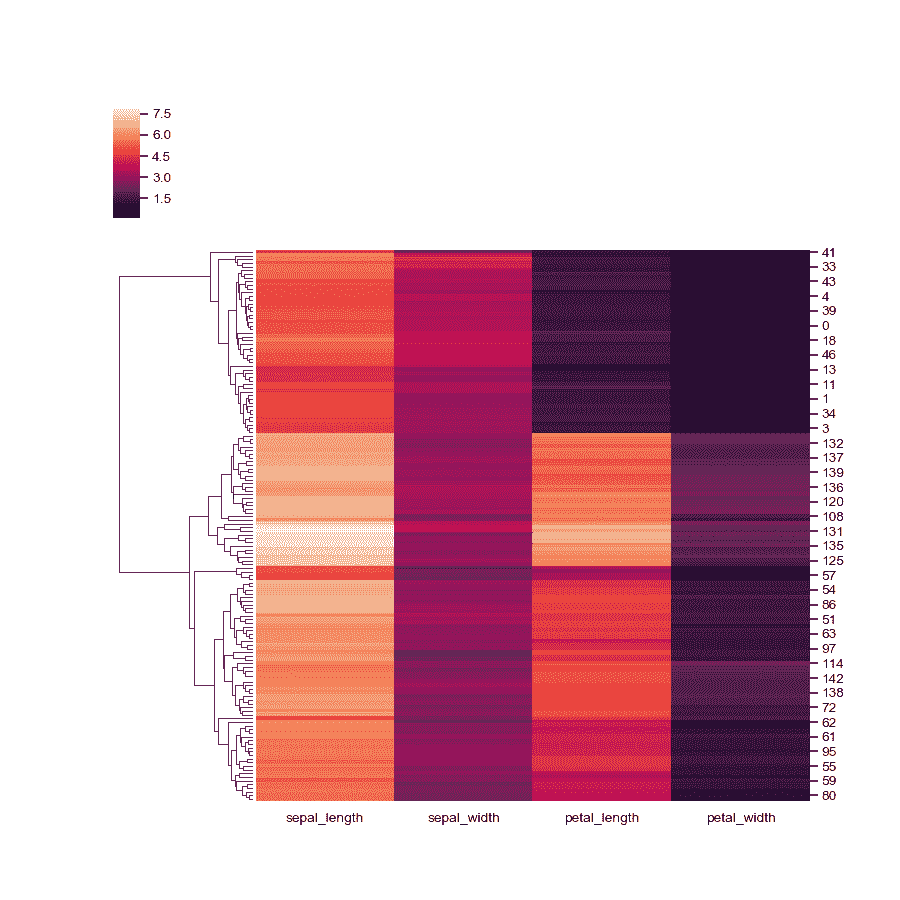
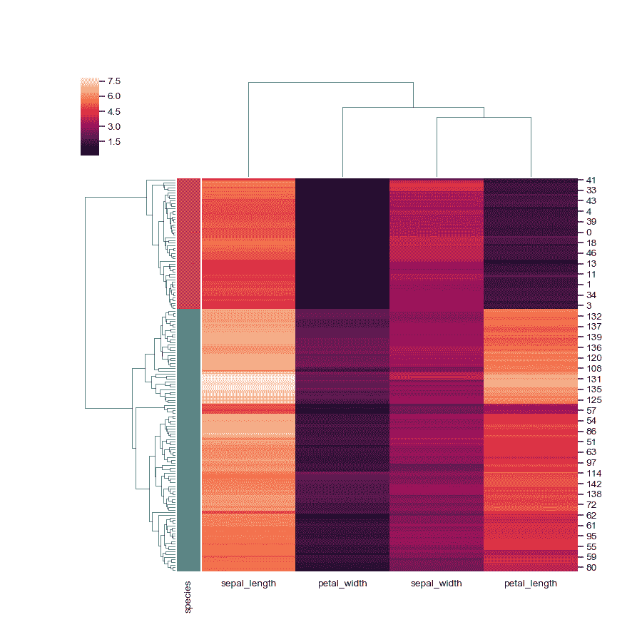
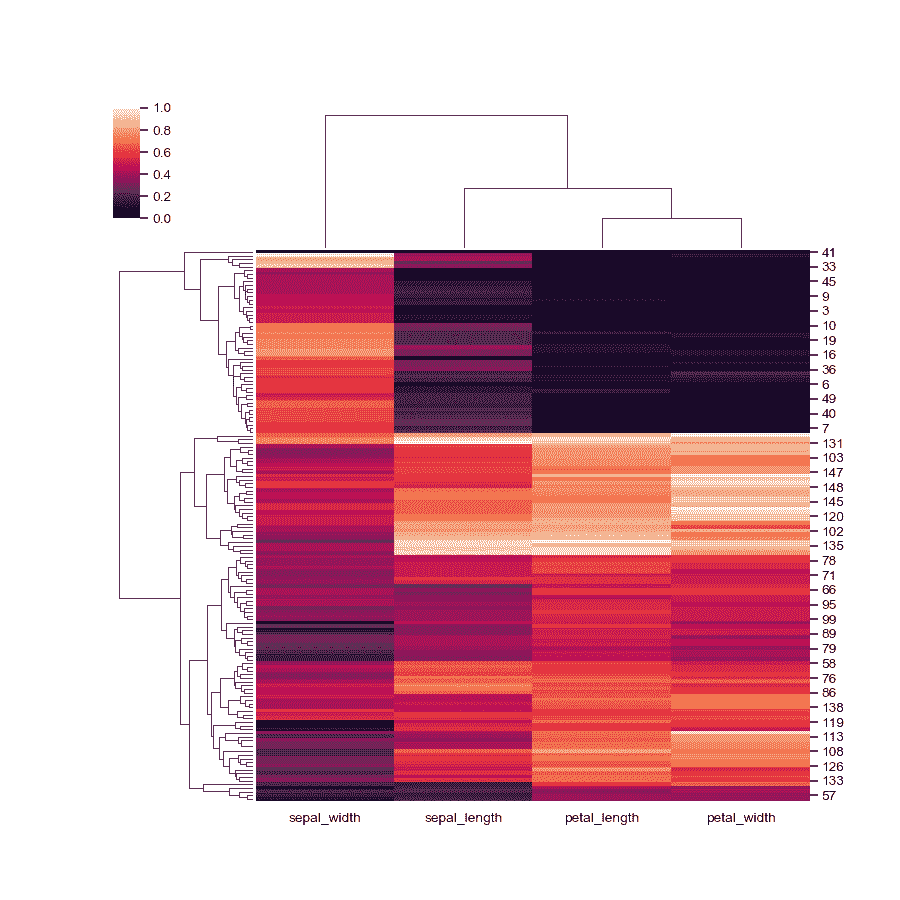
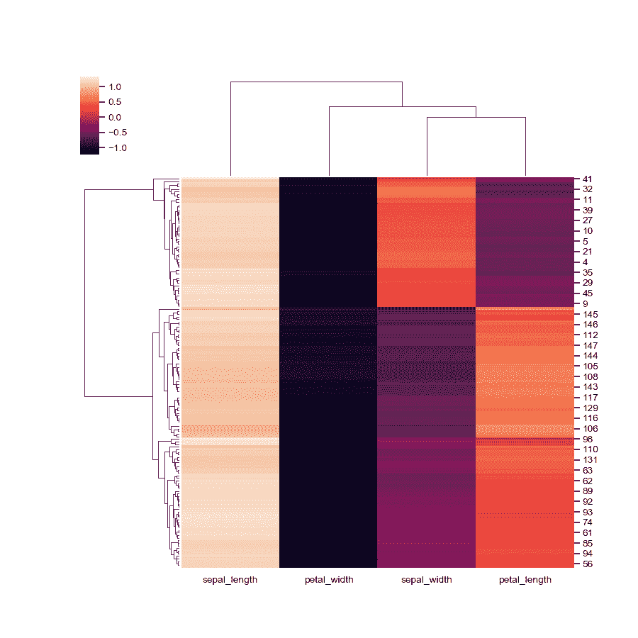

# seaborn.clustermap

> 译者：[cancan233](https://github.com/cancan233)

```py
seaborn.clustermap(data, pivot_kws=None, method='average', metric='euclidean', z_score=None, standard_scale=None, figsize=None, cbar_kws=None, row_cluster=True, col_cluster=True, row_linkage=None, col_linkage=None, row_colors=None, col_colors=None, mask=None, **kwargs)
```

将矩阵数据集绘制成分层聚类热图。

参数：**data：2D array-like**

> 用于聚类的矩形数据，不能包含 NA。

`pivot_kws`：字典，可选。

> 如果数据是整齐的数据框架，可以为 pivot 提供关键字参数以创建矩形数据框架。

`method`：字符串，可选。

> 用于计算聚类的链接方法。有关更多信息，请参阅文档 scipy.cluster.hierarchy.linkage [https://docs.scipy.org/doc/scipy/reference/generated/scipy.cluster.hierarchy.linkage.html](https://docs.scipy.org/doc/scipy/reference/generated/scipy.cluster.hierarchy.linkage.html)

`metric`：字符串，可选。

> 用于数据的距离度量。有关更多选项，请参阅 scipy.spatial.distance.pdist 文档。 [https://docs.scipy.org/doc/scipy/reference/generated/scipy.spatial.distance.pdist.html](https://docs.scipy.org/doc/scipy/reference/generated/scipy.spatial.distance.pdist.html) 要对行和列使用不同的度量（或方法），您可以子集构造每个链接矩阵，并将它们提供为`{row, col}_linkage.`

`z_score`：int 或 None,可选。

> 0（行）或 1（列）。是否计算行或列的 z 分数。Z 得分为 z = (x - mean)/std，因此每行（列）中的值将减去行（列）的平均值，然后除以行（列）的标准偏差。这可确保每行（列）的均值为 0，方差为 1.

`standard_scale`：int 或 None, 可选。

> 0（行）或 1（列）。是否标准化该维度，即每行或每列的含义，减去最小值并将每个维度除以其最大值。

**figsize: 两个整数的元组, 可选。**

> 要创建的图形的大小。

`cbar_kws`：字典, 可选。

> 要传递给`heatmap`中的`cbar_kws`的关键字参数，例如向彩条添加标签。

`{row,col}_cluster`：布尔值, 可选。

> 如果为真，则对{rows, columns}进行聚类。

`{row,col}_linkage`：numpy.array, 可选。

> 行或列的预计算链接矩阵。有关特定格式，请参阅 scipy.cluster.hierarchy.linkage.

`{row,col}_colors`：list-like 或 pandas DataFrame/Series, 可选。

> 要为行或列标记的颜色列表。用于评估组内的样本是否聚集在一起。可以使用嵌套列表或 DataFrame 进行多种颜色级别的标注。如果以 DataFrame 或 Series 形式提供，则从 DataFrames 列名称或 Series 的名称中提取颜色标签。DataFrame/Series 颜色也通过索引与数据匹配，确保以正确的顺序绘制颜色。

`mask`：布尔数组或 DataFrame, 可选。

> 如果通过，数据将不会显示在`mask`为真的单元格中。具有缺失值的单元格将自动被屏蔽。仅用于可视化，不用于计算。

`kwargs`：其他关键字参数。

> 所有其他关键字参数都传递给`sns.heatmap`


返回值：`clustergrid`：ClusterGrid

> ClusterGrid 实例。


注意点：

返回的对象有一个`savefig`方法，如果要保存图形对象而不剪切树形图，则应使用该方法。

要访问重新排序的行索引，请使用：`clustergrid.dendrogram_row.reordered_in`

列索引, 请使用: `clustergrid.dendrogram_col.reordered_ind`

范例

绘制聚类热图。

```py
>>> import seaborn as sns; sns.set(color_codes=True)
>>> iris = sns.load_dataset("iris")
>>> species = iris.pop("species")
>>> g = sns.clustermap(iris)

```



使用不同的相似性指标。

```py
>>> g = sns.clustermap(iris, metric="correlation")

```



使用不同的聚类方法。

```py
>>> g = sns.clustermap(iris, method="single")

```



使用不同的色彩映射并忽略色彩映射限制中的异常值。

```py
>>> g = sns.clustermap(iris, cmap="mako", robust=True)

```


改变图的大小。

```py
>>> g = sns.clustermap(iris, figsize=(6, 7))

```



绘制其原始组织中的一个轴。

```py
>>> g = sns.clustermap(iris, col_cluster=False)

```



添加彩色标签。

```py
>>> lut = dict(zip(species.unique(), "rbg"))
>>> row_colors = species.map(lut)
>>> g = sns.clustermap(iris, row_colors=row_colors)

```



标准化列中的数据。

```py
>>> g = sns.clustermap(iris, standard_scale=1)

```



正规化行内数据。

```py
>>> g = sns.clustermap(iris, z_score=0)

```


