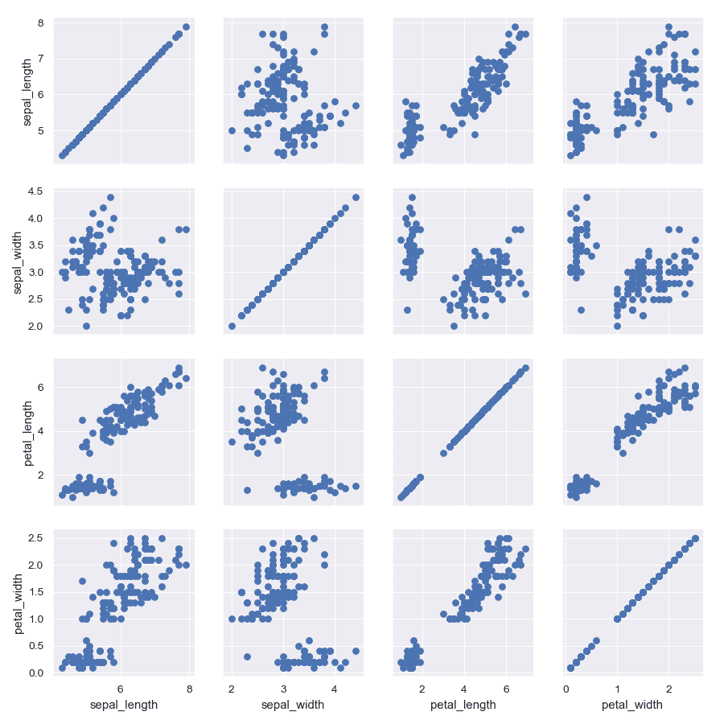
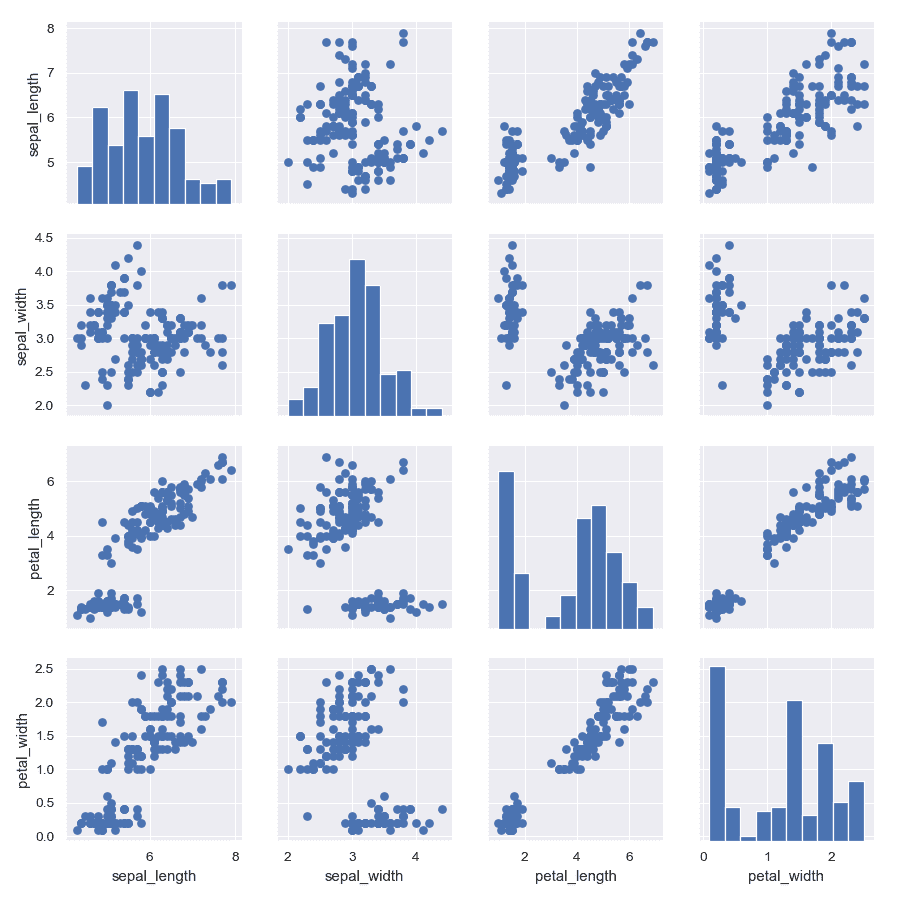
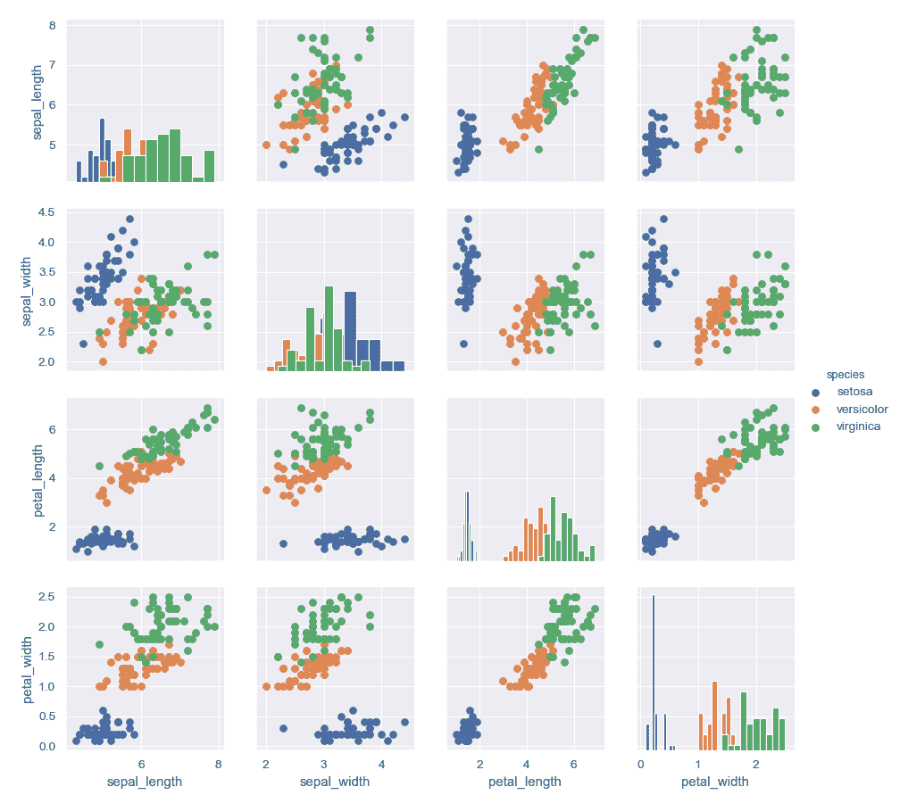
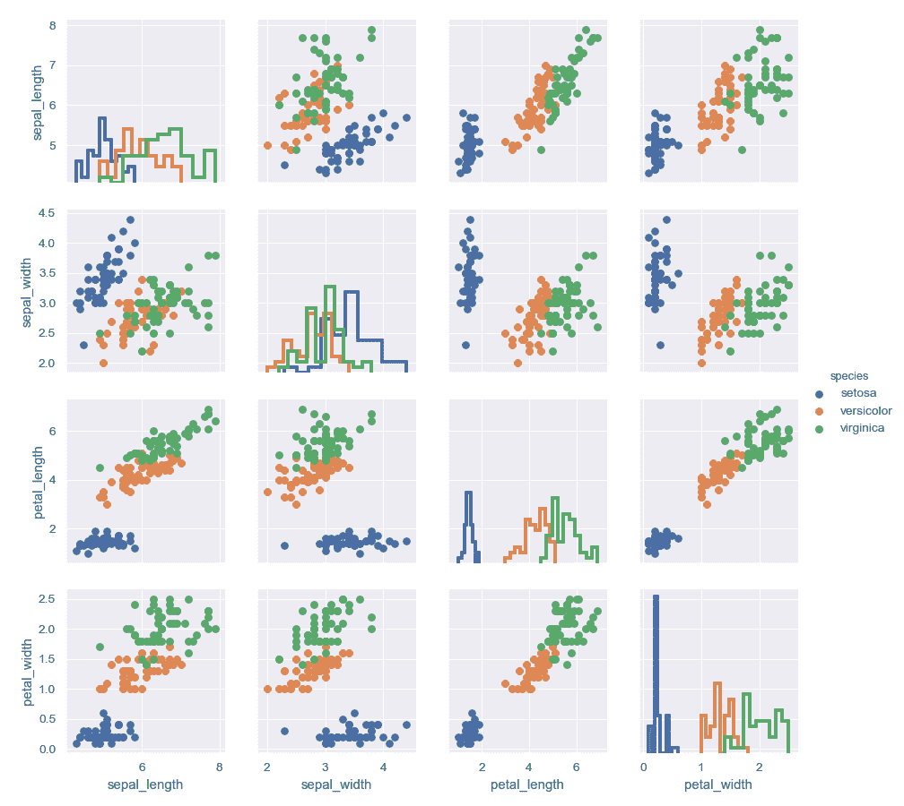
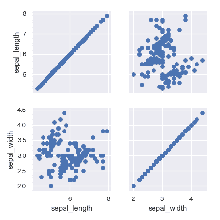
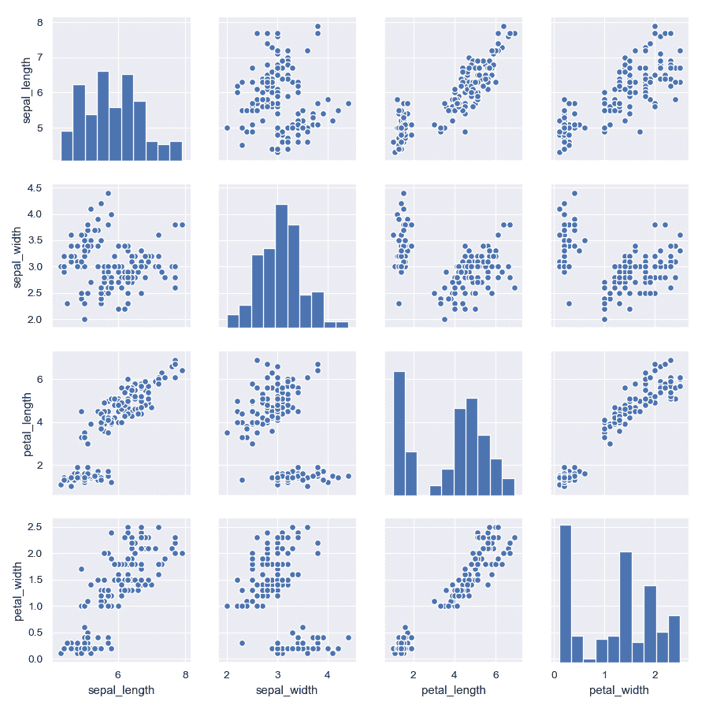
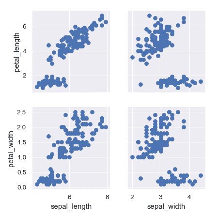
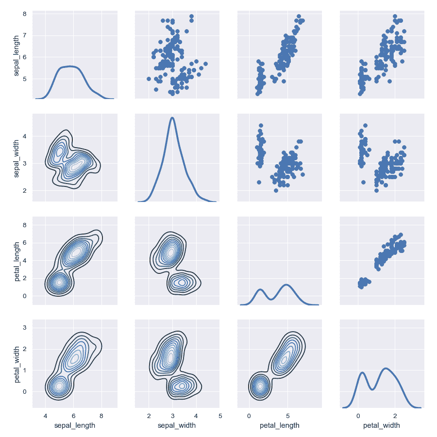
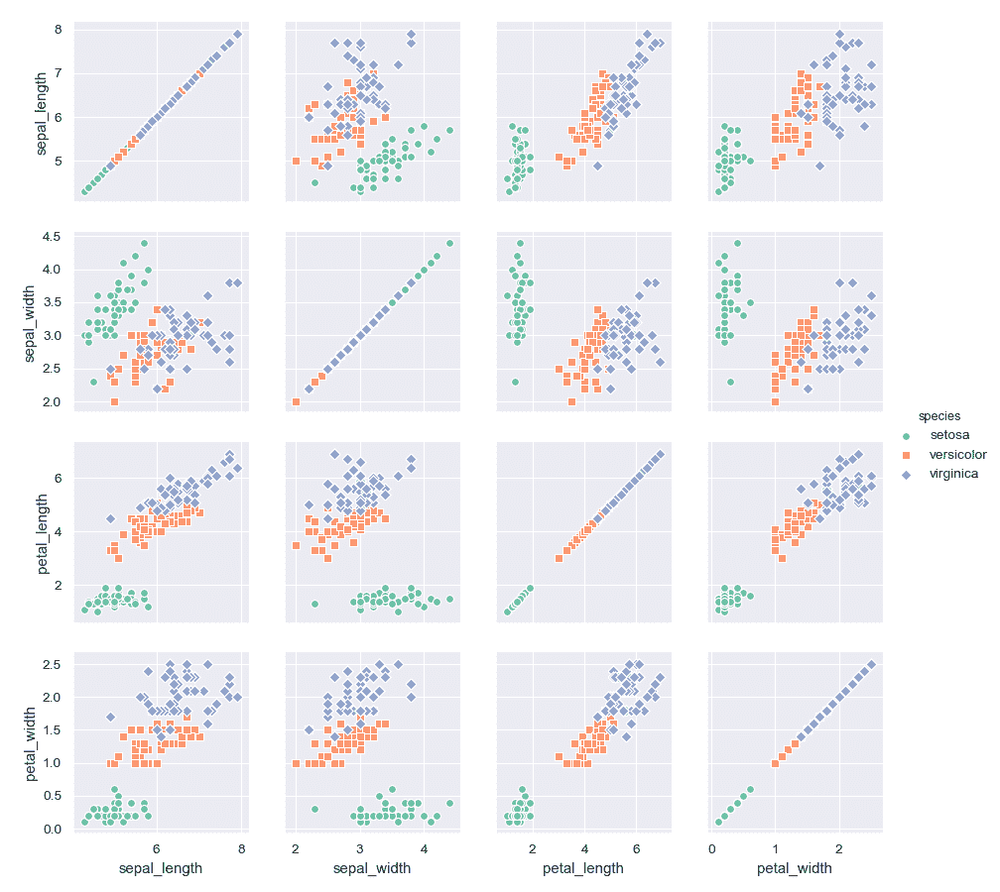

# seaborn.PairGrid

> 译者：[sfw134](https://github.com/sfw134)

```py
class seaborn.PairGrid(data, hue=None, hue_order=None, palette=None, hue_kws=None, vars=None, x_vars=None, y_vars=None, diag_sharey=True, height=2.5, aspect=1, despine=True, dropna=True, size=None)
```

用于绘制数据集中成对关系的子图网格。

此类将数据集中的每个变量映射到多个轴的网格中的列和行。可以使用不同的轴级绘图函数来绘制上三角和下三角的双变量图，并且对角线上可以显示每个变量的边际分布。 

它还可以通过`hue`参数用不同颜色绘制不同的数据子集来表示附加级别的条件化。这使用颜色来解析第三维的元素，但只是在彼此之上绘制子集，并且不会像接受`hue`的轴级函数那样为特定可视化定制`hue`参数。

参考[教程](../tutorial/axis_grids.html#grid-tutorial)获取更多信息。

```py
__init__(data, hue=None, hue_order=None, palette=None, hue_kws=None, vars=None, x_vars=None, y_vars=None, diag_sharey=True, height=2.5, aspect=1, despine=True, dropna=True, size=None)
```

初始化绘图和 PairGrid 对象。

参数：`data`：DataFrame 格式

> 整洁（长形式）数据框，其中每列是一个变量，每行是一个观察。

`hue`：字符串 （变量名）, 可选

> `data`中的变量，将绘图的不同面映射为不同的颜色。

`hue_order`：字符串列表

> 调色板中色调变量的等级顺序

`palette`：字典或者 seaborn 调色板

> 用于映射`hue`变量的颜色集.如果是一个字典，键应为`hue`变量中的值。

`hue_kws`：参数字典 -&gt; 值列表映射

> 其它的关键字参数，通过插入到绘图调用中使得其它的绘图属性在色调变量的不同水平上变化（例如散点图中的标记）。

`vars`：变量名列表, 可选

> 使用`data`中的变量，否则使用一个数值型数据类型的每一列。

`{x, y}_vars`：变量名列表，可选

> 将`data`中的变量分别用于图的行和列，即制作非方形图。

`height`：标量，可选

> 每个刻面的高度（以英寸为单位）。

`aspect`：标量，可选

> aspect 和 height 的乘积得出每个刻面的宽度（以英寸为单位）。

`despine`：布尔值，可选

> 从图中移除顶部和右侧脊柱。

`dropna`：布尔值，可选

> 在绘图之前删除数据中的缺失值。


另见

轻松绘制[`PairGrid`](#seaborn.PairGrid "seaborn.PairGrid")的常用用法。用于绘制条件关系的子图网格。

例子

为每个成对关系绘制一个散点图：

```py
>>> import matplotlib.pyplot as plt
>>> import seaborn as sns; sns.set()
>>> iris = sns.load_dataset("iris")
>>> g = sns.PairGrid(iris)
>>> g = g.map(plt.scatter)

```



在对角线上显示单变量分布：

```py
>>> g = sns.PairGrid(iris)
>>> g = g.map_diag(plt.hist)
>>> g = g.map_offdiag(plt.scatter)

```



(实际上没有必要每次都获取返回值，因为它是同一个对象，但它使得更容易处理文档测试)。

使用分类变量对点进行着色：

```py
>>> g = sns.PairGrid(iris, hue="species")
>>> g = g.map_diag(plt.hist)
>>> g = g.map_offdiag(plt.scatter)
>>> g = g.add_legend()

```



使用不同的样式显示多个直方图：

```py
>>> g = sns.PairGrid(iris, hue="species")
>>> g = g.map_diag(plt.hist, histtype="step", linewidth=3)
>>> g = g.map_offdiag(plt.scatter)
>>> g = g.add_legend()

```



绘制变量的子集

```py
>>> g = sns.PairGrid(iris, vars=["sepal_length", "sepal_width"])
>>> g = g.map(plt.scatter)

```



将其它关键字参数传给函数。

```py
>>> g = sns.PairGrid(iris)
>>> g = g.map_diag(plt.hist, edgecolor="w")
>>> g = g.map_offdiag(plt.scatter, edgecolor="w", s=40)

```



对行和列使用不同的变量：

```py
>>> g = sns.PairGrid(iris,
...                  x_vars=["sepal_length", "sepal_width"],
...                  y_vars=["petal_length", "petal_width"])
>>> g = g.map(plt.scatter)

```



在上三角和下三角使用不同的函数：

```py
>>> g = sns.PairGrid(iris)
>>> g = g.map_upper(plt.scatter)
>>> g = g.map_lower(sns.kdeplot, cmap="Blues_d")
>>> g = g.map_diag(sns.kdeplot, lw=3, legend=False)

```



为每个分类级别使用不同的颜色和标记：

```py
>>> g = sns.PairGrid(iris, hue="species", palette="Set2",
...                  hue_kws={"marker": ["o", "s", "D"]})
>>> g = g.map(plt.scatter, linewidths=1, edgecolor="w", s=40)
>>> g = g.add_legend()

```



方法

| [`__init__`](#seaborn.PairGrid.__init__ "seaborn.PairGrid.__init__")(data[, hue, hue_order, palette, …]) | 初始化绘图和 PairGrid 对象。 |
| `add_legend`([legend_data, title, label_order]) | 绘制一个图例，可能将其放在轴外并调整图形大小。 |
| [`map`](seaborn.PairGrid.map.html#seaborn.PairGrid.map "seaborn.PairGrid.map")(func, **kwargs) | 在每一个子图上用相同的函数绘制。  |
| [`map_diag`](seaborn.PairGrid.map_diag.html#seaborn.PairGrid.map_diag "seaborn.PairGrid.map_diag")(func, **kwargs) | 在每个对角线子图上用一个单变量函数绘制。 |
| [`map_lower`](seaborn.PairGrid.map_lower.html#seaborn.PairGrid.map_lower "seaborn.PairGrid.map_lower")(func, **kwargs) | 在下三角子图上用一个双变量函数绘制。|
| [`map_offdiag`](seaborn.PairGrid.map_offdiag.html#seaborn.PairGrid.map_offdiag "seaborn.PairGrid.map_offdiag")(func, **kwargs) | 在非对角线子图上用一个双变量函数绘制。 |
| [`map_upper`](seaborn.PairGrid.map_upper.html#seaborn.PairGrid.map_upper "seaborn.PairGrid.map_upper")(func, **kwargs) | 在上三角子图上用一个双变量函数绘制。|
| `savefig`(*args, **kwargs) | 保存图。 |
| `set`(**kwargs) | 在每个子图轴上设置属性。 |
