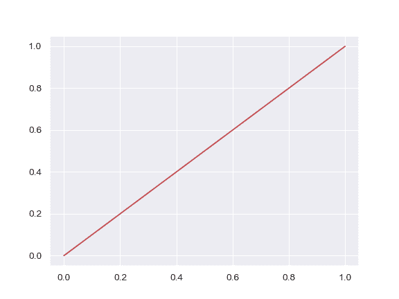
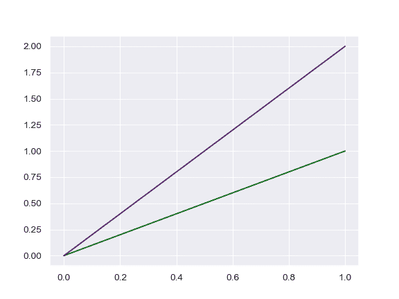

# seaborn.set_color_codes

```py
seaborn.set_color_codes(palette='deep')
```

Change how matplotlib color shorthands are interpreted.

Calling this will change how shorthand codes like “b” or “g” are interpreted by matplotlib in subsequent plots.

| Parameters: | **palette** : {deep, muted, pastel, dark, bright, colorblind}

> Named seaborn palette to use as the source of colors.

 |
| --- | --- |

See also

Color codes can be set through the high-level seaborn style manager.Color codes can also be set through the function that sets the matplotlib color cycle.

Examples

Map matplotlib color codes to the default seaborn palette.

```py
>>> import matplotlib.pyplot as plt
>>> import seaborn as sns; sns.set()
>>> sns.set_color_codes()
>>> _ = plt.plot([0, 1], color="r")

```



Use a different seaborn palette.

```py
>>> sns.set_color_codes("dark")
>>> _ = plt.plot([0, 1], color="g")
>>> _ = plt.plot([0, 2], color="m")

```

