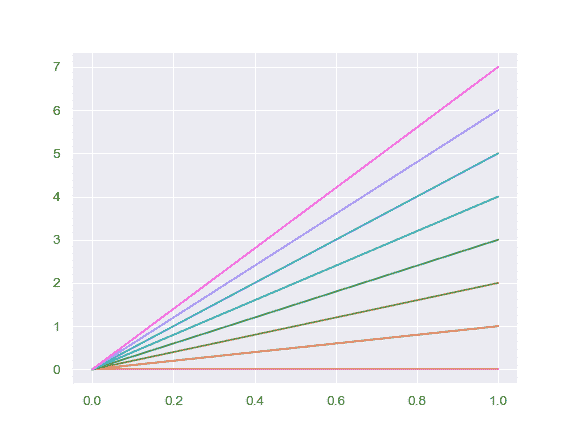

# seaborn.color_palette

> 译者：[Modrisco](https://github.com/Modrisco)

```py
seaborn.color_palette(palette=None, n_colors=None, desat=None)
```

返回一个颜色列表来定义一个调色板。

```py
Available seaborn palette names:
```

有 deep, muted, bright, pastel, dark, colorblind 六种颜色模式

```py
Other options:
```

matplotlib Colormap 的名字、‘ch:<cubehelix arguments>’, ‘hls’, ‘husl’，或任一 matplotlib 接受的不同格式颜色列表。

调用此函数并设置 `palette=None` 会返回当前 matplotlib 色彩循环。

matplotlib 调色板的顺序可以通过在调色板名称后添加 “_r” 来倒置，同样，添加 “_d” 可以将调色板设置为深色模式。（这些选项为互斥属性，返回的颜色列表同样可以被取反）

可以在 `with` 语句中使用此函数来为一个或多个点临时改变调色板。

参考这篇 [教程](../tutorial/color_palettes.html#palette-tutorial) 来获取更多信息。

参数：**palette：None, string, or sequence, optional**

> 调色板或者 None 值来返回给当前调色板。如果是序列，输入颜色会被使用，可能会被循环化并降低饱和度。


`n_colors`：int, 可选

> 调色板中的颜色数。如果为 None，则默认值将取决于调色板的指定方式。已命名调色板默认有 6 种颜色，抓取当前调色板或传递颜色列表不会更改颜色数，除非作出指定。要求比调色板中存在的颜色更多的颜色会导致调色板循环化。

`desat`：float, 可选

> 每种颜色的去饱和比例。


返回值：`palette`：RGB 元组序列。

> 调色板。操作类似于列表，但可以用作上下文管理器，并具有转换为十六进制颜色代码的 `as_hex` 方法。


另外

设置所有的默认颜色循环。重新分配颜色代码，如 “b”、“g” 等。从 seaborn 调色板中选择颜色。

例子

不带参数的调用将返回当前默认颜色循环中的所有颜色：

```py
>>> import seaborn as sns; sns.set()
>>> sns.palplot(sns.color_palette())

```


显示另一个 “seaborn 调色板”，具有与默认 matplotlib 颜色循环相同的基本色调顺序，但颜色更吸引人。默认情况下，使用调色板名称进行调用将返回 6 种颜色：

```py
>>> sns.palplot(sns.color_palette("muted"))

```


使用一个内置 matplotlib clolormap 的离散值：

```py
>>> sns.palplot(sns.color_palette("RdBu", n_colors=7))

```


创建自定义 cubehelix 调色板：

```py
>>> sns.palplot(sns.color_palette("ch:2.5,-.2,dark=.3"))

```


使用一个明确的 matplotlib 调色板并降低一些饱和度：

```py
>>> sns.palplot(sns.color_palette("Set1", n_colors=8, desat=.5))

```


创建 “dark”（深色）matplotlib 顺序调色板变体。(当对应于有序变量的多条线或点进行着色时，如果您不希望最轻的线不可见，则可以使用此选项)：

```py
>>> sns.palplot(sns.color_palette("Blues_d"))

```


作为上下文管理器使用：

```py
>>> import numpy as np, matplotlib.pyplot as plt
>>> with sns.color_palette("husl", 8):
...    _ = plt.plot(np.c_[np.zeros(8), np.arange(8)].T)

```


