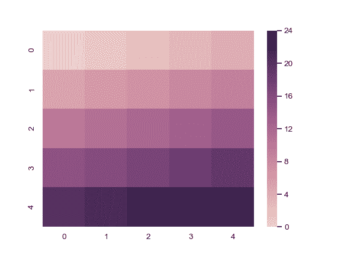
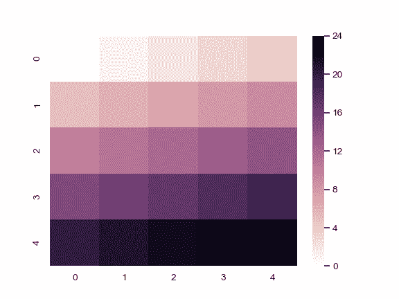

# seaborn.cubehelix_palette

> 译者：[Modrisco](https://github.com/Modrisco)

```py
seaborn.cubehelix_palette(n_colors=6, start=0, rot=0.4, gamma=1.0, hue=0.8, light=0.85, dark=0.15, reverse=False, as_cmap=False)
```

用 cubehelix 系统制作顺序调色板。

生成亮度呈线性减小(或增大)的 colormap。这意味着 colormap 在转换为黑白模式时(用于打印)的信息将得到保留，且对色盲友好。“cubehelix” 也可以作为基于 matplotlib 的调色板使用，但此函数使用户可以更好地控制调色板的外观，并且具有一组不同的默认值。

除了使用这个函数，还可以在 seaborn 中使用字符串速记生成 cubehelix 调色板。 请参见下面的示例。

参数：`n_colors`：int

> 调色板中的颜色数。

`start`：float, 0 &lt;= start &lt;= 3

> 第一个色调。

`rot`：float

> 围绕调色板范围内的色相控制盘旋转。

`gamma`：float 0 &lt;= gamma

> Gamma 系数用以强调较深 (Gamma < 1) 或较浅 (Gamma > 1) 的颜色。

`hue`：float, 0 &lt;= hue &lt;= 1

> 颜色的饱和度。

`dark`：float 0 &lt;= dark &lt;= 1

> 调色板中最暗颜色的强度。

`light`：float 0 &lt;= light &lt;= 1

> 调色板中最浅颜色的强度。

`reverse`：bool

> 如果为 True 值，则调色板将从暗到亮。

`as_cmap`：bool

> 如果为 True 值，则返回 matplotlib colormap 而不是颜色列表。


返回值：`palette or cmap`：seaborn 调色板或者 matplotlib colormap

> 类似列表的颜色对象的 RGB 元组，或者可以将连续值映射到颜色的 colormap 对象，具体取决于 `as_cmap` 参数的值。


另外

启动交互式小部件以调整 cubehelix 调色板参数。创建具有暗低值的连续调色板。创建具有亮低值的连续调色板。

参考

Green, D. A. (2011). “一种用于显示天文强度图像的配色方案”. Bulletin of the Astromical Society of India, Vol. 39, p. 289-295.

例子

生成默认调色板：

```py
>>> import seaborn as sns; sns.set()
>>> sns.palplot(sns.cubehelix_palette())

```


从相同的起始位置向后旋转：

```py
>>> sns.palplot(sns.cubehelix_palette(rot=-.4))

```


使用不同的起点和较短的旋转：

```py
>>> sns.palplot(sns.cubehelix_palette(start=2.8, rot=.1))

```


反转亮度渐变方向：

```py
>>> sns.palplot(sns.cubehelix_palette(reverse=True))

```


生成一个 colormap 对象：

```py
>>> from numpy import arange
>>> x = arange(25).reshape(5, 5)
>>> cmap = sns.cubehelix_palette(as_cmap=True)
>>> ax = sns.heatmap(x, cmap=cmap)

```



使用完整的亮度范围：

```py
>>> cmap = sns.cubehelix_palette(dark=0, light=1, as_cmap=True)
>>> ax = sns.heatmap(x, cmap=cmap)

```



使用 [`color_palette()`](seaborn.color_palette.html#seaborn.color_palette "seaborn.color_palette") 函数接口：

```py
>>> sns.palplot(sns.color_palette("ch:2,r=.2,l=.6"))

```


