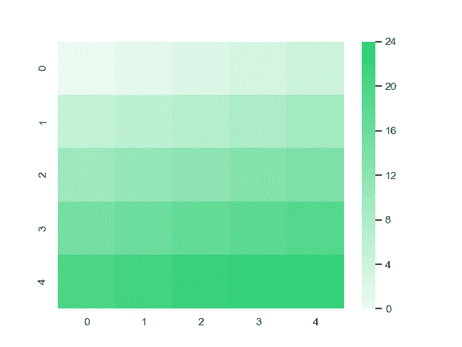

# seaborn.light_palette

> 译者：[Modrisco](https://github.com/Modrisco)

```py
seaborn.light_palette(color, n_colors=6, reverse=False, as_cmap=False, input='rgb')
```

制作一个混合浅色和 `color` 模式的顺序调色板。

这种调色板适用于数据集的范围从相对低值(不感兴趣)到相对高值(很感兴趣)时。

可以通过多种方式指定 `color` 参数，包括用于在 matplotlib 中定义颜色的所有选项，以及由 seborn 处理的其他几个颜色空间。也可以使用 XKCD color survey 中的颜色名字数据库。

如果您在使用 IPython notebook，您还可以通过 [`choose_light_palette()`](seaborn.choose_light_palette.html#seaborn.choose_light_palette "seaborn.choose_light_palette") 函数交互式选择调色板。

参数：`color`：高值的基色

> 十六进制、`input` 中的元组或者颜色名字。

`n_colors`：int, 可选

> 调色板中的颜色数。

`reverse`：bool, 可选

> 如果为 True 值，则反转混合的方向。

`as_cmap`：bool, 可选

> 如果为 True 值，则返回 matplotlib colormap 而不是列表。

`input`：{‘rgb’, ‘hls’, ‘husl’, xkcd’}

> 用于解释输入颜色的颜色空间。前三个选项适用于元组输入，后者适用于字符串输入。

返回值：`palette or cmap`：seaborn color palette or matplotlib colormap

> 类似列表的颜色对象的 RGB 元组，或者可以将连续值映射到颜色的 colormap 对象，具体取决于 as_cmap 参数的值。


另外

创建具有暗低值的连续调色板。创建有两种颜色的发散调色板。

例子

从一个 HTML 颜色生成一个调色板：

```py
>>> import seaborn as sns; sns.set()
>>> sns.palplot(sns.light_palette("purple"))

```


生成亮度降低的调色板：

```py
>>> sns.palplot(sns.light_palette("seagreen", reverse=True))

```


从 HUSL 空间种子生成选项板：

```py
>>> sns.palplot(sns.light_palette((260, 75, 60), input="husl"))

```


生成一个 colormap 对象：

```py
>>> from numpy import arange
>>> x = arange(25).reshape(5, 5)
>>> cmap = sns.light_palette("#2ecc71", as_cmap=True)
>>> ax = sns.heatmap(x, cmap=cmap)

```


